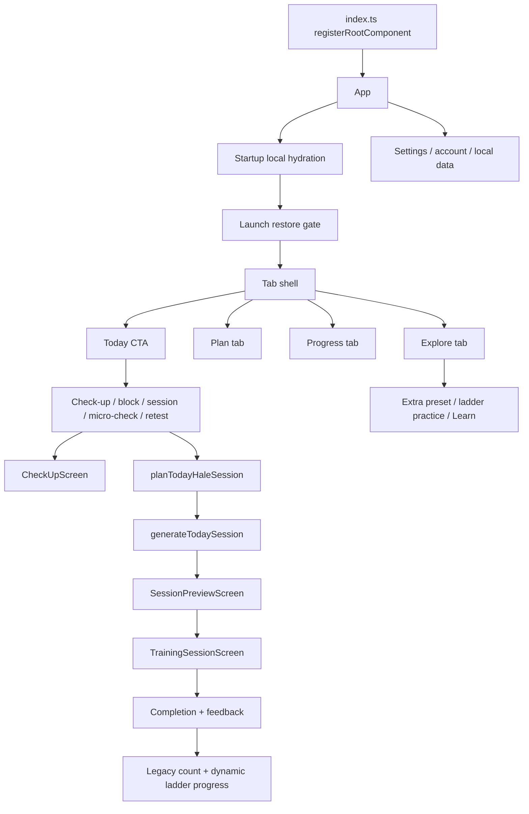
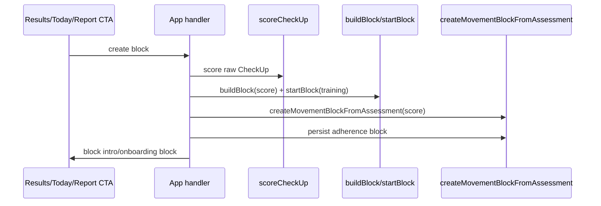
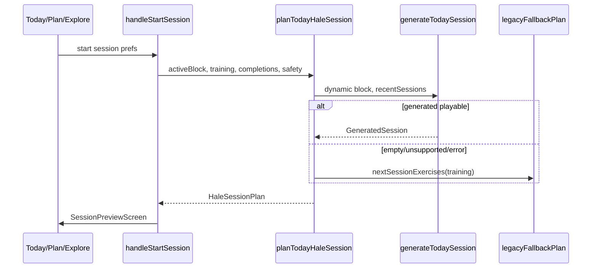
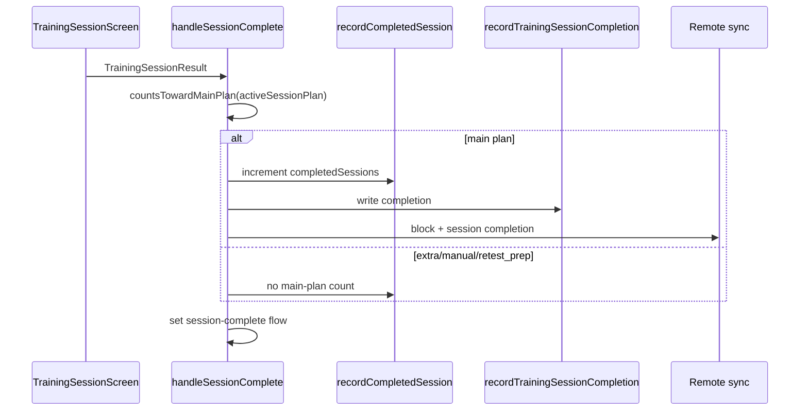
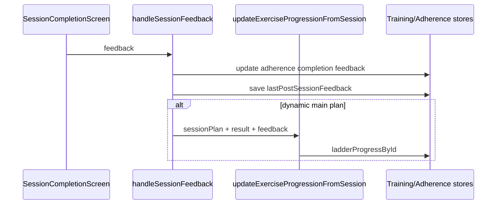
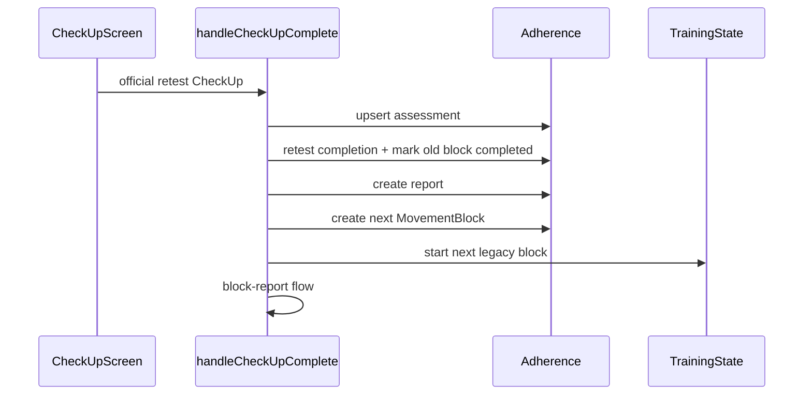

# Hale Production-Readiness Logic Audit - Stage 1

Stage: Static production-path, contradiction, invariant, and dead-path audit  
Date: 2026-06-19  
Scope: current working tree, including pre-existing uncommitted changes  
Output-only rule: this audit intentionally changes no production code, tests, config, dependencies, fixtures, schemas, or generated files.

## 1. Executive Verdict

Stage 0's architecture map was materially accurate: Hale currently has a dynamic session-generation architecture, adherence MovementBlock architecture, and legacy TrainingState/block architecture all active at runtime. Stage 1 narrows that to: one active product architecture with production fallbacks and independently mutable compatibility state, not a single canonical training system.

Summary counts:

| Metric | Count | Notes |
| --- | ---: | --- |
| Production-reachable major paths | 28 | Includes onboarding, check-up, block, session, feedback, Explore, account, restore, and route paths. |
| Conditionally production-reachable paths | 8 | Require active block, signed-in state, equipment, lifecycle state, or persisted state. |
| Legacy-but-reachable paths | 5 | Legacy block, buildBlock/startBlock, nextSessionExercises, recordCompletedSession, legacy serializers. |
| Fallback-only production paths | 2 | Main dynamic fallback and preset fallback in `planTodayHaleSession`. |
| Beta-hidden paths | 2 | TUG beta battery and v1_optional exercise levels. |
| Development-only paths | 4 | Dev assessment/live screens, dev recording, debug workout scenarios. |
| Test-only paths | 3 | Synthetic fixtures, replay fixtures, test-only diagnostic generators. |
| Apparently dead paths | 2 | `dev-assessment` and `dev-live` are renderable flow values but no current UI setter was found. |
| Confirmed defects | P0: 2, P1: 4, P2: 2, P3: 0 | See section 13. |
| Product decisions required | 10 | Mostly completion, invalid assessment, manual check-up, equipment, fallback, and account policy. |
| Stage 0 corrections/refutations | 4 | Null/stale session-start narrowed; active-flow restore refuted; TUG status narrowed; dev flow reachability corrected. |

High-level verdict:

- Hale is not structurally ready for beta without Stage 1 remediation on identity/local data isolation and invalid-baseline block creation.
- Hale is ready to proceed to Stage 2 measurement audit once Stage 2 explicitly scopes the production battery to `DEFAULT_BATTERY` and treats TUG as beta-hidden/historical-support only.
- The highest-risk architectural seam is not pose logic yet; it is cross-path state authority: assessment validity, session completion credit, dynamic-vs-legacy progression, and local account scoping.

## 2. Baseline Verification

Initial `git status --short --untracked-files=all`:

```text
 M src/navigation/TabBar.tsx
 M src/navigation/icons.tsx
 M src/screens/TodayScreen.tsx
 M src/theme/index.ts
?? docs/audits/HALE_LOGIC_AUDIT_STAGE_0.md
```

Initial `git diff --name-only`:

```text
src/navigation/TabBar.tsx
src/navigation/icons.tsx
src/screens/TodayScreen.tsx
src/theme/index.ts
```

Initial `git diff --stat`:

```text
 src/navigation/TabBar.tsx   |  24 +-
 src/navigation/icons.tsx    |  56 ++--
 src/screens/TodayScreen.tsx | 712 +++++++++++++++++++++++++-------------------
 src/theme/index.ts          |  19 ++
 4 files changed, 465 insertions(+), 346 deletions(-)
```

Repository configuration inspected:

| Area | Result |
| --- | --- |
| Package entry | `package.json` main is `index.ts`; `index.ts:1-8` registers `App`. |
| Runtime versions | Expo `~56.0.11`, React Native `0.85.3`, React `19.2.3` in `package.json:5-22`. |
| Lockfile | `package-lock.json` lockfileVersion 3, root dependencies 17, root devDependencies 7. |
| Jest | `package.json:45-51` uses `jest-expo`, roots `src` and `modules`. |
| TypeScript | `tsconfig.json:1-7` extends Expo base, `strict: true`, types `jest,node`. |
| Expo config | `app.json:1-46`; scheme `hale`, camera permission, local pose-detection plugin, Sentry plugin. |
| Feature flags | Sentry gated by `EXPO_PUBLIC_ENABLE_SENTRY === '1'` plus DSN in `src/services/observability/sentry.ts:33-55`; Apple sign-in gated by `EXPO_PUBLIC_ENABLE_APPLE_SIGN_IN === '1'` in `src/components/accountAuthConfig.ts:4-6`; pose avatar render flags are visual-only. |
| Lint | No lint script configured in `package.json:33-44`. |

Validation commands:

| Command | Exit | Result | Warnings / notes |
| --- | ---: | --- | --- |
| `npm test -- --runInBand` | 0 | 75 suites passed, 473 tests passed, 0 snapshots | Watchman recrawl warning; expected console logging/warnings from backend/session planning tests; Jest reported open handles after completion. |
| `npm run typecheck` | 0 | TypeScript passed | None observed. |
| `npx --no-install expo config --json >/tmp/hale-expo-config-stage1.json && node -e '...'` | 0 | Expo public config parsed: name `Hale`, slug `hale`, scheme `hale`, 6 plugins, iOS `com.suvangoel.hale`, Android `com.suvangoel.hale` | Temporary `/tmp` output deleted. |
| Lint | Not run | No repository lint script exists | Not applicable. |

Additional non-mutating diagnostics:

- Pure `tsx` imports that touched React Native through barrel exports failed with `react-native/index.js:27 Unexpected "typeof"`. This is an audit limitation, not a repo failure. It affected direct ad-hoc imports of `src/haleFlow/sessionPlanning.ts` and `src/haleFlow/assessments.ts`; the same code is covered by Jest/Babel.
- Pure-domain diagnostics were executed through `npx tsx -e` for scoring/block defaults, dynamic generator rotation, and exercise registry consistency. No files were written.

Files changed by audit commands before creating this report: none.

## 3. Stage 0 Verification Table

| Stage 0 claim | Verified result | Classification | Evidence | Correction needed |
| --- | --- | --- | --- | --- |
| Default production check-up excludes TUG | Confirmed | Confirmed production-reachable / Beta-hidden | `src/checkup/checkup.ts:35-50`, `src/screens/CheckUpScreen.tsx:23-41`, `src/screens/CheckUpScreen.tsx:87-89` | None; TUG is registered/scored for beta or historical rows only. |
| Invalid baseline can create a plan | Confirmed and strengthened | Confirmed software defect P0 | `App.tsx:1210-1339`, `App.tsx:1352-1404`, `src/adherence/blockService.ts:9-13`; pure diagnostic showed `weakestDomain:null -> strength_power`. | Gate block creation by explicit validity/product rule. |
| Invalid assessment can become latest official | Narrowed | Stage 0 claim corrected / Latent defect | `latestOfficialAssessment` does not filter status at `src/haleFlow/assessments.ts:46-52`, but lifecycle `hasOfficialAssessment` requires completed at `src/haleFlow/appLifecycle.ts:356-358`. | Audit callers individually; do not assume lifecycle trusts invalid official. |
| Manual extra can influence future block | Confirmed | Product decision required P1 | `App.tsx:1848-1890` uses `lastResult ?? latest history`; `viewLast` loads latest history at `App.tsx:1840-1846`. | Define allowable source types for block creation. |
| Non-training completions can influence dynamic planning | Confirmed | Confirmed software defect P1 | `App.tsx:1416-1433`, `src/haleFlow/sessionPlanning.ts:537-560`, `src/training/workoutGeneration.ts:307-347`. | Filter by session type before generator recentSessions. |
| Null plan counts toward main plan | Function true, runtime launch narrowed | Stage 0 claim corrected / Latent defect | `countsTowardMainPlan(null)` at `src/haleFlow/sessionPlanning.ts:282-287`; `beginPlannedSession` guards null/empty at `App.tsx:1489-1495`. | Keep callback-race audit for Stage 6/7; start button path is guarded. |
| Skipped session can count complete | Confirmed | Confirmed software defect P1 / Product decision required | `src/training/sessionPlayer.ts` test asserts all skipped reaches done; `App.tsx:1497-1572` credits result if main plan. | Define completion-credit threshold. |
| Missing result can be completed | Confirmed | Latent defect P1 | `src/haleFlow/sessionPlanning.ts:568-600` treats absent item as completed. | Require result/plan ID reconciliation. |
| Legacy and dynamic progression diverge | Confirmed | Confirmed production-reachable / Product decision required | Legacy count in `App.tsx:1506-1508`; dynamic ladder only on feedback at `App.tsx:1689-1706`. | Decide feedback and progression contract. |
| Equipment has multiple sources | Confirmed | Product decision required P1 | Settings handlers `App.tsx:1741-1781`; generator merge `src/haleFlow/sessionPlanning.ts:646-671`; Explore duplicate `src/haleFlow/exploreViewModel.ts:235-260`. | Choose canonical equipment model. |
| Dynamic failure falls back silently | Confirmed | Fallback-only but production-reachable P1 | `src/haleFlow/sessionPlanning.ts:101-143`, `src/haleFlow/sessionPlanning.ts:501-535`; dev-only warning. | Add production observability/constraints or hard stop. |
| Planning date ignored | Confirmed for plannedDateKey only | Confirmed software defect P2 | `src/haleFlow/sessionPlanning.ts:856-858`; other week helpers accept injected dates. | Use supplied `today` in planned date key. |
| Exercise/ladders disagree | Confirmed | Latent defect / Testability gap | Registry diagnostic over 37 exercises/37 ladder levels found 11 equipment, 3 camera, 34 level, 37 release-status mismatches. | Add invariant tests and source resolution. |
| Beta/dev gates incomplete | Narrowed | Stage 0 claim corrected | TUG battery is exported but not used by production screen; dev flows have no setter; recorders gated `__DEV__`. | Add explicit release-build assertions; label apparently dead dev flow setters. |
| Sign-out can expose previous local data | Confirmed | Confirmed software defect P0 | `src/components/AccountAuthCard.tsx:173-182`, `src/services/backend/AuthProvider.tsx:271-284`, restore skip `src/services/backend/restoreService.ts:191-199`. | Remediate before beta. |
| Active flow can skip restore on launch | Refuted for current launch path | Stage 0 false positive | Initial flow is null; restore gating waits for local loads at `App.tsx:424-521`; UI not rendered until `restoreReady` at `App.tsx:2026-2028`. | Keep as latent only if future deep links set flow before restore. |
| Multiple active blocks can exist | Confirmed as persisted/restore latent | Latent defect P1 | `getActiveMovementBlock` tie-breaks latest at `src/adherence/blockService.ts:69-73`; `upsertMovementBlock` archives actives at `src/adherence/adherenceService.ts:13-21`; restore maps rows directly at `src/services/backend/restoreService.ts:316-343`. | Enforce/repair single-active invariant. |

## 4. Production-Path Manifest



| Path ID | User/persisted trigger | Entry component | Handler chain | Business-logic chain | Data read | Data written | Gate/flag | Reachability classification | Evidence |
| --- | --- | --- | --- | --- | --- | --- | --- | --- | --- |
| P01 | App launch | `index.ts` -> `App` | `registerRootComponent -> App` | local store loads -> restore gate -> tab shell | history, profile, training, microChecks, adherence | ready flags, restored state if empty | `restoreReady` | Confirmed production-reachable | `index.ts:1-8`, `App.tsx:339-369`, `App.tsx:424-521`, `App.tsx:2026-2028` |
| P02 | First-run onboarding CTA | `TodayScreen` | Today CTA -> `handleTodayPrimaryAction` -> flow step | onboarding state -> profile/safety/equipment/camera | prefs/history/adherence | prefs onboarding/profile | none | Confirmed production-reachable | `App.tsx:1892-1921`, `App.tsx:2056-2084` |
| P03 | Baseline check-up | `CameraSetupScreen`, `CheckUpScreen` | camera setup begin -> `beginOnboardingCheckUp`/`beginCheckUp('baseline')` -> `CheckUpScreen` | `CheckUpOrchestrator(DEFAULT_BATTERY)` -> `handleCheckUpComplete` | pose frames, prefs, history | raw check-up, assessment, prefs step, remote checkup if signed in | camera/audio permission | Confirmed production-reachable | `App.tsx:1183-1207`, `App.tsx:2077-2096`, `src/checkup/checkup.ts:35-81` |
| P04 | Manual check-up | `ManualCheckupStartScreen` | route/progress -> `openManualCheckup` -> `beginCheckUp('manual_extra')` | same check-up pipeline, non-official assessment | latest assessment, active block | raw check-up, assessment, history | camera/audio | Confirmed production-reachable | `App.tsx:1952`, `App.tsx:1988-1996`, `App.tsx:2085-2096` |
| P05 | Official re-test | Today/Progress/Manual | CTA -> `beginCheckUp('official_retest')` | check-up -> assessment -> retest completion -> report -> next block | active block, history, training, adherence | completed old block, report, new block, training block | active block/retest due | Conditionally production-reachable | `App.tsx:1210-1323`, `App.tsx:1910-1912`, `App.tsx:2259-2260` |
| P06 | Weekly micro-check | Today/manual/session-complete | CTA -> `setFlow('microcheck')` -> `MicroCheckScreen` | `getMicroCheckForBlock` -> save microcheck -> adherence completion | active block, adherence, training | microcheck file, micro_check completion, remote microcheck | active block optional | Confirmed production-reachable | `App.tsx:1592-1640`, `App.tsx:1907-1909`, `App.tsx:2124-2129`, `App.tsx:2183` |
| P07 | Create first block from results | `OnboardingResultsScreen`/`ResultsScreen` | create block CTA -> `handleStartPlan` | `scoreCheckUp` -> legacy `buildBlock` + adherence `createMovementBlockFromAssessment` -> `startBlock` | visible result, prefs, training | adherence block, milestones, training block | result exists | Confirmed production-reachable | `App.tsx:2096-2109`, `App.tsx:1352-1404` |
| P08 | Create next block | Today/Plan/block report | route/CTA -> `handleStartNextBlock` | latest or last result -> `scoreCheckUp` -> `buildBlock` + MovementBlock | `lastResult`, latest history, training | adherence block, training block | result or starts check-up | Confirmed production-reachable | `App.tsx:1848-1890`, `App.tsx:2000-2003`, `App.tsx:2173-2175` |
| P09 | Plan today's session | Today/Plan/block intro | CTA -> `handleStartSession` | `planTodayHaleSession` -> dynamic generation -> validation/fallback -> `activeSessionPlan` | safety, lifeGoal, activeBlock, training, completions | in-memory plan | active block or fallback/preset | Confirmed production-reachable | `App.tsx:1406-1438`, `src/haleFlow/sessionPlanning.ts:94-191` |
| P10 | Start session | `SessionPreviewScreen` | preview start -> `beginPlannedSession` | guard plan non-null/non-empty -> set IDs -> `TrainingSessionScreen` | activeSessionPlan | sessionIds, sessionType | non-empty exercises | Confirmed production-reachable | `App.tsx:1489-1495`, `App.tsx:2111-2123` |
| P11 | Complete session | `TrainingSessionScreen` | player done -> screen `onComplete` -> `handleSessionComplete` | `countsTowardMainPlan` -> legacy count -> generated summary -> adherence completion | activeSessionPlan, training, activeBlock | training state, adherence completion, remote completion | main plan source | Confirmed production-reachable | `App.tsx:1497-1590` |
| P12 | Submit/skip feedback | `SessionCompletionScreen` | feedback -> `handleSessionFeedback`; done -> `goHome` | persist feedback; dynamic ladder progress only on feedback | lastCompletion, activeSessionPlan, result | adherence completion update, training feedback/progress | lastCompletion exists | Confirmed production-reachable | `App.tsx:1643-1739`, `App.tsx:2177-2186` |
| P13 | Onboarding equipment | `OnboardingEquipmentScreen` | save -> profile/prefs handler | selected equipment -> safety/training seed | prefs onboarding | prefs/training depending handler | onboarding only | Confirmed production-reachable | render at `App.tsx:2064-2069`; equipment state also in settings paths |
| P14 | Settings equipment | `SettingsScreen` | settings -> `toggleEquipment`/`toggleAvailableEquipment` | update training equipment and/or safety availableEquipment | prefs, training | prefs and/or training | settings flow | Confirmed production-reachable | `App.tsx:1741-1781`, `App.tsx:2201-2218` |
| P15 | Safety/pain profile | `SafetyProfileScreen`, session preferences | save -> `onSafetyProfileSave`; session adjustment -> `handleStartSession` | safety profile feeds equipment/readiness/pain planning | prefs safety | prefs profile | onboarding/settings/session UI | Confirmed production-reachable | `App.tsx:2058-2063`, `App.tsx:1416-1433` |
| P16 | Explore extra preset | `ExploreScreen` | preset tile -> `handleStartExtraSession` -> `handleStartSession` | preset -> dynamic generator -> session preview; counts false | equipment, safety, progress | in-memory plan; generated summary after completion | equipment card disabled for some presets | Confirmed production-reachable | `src/screens/ExploreScreen.tsx:68-84`, `App.tsx:1451-1460`, `src/haleFlow/sessionPlanning.ts:146-183` |
| P17 | Ladder practice | `ExploreScreen` -> detail | ladder tile -> `openLadderDetail` -> practice -> `planLadderPracticeSession` | core ladder only -> one exercise -> manual source | ladder, progress, equipment | in-memory plan | v1_core ladder/level | Confirmed production-reachable | `src/screens/ExploreScreen.tsx:88-103`, `src/screens/ExploreDetailScreens.tsx:18-80`, `src/haleFlow/sessionPlanning.ts:193-230` |
| P18 | Restart session | Today/restart intro | inactive CTA -> `handleStartRestartSession` | restart session type -> preset/gentler readiness | active block, completions | in-memory plan, then completion if done | inactive lifecycle | Conditionally production-reachable | `App.tsx:1440-1442`, `App.tsx:1913-1915`, `src/haleFlow/sessionPlanning.ts:607-643` |
| P19 | Re-test preparation | week-complete CTA | Today CTA -> `explore_extra_sessions` -> preset mobility reset | `sessionTypeFor` returns `retest_prep`; counts false | lifecycle week_complete | generated summary only if completed | week complete | Conditionally production-reachable | `App.tsx:1916-1918`, `src/haleFlow/sessionPlanning.ts:607-643`, `src/haleFlow/sessionPlanning.ts:282-287` |
| P20 | Sign in | `AccountAuthCard` | submit password/provider -> auth provider -> refresh profile | Supabase auth -> App restore if local empty | auth state, remote snapshot | auth state, maybe restored stores | env/provider config | Confirmed production-reachable | `src/components/AccountAuthCard.tsx:157-170`, `src/services/backend/restoreService.ts:191-230` |
| P21 | Sign out | `AccountAuthCard` | `submitSignOut` -> `signOut` | Supabase signOut only; local Hale files preserved | auth state | auth state only | signed in | Confirmed production-reachable | `src/components/AccountAuthCard.tsx:173-182`, `src/services/backend/AuthProvider.tsx:271-284` |
| P22 | Clear local data | Account data action | confirm -> `clearLocalHaleData` -> `signOut` | delete known local files and recordings | local files | deletes local stores | explicit destructive confirmation | Confirmed production-reachable | `src/components/AccountAuthCard.tsx:217-245`, `src/services/backend/accountDataService.ts:53-97` |
| P23 | Restore remote data | Signed-in launch | App restore effect -> `restoreRemoteStateIfLocalEmpty` | skip if local meaningful; map remote snapshot if empty | local stores, remote rows | local stores | signed in + empty local | Conditionally production-reachable | `App.tsx:424-521`, `src/services/backend/restoreService.ts:191-230`, `src/services/backend/restoreService.ts:298-305` |
| P24 | Export data | Account UI | `submitExportData` -> `shareHaleDataExport` | local/remote export service | local/backend | share artifact outside repo | signed in | Confirmed production-reachable | `src/components/AccountAuthCard.tsx:184-202` |
| P25 | Delete account request | Account UI | confirm delete -> `requestCloudAccountDeletion` | currently throws deferred cloud deletion message before local clear | none | none on throw | signed in + confirmation | Confirmed production-reachable | `src/components/AccountAuthCard.tsx:232-244`, `src/services/backend/accountDataService.ts:110-112` |
| P26 | Progress/latest results/report | `ProgressScreen` | view latest/report/retest -> App handlers | score latest history, report view models | history, blocks, reports | selected result/report flow only | tab | Confirmed production-reachable | `App.tsx:1840-1846`, `App.tsx:1930-1950`, `App.tsx:2265-2279` |
| P27 | String route handling | Any route prop/deep link-like string | `handleRoute(route)` | maps route strings to flows or handlers | route string, current state | flow or plan/check-up creation | caller-dependent | Conditionally production-reachable | `App.tsx:1963-2022` |
| P28 | Dev skip onboarding check-up | Camera setup in dev | `onDevSkipCheckUp` -> synthetic check-up | syntheticCheckUp -> normal completion | dev fixture | raw check-up/assessment/block-capable result | `__DEV__` | Development-only | `App.tsx:1344-1350`, `App.tsx:2082` |

Required path answers:

- Can any flow value be set without visible user action? Yes: lifecycle handlers and route strings can set flows programmatically; restore does not route directly into a flow.
- Can restored state route directly into a flow? No. Restore updates stores; tab/lifecycle derives CTA after `restoreReady`.
- Can a stale in-memory plan be started? Start button path is guarded by `activeSessionPlan && exercises.length`; completion callback races remain Stage 6/7 work.
- Can an old persisted training block activate legacy path? Yes, lifecycle has legacy fallback summaries and `legacyFallbackPlan` uses `nextSessionExercises`.
- Can a development screen be reached in release? No direct setter found; rendering is not itself guarded, but no production route sets those values.
- Can beta TUG enter production check-up? No current production screen constructs `BETA_BATTERY_WITH_TUG`; TUG can appear in historical/scoring rows.
- Can Explore/manual/restart/retest-prep enter main-plan completion? Preset/manual/retest_prep count false; restart counts true by design.
- Can completion handler fire twice? Screen has one-shot refs in tests for player/screen, but App handler itself is not idempotent; dedupe protects adherence completions, legacy count can still be vulnerable to repeated callback in Stage 6/7.
- Can app route before hydration/restore? UI returns `AuthLoadingScreen` until `restoreReady`.
- Can lifecycle and CTA disagree? The main CTA uses lifecycle primary action; plan/progress tabs can expose explicit actions that bypass Today ordering.

## 5. Flow and Route Reachability Ledger

| Flow/route/CTA | Setter/caller | Render target | Gate | Reachability classification | Notes |
| --- | --- | --- | --- | --- | --- |
| `welcome` | onboarding CTA, flowForOnboardingStep | `WelcomeScreen` | restoreReady | Confirmed production-reachable | `App.tsx:179-190`, `App.tsx:2056-2057` |
| `life-goal` | onboarding route/settings | `LifeGoalOnboardingScreen` | restoreReady | Confirmed production-reachable | `App.tsx:1966-1968`, `App.tsx:2130-2135` |
| `safety-profile` | onboarding/settings/route | `SafetyProfileScreen` | restoreReady | Confirmed production-reachable | `App.tsx:2058-2063`, `App.tsx:1969-1971` |
| `equipment` | onboarding route | `OnboardingEquipmentScreen` | onboarding | Confirmed production-reachable | `App.tsx:2064-2069`, `App.tsx:1972-1974` |
| `camera-explanation` | onboarding route | `CameraExplanationScreen` | permission prompt | Confirmed production-reachable | `App.tsx:2070-2076` |
| `camera-setup` | Today/Plan/Learn | `CameraSetupScreen` | permission prompt | Confirmed production-reachable | `App.tsx:2077-2084`, `App.tsx:1897-1899` |
| `manual-checkup` | Progress/route | `ManualCheckupStartScreen` | restoreReady | Confirmed production-reachable | `App.tsx:1952`, `App.tsx:2085-2093` |
| `checkup` | beginCheckUp | `CheckUpScreen` | camera/audio | Confirmed production-reachable | `App.tsx:2094-2096`, `CAMERA_FLOWS` at `App.tsx:173-174` |
| `results` | check-up completion, view latest | results/onboarding results | visibleResult | Confirmed production-reachable | `App.tsx:2096-2110` |
| `session-preview` | `handleStartSession`, practice | `SessionPreviewScreen` | activeSessionPlan | Confirmed production-reachable | `App.tsx:2111-2116` |
| `training` | `beginPlannedSession` | `TrainingSessionScreen` | sessionIds length + camera/audio | Confirmed production-reachable | `App.tsx:2117-2123` |
| `microcheck` | Today/manual/session-complete/route | `MicroCheckScreen` | camera/audio | Confirmed production-reachable | `App.tsx:2124-2129` |
| `onboarding-block` | first block creation | `OnboardingBlockScreen` | displayMovementBlock | Confirmed production-reachable | `App.tsx:2136-2141` |
| `block-intro` | block creation | `BlockIntroScreen` | displayMovementBlock | Confirmed production-reachable | `App.tsx:2142-2148` |
| `restart-intro` | lifecycle/route | `RestartSessionScreen` | activeMovementBlock | Conditionally production-reachable | `App.tsx:2149-2156` |
| `weekly-summary` | flow value only | `WeeklySummaryScreen` | displayMovementBlock | Reachability ambiguous | No current setter found in searched App paths. |
| `block-report` | retest/report route | `BlockReportScreen` | reportDisplayBlock | Confirmed production-reachable | `App.tsx:2165-2176` |
| `session-complete` | session completion | `SessionCompletionScreen` | displayMovementBlock | Confirmed production-reachable | `App.tsx:2177-2186` |
| `ladder-detail` | Explore ladder | `LadderDetailScreen` | selected ladder | Confirmed production-reachable | `App.tsx:2187-2193` |
| `learn-detail` | Explore learn | `LearnDetailScreen` | selected article | Confirmed production-reachable | `App.tsx:2194-2200` |
| `settings` | tabs/Learn | `SettingsScreen` | restoreReady | Confirmed production-reachable | `App.tsx:2201-2218` |
| `dev-assessment` | no setter found | `AssessmentScreen` | camera/audio; back button only `__DEV__` | Apparently dead / Development-only intent | Flow exists and renders, but route/CTA search found no setter. |
| `dev-live` | no setter found | `LiveSessionScreen` | camera/audio; back button only `__DEV__` | Apparently dead / Development-only intent | Same as above. |
| Route `baseline-retake`/`checkup-retake` | `handleRoute` | check-up | camera/audio | Conditionally production-reachable | Depends on route caller. |
| Route `manual-extra-checkup` | `handleRoute` | check-up | camera/audio | Conditionally production-reachable | Can create non-official history. |
| Route `quick-recheck` | `handleRoute` | check-up | camera/audio | Conditionally production-reachable | Active-block source ID assigned. |
| Route default/home | `handleRoute` | tab shell | none | Confirmed production-reachable | Defensive default returns home. |

## 6. Canonical Source-of-Truth Map

| Concept | Representations | Authoritative writer | Readers | Conversion points | Persistence | Backend form | Apparent canonical source | Contradictions | Risk |
| --- | --- | --- | --- | --- | --- | --- | --- | --- | --- |
| User identity | Supabase auth user, local fixed IDs | AuthProvider | sync services, observability | auth state -> user context | Supabase/AsyncStorage | auth user id | Supabase for remote; local files not user-keyed | local data uses fixed filenames/user IDs | P0 |
| Profile | `Preferences.profile`, backend profile | ProfileStore/profile sync | lifecycle, settings, planning | remote merge -> local prefs | `preferences.json` | `profiles` | local first after hydration | sign-out preserves profile | P0 |
| Safety profile | `profile.safetyProfile` | onboarding/settings safety save | lifecycle/planning/Explore | safety equipment -> generator equipment set | preferences | profile JSON | profile safety | training equipment can override optional items | P1 |
| Equipment | safety `availableEquipment`, `training.equipment`, ladder/exercise tags | settings/onboarding/training restore | generator, Explore, preview, player | `availableEquipmentFor`, `syncAvailableEquipment` | preferences + training state | profile JSON + training_state | indeterminate mixture | duplicate helpers and metadata mismatches | P1 |
| Onboarding completion | prefs onboarding fields, active block existence | onboarding handlers/block creation | onboarding derive/lifecycle | check-up result -> prefs results -> block complete | preferences/adherence | profile JSON | prefs plus active block | invalid result can mark results | P0 |
| Raw check-up | `CheckUp`, `StoredCheckUp` | CheckUpScreen/App | scoring/history/progress/restore | deserializer/remote mapper | `checkup-*.json` | `movement_checkups` | raw local check-up | check-up type not embedded in raw history | P1 |
| Movement assessment | `MovementAssessment` | `createMovementAssessment` | lifecycle/progress/block reports | score -> assessment | adherence state | derived/restored from movement_checkups | adherence assessment | status confidence not uniformly filtered | P1 |
| Official assessment | `isOfficialForProgress` boolean | check-up completion and restore | lifecycle, progress | check-up type -> official flag | adherence | movement_checkups status/type | completed official for lifecycle | helper `latestOfficialAssessment` ignores status | P1 |
| Latest assessment | computed latest official or latest history | App memos/helpers | beginCheckUp/manual/progress | history -> score/assessment fallback | none derived | none | mixed derived state | manual history can be latest for block | P1 |
| Baseline | check-up type, first history, onboarding prefs | check-up completion | lifecycle/onboarding/results | raw check-up -> score -> assessment | history/adherence/prefs | movement_checkups | first official completed assessment should be canonical | current block creation trusts visible result | P0 |
| Manual extra | check-up type/history row | manual check-up completion | progress/next block/latest history | raw check-up -> score | history/adherence | movement_checkups | should be non-official | next block can use it | P1 |
| Official re-test | check-up type + completion | retest completion handler | reports/next block/lifecycle | score -> report -> next block | history/adherence/training | movement_checkups/blocks/reports | official retest assessment | long multi-write sequence | P1 |
| Movement block | adherence `MovementBlock` | `createMovementBlockFromAssessment`, restore | lifecycle/planning/progress | MovementBlock -> dynamic block | adherence-state | `movement_blocks` | adherence block | restore can contain multiple actives | P1 |
| Dynamic block | `TrainingBlock` in workoutGeneration | conversion or createTrainingBlockFromAssessment | dynamic generator | MovementBlock -> dynamic block | not persisted as such | none | derived from MovementBlock | legacy block also exists | P1 |
| Legacy `TrainingState.block` | legacy block with weakestDomain/sessions | `startBlock(buildBlock(...))` | fallback/lifecycle legacy/retestDue | score -> `buildBlock` | training-state | training_state JSON | compatibility/fallback | independently mutable | P1 |
| Session template | dynamic `SessionTemplate` | `createSessionTemplatesForFocus` | generator/planner/weekly UI | MovementBlock focus -> templates | not direct; IDs in summaries/completions | summary JSON | dynamic generator | plannedDate parsing by string | P1 |
| Active session plan | in-memory `HaleSessionPlan` | `handleStartSession`/practice | preview/training/completion/feedback | GeneratedSession -> HaleSessionPlan | none | session summary after completion | in-memory plan | callback races not idempotent | P1 |
| Legacy `nextSessionExercises` | training state helper | legacy `recordCompletedSession` | fallback plan | training block/progress -> IDs | training-state | training_state JSON | fallback-only | bypasses dynamic constraints if fallback | P1 |
| Session result | `TrainingSessionResult` | TrainingSessionScreen/player | completion/feedback/valid-time | player result -> summary/progress | not separately local | raw_result_json remote only | transient App state | missing item treated completed in dynamic feedback | P1 |
| Adherence completion | `TrainingSessionCompletion` | session/micro/retest handlers | lifecycle/planning/progress | block/sessionType/plannedDate -> ID | adherence-state | `training_session_completions` | adherence for lifecycle | planning adapter does not filter session types | P1 |
| Generated session summary | compact summary | completion/feedback handlers | dynamic planning restore/context | sessionPlan -> summary | training-state | training_state + session summary | recent generator context | capped/compact; duplicate with completions | P2 |
| Exercise-ladder progression | `ladderProgressById` | feedback handler | generator/Explore/progress | completion results -> ladder progress | training-state | training_state JSON | dynamic progression | not updated if feedback omitted | P1 |
| Legacy completed-session count | `training.progress.completedSessions` | `recordCompletedSession` | legacy fallback/retest | session result -> progress count | training-state | training_state JSON | compatibility | advances before feedback | P1 |
| Weekly session count | adherence filtered helpers | completion handler | lifecycle/Plan UI | completions -> weekWindow | adherence-state | session rows | adherence filtered sessions | generator recentSessions uses unfiltered adapter | P1 |
| Micro-check completion | microcheck file + adherence completion | micro-check handler | lifecycle/planning adapter/progress | MicroCheckResult -> completion | microcheck file/adherence | micro_checks/session completion | micro-check file plus completion | can enter dynamic recentSessions | P1 |
| Re-test completion | adherence completion type `retest` | retest handler | block status/report/planning adapter | check-up -> completion | adherence | session completion row | retest assessment/report | can enter dynamic recentSessions | P1 |
| Block report | `MovementBlockReport` | retest handler | progress/report screen | baseline/retest score -> report | adherence-state | `movement_block_reports` | adherence report | multi-write crash window | P1 |
| Planned date | string keys in completion/metadata | session planning/completion | dedupe/week/template status | templateId/date -> key | adherence/training summary | completion summary | should be metadata plannedDateKey | ambient `new Date()` in key | P2 |
| Current date/week | `today` args, `new Date()` | lifecycle/planning/App handlers | lifecycle/generator/sync | ISO/dateKey/weekWindow | transient | timestamps | injected where possible | mixed UTC and ambient clock | P2 |
| Exercise metadata | exercise registry definitions, ladders | exercise modules/ladders | generator/player/Explore | generated level -> exercise definition | source only | none | split by runtime stage | mismatches found | P2 |
| Release eligibility | ladder level releaseStatus | ladders/generator | generator/Explore/practice | releaseVisible/listVisible | source only | none | ladder releaseStatus | exercise definitions lack releaseStatus | P2 |
| Camera orientation | exercise definition spec, ladder string | exercise modules/ladders | player/preflight/preview/Explore | GeneratedExercise -> HaleExercise | source only | none | player uses exercise definition; generator/preview uses ladder | 3 mismatches | P2 |
| Equipment requirements | exercise definitions, ladder levels, Explore helper | exercise modules/ladders | generator/player/preview/Explore | level/equipment tags | source only | none | generator uses ladder; player uses definition | 11 mismatches | P1/P2 |
| Pain exclusions | generator-local rules | workoutGeneration | generator only | ladder/level -> exclusion | source only | none | generator | Explore cannot fully prove safety | Domain review |
| Substitution/regression | exercise definition links, ladder fallback reasons | exercise modules/generator | progression/generator | progression IDs/slot fallback | source only | none | registry links for player/progression | no broken refs; fallback reasons separate | P3 |

Architectural determination: Hale currently has one active dynamic planning system with an active production legacy fallback and a still-mutating legacy TrainingState. Adherence `MovementBlock` is the runtime source for lifecycle and dynamic generation; legacy `TrainingState.block` is still written at block creation/retest and read by fallback, legacy progress, store migration, and old-state compatibility. This is not merely migration-only.

## 7. Legacy Versus Dynamic Architecture Map

Authoritative in normal production:

- Lifecycle and Today/Plan state: adherence `MovementBlock` plus filtered adherence completions.
- Dynamic session content: `planTodayHaleSession -> generateTodaySession`.
- Dynamic progression: feedback path updates `training.ladderProgressById`.

Compatibility/fallback still active:

- `buildBlock`, `startBlock`, `recordCompletedSession`, `nextSessionExercises`, and `TrainingState.block` are written or read by production App handlers.
- `legacyFallbackPlan` is production-reachable when dynamic generation throws, returns empty, or produces unsupported IDs.
- Legacy serializers keep old state loadable and can activate fallback paths.

Where divergence can occur:

- Session completion immediately increments legacy count; ladder progression waits for feedback.
- Adherence completion filters are correct for lifecycle, but generator recentSessions adapter is unfiltered.
- MovementBlock and legacy TrainingState.block can disagree after restore/partial writes.
- Training equipment and safety equipment can diverge.

Block creation:



Today session generation:



Session completion:



Feedback/progression:



Re-test to next block:



Later audits:

- Stage 2 should audit `CheckUpScreen` + `CheckUpOrchestrator(DEFAULT_BATTERY)`.
- Stage 5 should audit dynamic generator invariants and fallback containment.
- Stage 6 should audit player completion semantics.
- Stage 7 should audit completion/progression/report idempotency.
- Stage 8 should audit local/remote state and account isolation.

## 8. Reachable Legacy, Fallback, Beta, Debug, and Dead-Path Ledger

| Symbol/path | Defined in | Runtime callers | Test callers | Persisted activation path | Reachability classification | Replacement/canonical path | Removal blocked by | Risk |
| --- | --- | --- | --- | --- | --- | --- | --- | --- |
| `buildBlock` | `src/training/block.ts` | `App.tsx:1358`, `App.tsx:1286`, `App.tsx:1857` | training/lifecycle tests | old/new block creation writes legacy block | Legacy but still reachable | MovementBlock -> dynamic block | legacy fallback/state compatibility | P1 |
| `startBlock` | `src/training/state.ts` | block/retest/next-block handlers | many tests | writes `TrainingState.block` | Legacy but still reachable | adherence MovementBlock | store migration/fallback | P1 |
| `recordCompletedSession` | `src/training/state.ts` | `App.tsx:1506-1508` | sessionPlanning/store tests | increments legacy count | Legacy but still reachable | adherence completions + ladder progress | legacy progress/retest | P1 |
| `nextSessionExercises` | `src/training/state.ts` | `legacyFallbackPlan` | store/sessionPlanning tests | old block/progress | Fallback-only but production-reachable | dynamic generator | fallback policy | P1 |
| `legacyFallbackPlan` | `src/haleFlow/sessionPlanning.ts:501-535` | planToday fallback branches | sessionPlanning tests | active block with generator failure | Fallback-only but production-reachable | dynamic generated plan | compatibility | P1 |
| `TrainingState.block` serializers | `src/training/serialize.ts` | store load/save | store tests | `training-state.json` old/new | Reachable only from persisted legacy data plus new writes | MovementBlock | migration | P1 |
| `BETA_BATTERY_WITH_TUG` | `src/checkup/checkup.ts:43-50` | none found in production | check-up/progress tests may import constants | none | Beta-hidden | `DEFAULT_BATTERY` | beta release criteria | Domain review |
| TUG movement | `src/movements/tug.ts`, registry | movement registry/scoring historical row | movement/scoring tests | historical check-up item can score/display | Beta-hidden / Conditionally production-reachable via persisted data | balance ladder primary | historical compatibility | P2 |
| `dev-assessment` flow | `App.tsx:170`, render `2219-2220` | no setter found | none direct | none | Apparently dead / Development-only intent | none | possible future dev menu | P3 |
| `dev-live` flow | `App.tsx:171`, render `2221-2222` | no setter found | none direct | none | Apparently dead / Development-only intent | none | possible future dev menu | P3 |
| Landmark recording | CheckUp/Training/MicroCheck screens | `__DEV__` recorder start/record | replay tests | dev recordings only | Development-only | replay harness | dev threshold tuning | Low |
| Debug workout scenarios | `src/training/debugWorkoutScenarios.ts` | exported through training barrel; no production caller found | workoutGeneration tests | none | Test-only / Development-only | generator tests | dev preview usefulness | Low |
| `listVisibleExerciseLadders(true)` optional | `src/exercises/ladders.ts:715-724` | Explore calls false | catalog tests call default | none | Beta-hidden | false/default production core list | optional release | P2 |
| `manualCheckup.ts` | `src/haleFlow/manualCheckup.ts` | manual check-up UI/options | haleFlow tests | manual route | Confirmed production-reachable | check-up type matrix | product semantics | P1 |
| restore mappers | `src/services/backend/restoreService.ts` | signed-in empty-local restore | backend tests | remote rows | Migration-only / production restore | local stores | Stage 8 | P1 |

Required dead-path answers:

- Files only imported by tests include synthetic fixture helpers and replay fixtures; debug workout scenarios are exported but no production caller was found.
- Screens represented in flow union but never set: `dev-assessment`, `dev-live`, and likely `weekly-summary`.
- Flow values set but never rendered: none found among searched App flow values.
- Buttons wired to handlers that no longer affect canonical state: settings equipment updates both safety/training inconsistently rather than a single canonical model.
- Compatibility fields still written but not canonical: `TrainingState.block`, legacy completed count, generated summaries duplicate completion context.
- Compatibility fields still read but not written for new users: old serialized versions in training/profile/history stores.
- Old serialized data can invoke legacy code through `TrainingState.block` and fallback.
- Duplicate helpers where one is silently unused: equipment support logic exists in generator, sessionPlanning, and Explore; all are active in different paths.
- Comments claiming beta/debug status without enforceable gate: TUG beta battery is enforceably absent from production screen construction; dev flow render branches are not release-gated but no setter found.

## 9. Contradiction Ledger

| Contradiction ID | Concept | Source A | Source B | Runtime winner | Reachability | Consequence | Severity | Required resolution stage |
| --- | --- | --- | --- | --- | --- | --- | --- | --- |
| C-001 | Invalid/no-domain focus | `scoreCheckUp` returns `weakestDomain:null` | `movementDomainFromScoreDomain(null)` returns `strength_power` | Block helpers default to strength | Production | Unmeasured baseline can create strength plan | P0 | Stage 3/5 |
| C-002 | Official validity | `latestOfficialAssessment` filters only official flag | lifecycle `hasOfficialAssessment` requires completed | Caller-dependent | Production/latent | Invalid official can affect helper callers | P1 | Stage 3 |
| C-003 | Manual latest result | raw history latest has no type filter | official assessment model has type/status | `handleStartNextBlock` uses latest raw history | Production | Manual extra can seed next block | P1 | Stage 3/7 |
| C-004 | Completion filters | adherence helpers filter training types | `recentSessionsFor` maps all completions completed | Generator recentSessions wins for rotation | Production | micro/retest can affect A/B/C/week state | P1 | Stage 5/7 |
| C-005 | Null session plan | `countsTowardMainPlan(null)` true | preview start guards non-null/non-empty | callback caller-dependent | Latent | stale callback could credit main plan | P1 | Stage 6/7 |
| C-006 | Session completion | player records skipped items | App credits session-level result | App completion wins | Production | all-skipped can count as complete | P1 | Stage 6/7 |
| C-007 | Missing result | plan metadata lists exercises | result item map may omit exercise | `completedExerciseResultsForPlan` treats absent as complete | Latent | progress from missing evidence | P1 | Stage 6/7 |
| C-008 | Legacy vs dynamic progression | legacy count on completion | ladder progress on feedback | both persist independently | Production | count/progression divergence | P1 | Stage 7 |
| C-009 | Equipment source | safety profile equipment | training equipment flags | merged with training optional deletes | Production | available items can be silently removed | P1 | Stage 4/5 |
| C-010 | Fallback constraints | dynamic generator filters pain/equipment/release | legacy fallback uses nextSessionExercises | fallback wins on dynamic failure | Fallback-only | constraints can be bypassed silently | P1 | Stage 5 |
| C-011 | Planned date | caller passes `today` | `plannedDateKey` uses `new Date()` | ambient clock wins | Production | duplicate/wrong date keys in tests/timezone/backdate | P2 | Stage 5/7 |
| C-012 | Exercise equipment | exercise definitions | ladder levels | generator/Explore use ladder; player uses definition | Production | preview/generation/player mismatch | P2/P1 | Stage 4 |
| C-013 | Camera view | exercise definitions | ladder levels | player/preflight uses exercise; generator/preview uses ladder | Production for affected exercises if selected | setup cue/preflight mismatch | P2 | Stage 4/6 |
| C-014 | Release status | exercise definitions lack releaseStatus | ladder levels contain releaseStatus | generator/Explore use ladder | Production hidden risk | no single release source | P2 | Stage 4 |
| C-015 | Account state | auth user changes | local Hale stores fixed | local stores win before restore if meaningful | Production | user data bleed | P0 | Stage 8 |
| C-016 | Active block uniqueness | upsert archives existing active | restore maps rows directly | restore can persist multiple | Persisted/remote | latest active tie-break hides others | P1 | Stage 7/8 |

## 10. Exercise Metadata Consistency Results

Diagnostic method: `npx tsx -e` imported `src/exercises`, `listExercises`, and `EXERCISE_LADDERS`; no repository files were written.

Counts:

| Check | Count |
| --- | ---: |
| Total registered exercises checked | 37 |
| Total ladders checked | 11 |
| Total ladder levels checked | 37 |
| Exercises not present in a ladder | 0 |
| Ladder IDs absent from registry | 0 |
| Broken progress references | 0 |
| Broken regression references | 0 |
| Broken substitutions | 0 |
| Equipment mismatches | 11 |
| Camera-view mismatches | 3 |
| Level/index mismatches | 34 |
| Release-status mismatches | 37 |
| Prescription mismatches | 0 conflicting; ladder has no prescription fields |
| Exercises selectable by generator but unsupported by player | 0 |
| Exercises supported by player but unreachable in default production | 7 v1_optional levels |
| Exercises visible in Explore but not safely playable | 0 confirmed unsupported; metadata mismatches remain |
| Optional/beta exercises reachable through production logic | 0 through current UI; 7 conditionally if a caller passes `includeOptionalLevels:true` |

Runtime metadata winners:

| Runtime stage | Metadata source used |
| --- | --- |
| Session generation | Ladder level metadata in `workoutGeneration.ts`. |
| Session preview | Adapted generated exercise metadata, mostly ladder level fields. |
| Player execution | Exercise registry definition by exercise ID. |
| Preflight/camera view | Exercise definition camera spec in player/controller. |
| Progression | Ladder ID/level metadata from generated session summary plus registry progression links. |
| Explore display | Ladder metadata via `exploreViewModel`. |

Equipment mismatches:

| Exercise | Exercise definition | Ladder level | Runtime consequence |
| --- | --- | --- | --- |
| `squat-supported` | `chair` | `chair,counter` | Generator/Explore require/show counter support; player definition does not. |
| `chair-supported-split-squat` | `chair` | `chair,counter` | Optional hidden by default; mismatch if released. |
| `heel-raise-supported` | `wall` | `wall,counter` | Support requirement display/generation differs from player definition. |
| `toe-raise-supported` | `wall` | `wall,counter` | Same. |
| `push-up-incline` | `chair` | `chair,counter` | Same. |
| `standing-band-row` | `long_band` | `long_band,door_anchor` | Generator requires resistance band for both; player definition omits anchor. |
| `balance-feet-together-hold` | `none` | `counter` | Explore/generator safety support is stricter than player definition. |
| `balance-tandem-hold` | `none` | `counter` | Same. |
| `balance-single-leg-hold` | `none` | `counter` | Same. |
| `thoracic-rotation` | `none` | `chair` | Display/generation may require chair; player does not. |
| `supported-hip-flexor-stretch` | `chair` | `chair,counter` | Support mismatch. |

Camera-view mismatches:

| Exercise | Exercise definition | Ladder level | Runtime consequence |
| --- | --- | --- | --- |
| `glute-bridge-hold` | `side` | `side_oblique` | Generator/preview may tell/show side-oblique; player preflight expects side. |
| `glute-bridge-reps` | `side` | `side_oblique` | Same. |
| `neck-rotation` | `front` | `not_required` | Optional hidden by default; if released, player still expects front. |

Level/index mismatches:

Most mismatches are expected one-based exercise definition levels versus zero-based ladder level indices. Three are not simple +1 offsets and need explicit review: `glute-bridge-hold` (1 vs 2), `glute-bridge-reps` (2 vs 3), `loaded-march` (1 vs 2), and `neck-rotation` (1 vs 4). The full raw mismatch count is 34.

Release-status mismatches:

All 37 exercise definitions have no `releaseStatus` field while all 37 ladder levels do. Runtime currently uses ladder release status in generator/Explore; player support is not release-aware. This is acceptable only if ladder metadata remains the canonical release source and tests enforce that no hidden exercise can be launched through a registry-only path.

Hidden default-production exercise IDs:

`loaded-sit-to-stand`, `squat-slow-eccentric`, `squat-loaded`, `chair-supported-split-squat`, `push-up-standard`, `mini-band-lateral-walk`, `neck-rotation`.

## 11. Invariant Register

| Invariant ID | Invariant | Scope | Status | Proof/counterexample | Runtime reachability | Existing test | Severity if violated | Required later stage |
| --- | --- | --- | --- | --- | --- | --- | --- | --- |
| INV-001 | A plan cannot be created from an assessment with no valid measured domain. | Assessment/block | Fails | Empty score has `weakestDomain:null`; block defaults strength. | Production | No full-path guard test | P0 | Stage 3/5 |
| INV-002 | Official assessment used for lifecycle/block creation has completed status. | Assessment | Holds only under stated preconditions | lifecycle checks completed; helper does not. | Production/latent | Partial | P1 | Stage 3 |
| INV-003 | Manual extra cannot silently replace official baseline/retest semantics. | Assessment/block | Fails | `handleStartNextBlock` can use latest raw history. | Production | Manual type tests bypass App path | P1 | Stage 3/7 |
| INV-004 | Beta assessment cannot enter normal production battery. | Check-up | Holds | `CheckUpScreen` constructs default battery only. | Production | Onboarding test asserts no TUG | P2 | Stage 2 |
| INV-005 | A block has valid measured focus unless approved fallback. | Block | Fails | null domain -> strength. | Production | Legacy block test accepts null for legacy only | P0 | Stage 3/5 |
| INV-006 | Only one adherence MovementBlock is active. | Adherence | Holds only under stated preconditions | upsert archives; restore may map multiple. | Persisted/remote | Not directly covered | P1 | Stage 7/8 |
| INV-007 | Legacy and adherence block state cannot disagree without reconciliation. | Training architecture | Not provable | both written separately; restore can differ. | Production | Split tests | P1 | Stage 7/8 |
| INV-008 | Only qualifying training completions affect A/B/C rotation. | Planning | Fails | `recentSessionsFor` maps all completions. | Production | No test | P1 | Stage 5/7 |
| INV-009 | Micro-check completions do not count as training sessions. | Lifecycle/planning | Holds for lifecycle; fails for generator adapter | adherence helpers filter; recentSessions does not. | Production | lifecycle test only | P1 | Stage 7 |
| INV-010 | Re-test completions do not count as training sessions. | Lifecycle/planning | Holds for lifecycle; fails for generator adapter | same as above. | Production | no adapter test | P1 | Stage 7 |
| INV-011 | Extra/practice sessions do not advance main plan. | Completion | Holds for normal App plan path | `countsTowardMainPlan` false for preset/manual/retest_prep. | Production | Direct helper tests | P1 | Stage 7 |
| INV-012 | Null/stale session plan cannot count toward main plan. | Completion | Product decision required | helper returns true; start path guarded. | Latent | No App race test | P1 | Stage 6/7 |
| INV-013 | Generated session cannot be empty. | Planning | Holds only under stated preconditions | empty dynamic triggers legacy fallback; fallback can be empty if legacy IDs empty. | Fallback | Partial | P1 | Stage 5 |
| INV-014 | Every generated exercise ID is registered. | Planning | Holds via validation/fallback | unsupported dynamic output falls back. | Production | sessionPlanning test | P1 | Stage 5 |
| INV-015 | Every generated exercise is V1 eligible. | Planning | Holds for dynamic default | releaseVisible filters optional unless flag. | Production | generator tests | P2 | Stage 4/5 |
| INV-016 | Every generated exercise is supported by player. | Planning/player | Holds currently | registry dump unsupported count 0. | Production | catalog/sessionPlanning | P1 | Stage 4/6 |
| INV-017 | Every generated exercise is compatible with current equipment. | Planning | Holds for ladder metadata; not player metadata | generator filters ladder tags; definitions may differ. | Production | generator tests | P1 | Stage 4/5 |
| INV-018 | Every generated exercise respects current pain exclusion. | Planning | Holds only for generator path | fallback may bypass. | Production/fallback | generator tests | P1 | Stage 5 |
| INV-019 | Fallback cannot bypass constraints that caused dynamic failure. | Planning | Fails / not provable | fallback uses legacy nextSessionExercises only. | Fallback | fallback tests check only IDs | P1 | Stage 5 |
| INV-020 | Same inputs and injected date produce same plan. | Planning/date | Fails for plannedDateKey | ambient `new Date()` used. | Production/tests | Not covered | P2 | Stage 5 |
| INV-021 | Missing result is not silently interpreted as completed exercise. | Progression | Fails | absent item -> completionRate 1. | Latent | No test | P1 | Stage 7 |
| INV-022 | Skipped item is distinguishable from completed item. | Player/progression | Holds at item level | player records skipped; progression filters item status. | Production | sessionPlayer/progression tests | P1 | Stage 6 |
| INV-023 | All-skipped session cannot receive full session credit without rule. | Completion | Fails / product decision required | player can finish all skipped; App credits session. | Production | Test entrenches skipped done | P1 | Stage 6/7 |
| INV-024 | Completion cannot be processed twice. | Completion | Not provable | App handler not idempotent; adherence dedupe only partial. | Latent | screen/player one-shot not App | P1 | Stage 6/7 |
| INV-025 | Same completion ID cannot progress ladder twice. | Progression | Not provable | progression helper has no completion-ID dedupe. | Latent | No idempotency test | P1 | Stage 7 |
| INV-026 | Legacy and dynamic progression cannot diverge. | Progression | Fails | count before feedback, ladder after feedback. | Production | Tests independent | P1 | Stage 7 |
| INV-027 | Feedback omission cannot leave contradictory state. | Progression | Fails / product decision | completed count can advance without ladder progress. | Production | No full App test | P1 | Stage 7 |
| INV-028 | Extra, preset, manual, restart, retest-prep semantics are explicit and consistent. | Completion | Holds only under stated preconditions | restart counts; preset/manual/retest_prep do not; adapter leak remains. | Production | helper tests | P1 | Stage 7 |
| INV-029 | Registry and ladder IDs agree. | Exercise metadata | Holds | 0 missing both ways. | Production | catalog tests + diagnostic | P1 | Stage 4 |
| INV-030 | Progression references resolve. | Exercise metadata | Holds | 0 broken. | Production | catalog test | P1 | Stage 4 |
| INV-031 | Regression references resolve. | Exercise metadata | Holds | 0 broken. | Production | catalog test | P1 | Stage 4 |
| INV-032 | Substitution references resolve. | Exercise metadata | Holds | 0 broken. | Production | catalog test | P2 | Stage 4 |
| INV-033 | No progression graph unintended cycle. | Exercise metadata | Holds only under stated preconditions | symmetric links imply linear families; no full graph proof for all optional paths. | Production | partial contiguous tests | P2 | Stage 4 |
| INV-034 | Equipment requirements used by generation match shown/user/player requirements. | Exercise metadata | Fails | 11 equipment mismatches. | Production | Not tested | P1/P2 | Stage 4 |
| INV-035 | Camera orientation used by preflight matches exercise shown. | Exercise metadata | Fails | 3 camera mismatches. | Conditional | Not tested | P2 | Stage 4/6 |
| INV-036 | Set type selected by player matches prescription. | Exercise metadata/player | Holds | catalog tests instantiate graders/prescriptions. | Production | catalog/setGrader tests | P1 | Stage 6 |
| INV-037 | Release filtering cannot expose beta through another source. | Release | Not provable | player registry is release-unaware; current UI uses ladders false/default. | Conditional | partial | P2 | Stage 4 |
| INV-038 | Level numbering cannot cause off-by-one display/progression error. | Exercise metadata | Product decision required | 34 raw mismatches, mostly one-based vs zero-based. | Production | contiguous registry only | P2 | Stage 4 |
| INV-039 | Development paths are not production-reachable without enforceable gate. | Routing | Holds for setters, not render branches | no setter found; render not release-gated. | Apparently dead | No release test | P2/P3 | Stage 1 remediation |
| INV-040 | Second signed-in user cannot inherit first user's local state. | Identity | Fails | sign-out preserves local; restore skips non-empty. | Production | No account-switch test | P0 | Stage 8 |
| INV-041 | Lifecycle routing does not run against partially hydrated state. | Startup | Holds | tab shell waits restoreReady. | Production | launch guard tests partial | P1 | Stage 8 |
| INV-042 | Supplied planning date is not replaced by ambient time. | Date | Fails | plannedDateKey. | Production | No test | P2 | Stage 5 |
| INV-043 | Week/retest calculations use consistent date model. | Date/lifecycle | Holds only under stated preconditions | lifecycle normalizes injected today; App passes ambient now. | Production | lifecycle tests | P2 | Stage 7 |
| INV-044 | Same-day repeated actions do not create duplicate progress. | Idempotency | Holds only for adherence dedupe keys | legacy count and dynamic summaries need audit. | Production | partial | P1 | Stage 7 |
| INV-045 | Old persisted data cannot silently activate incompatible fallback. | Migration | Not provable | legacy block can trigger fallback. | Persisted | store tests load old data | P1 | Stage 8 |
| INV-046 | Restore cannot produce multiple active blocks. | Restore | Not provable / latent fail | remote rows mapped directly. | Remote restore | No multiple-active restore test | P1 | Stage 8 |
| INV-047 | Delete-account action either clears local data or clearly does not. | Account | Holds for copy, but product decision | throws deferred before clear. | Production | likely component tests, not full Stage 8 | P1 | Stage 8 |
| INV-048 | Dynamic fallback is observable in production. | Observability | Fails | only `console.warn` under `__DEV__`. | Fallback | No prod test | P1 | Stage 5 |
| INV-049 | Explore visible ladder can be practiced. | Explore/practice | Holds for v1_core with equipment fallback | practice uses core ladder and `hasExercise`. | Production | explore/sessionPlanning tests | P2 | Stage 4 |
| INV-050 | Check-up completion cannot fire twice. | Check-up | Holds in screen via `completedRef`; App handler not idempotent | screen guards; handler persists sequentially. | Production/latent | screen behavior not directly in Stage 1 | P1 | Stage 2/8 |

Failed invariants: 16. Product-decision/questionable invariants: 6. Not provable/latent: 8.

## 12. Detailed Verification of Stage 0 Risks

### A. Invalid baseline can create a plan

Result: confirmed software defect, P0, High confidence.

Current code path: `CheckUpScreen -> handleCheckUpComplete -> setFlow('results') -> OnboardingResultsScreen/ResultsScreen -> handleStartPlan -> scoreCheckUp -> buildBlock + createMovementBlockFromAssessment`.

Minimal concrete input/state: a baseline `CheckUp` with no measured items. Pure diagnostic output showed `score.weakestDomain` is `null`; `movementDomainFromScoreDomain(null)` returns `strength_power`; `createMovementBlockFromAssessment` returns an active block with focus `strength_power`.

Actual mutation: block creation can write a legacy training block and adherence MovementBlock despite no valid measured domain. `createMovementAssessment` would mark low-confidence score invalid, but `handleStartPlan` does not check assessment status.

Existing tests: scoring tests verify skipped/unmeasured yields partial coherent score; onboarding tests verify baseline history moves to results; no test asserts invalid baseline cannot create a block.

Final classification: Confirmed software defect P0; product decision required for minimum measured domains.

### B. Invalid assessment can become latest official

Result: narrowed, Medium confidence.

`latestOfficialAssessment` filters only `isOfficialForProgress` and sorts by completed/created date (`src/haleFlow/assessments.ts:46-52`). Lifecycle's `hasOfficialAssessment` does require `status === 'completed'` (`src/haleFlow/appLifecycle.ts:356-358`). Therefore Stage 0 was too broad if applied to lifecycle. The risk remains for any direct caller of `latestOfficialAssessment` or code that derives latest from raw history.

Existing tests: haleFlow tests assert official flags, not invalid-official exclusion across all callers.

Final classification: Stage 0 claim corrected; latent defect/product decision P1.

### C. Manual extra assessment can influence a future block

Result: confirmed, P1, High confidence.

Runtime chain: `ProgressScreen view latest -> App.viewLast -> setLastResult(latest.checkUp) -> handleStartNextBlock -> sourceResult = lastResult ?? latest history -> scoreCheckUp -> buildBlock/createMovementBlockFromAssessment`.

Trigger: user completes a manual extra check-up after a block, then starts next block from Progress or block-report path where `lastResult` or latest history points at that manual extra.

Actual output: new MovementBlock and legacy block are seeded from manual extra score. Raw history does not encode check-up type; type lives in adherence assessment.

Existing tests: manual options tests assert manual is non-official; no test prevents raw manual history from block creation.

Final classification: Product decision required P1 / latent confirmed path.

### D. Non-training completions can influence dynamic planning

Result: confirmed software defect, P1, High confidence.

Trace: `App.tsx:1416-1433` passes all `adherence.completions`; `recentSessionsFor` maps every completion to status completed at `src/haleFlow/sessionPlanning.ts:537-560`; `getTemplateSelection` counts all non-skipped block sessions at `src/training/workoutGeneration.ts:312-347`.

Minimal diagnostic: direct generator calls with a micro or retest completion showed those records enter recent session inputs. A single micro/retest with templateId `micro`/`retest` did not change selected template from `strength-A` because it does not match A/B/C IDs, but it does count toward `completedThisWeek`. Three such completions in one week would satisfy week-complete count even with no training sessions.

Existing tests: lifecycle tests correctly filter micro-check completions; no test covers the adapter into generator recentSessions.

Final classification: Confirmed software defect P1.

### E. Null plan counts toward the main plan

Result: function confirmed, production trigger narrowed, Medium confidence.

`countsTowardMainPlan(null)` returns true at `src/haleFlow/sessionPlanning.ts:282-287`. However `beginPlannedSession` now returns if `!activeSessionPlan || activeSessionPlan.exercises.length === 0` (`App.tsx:1489-1495`), and the renderer only mounts preview/training with plan/IDs (`App.tsx:2111-2123`).

Remaining risk: a stale completion callback after state has been cleared could see null activeSessionPlan and count as main plan. Stage 1 did not prove a concrete UI trigger.

Final classification: Stage 0 claim corrected; latent defect P1.

### F. Skipped or invalid sessions can count as complete

Result: confirmed for skipped sessions, P1, High confidence.

Player behavior: sessionPlayer test asserts setup trouble can skip every item and still reach `session-complete` equivalent result with skipped items. App behavior: `handleSessionComplete` records a main-plan completion if `countsTowardMainPlan` is true; it does not inspect item completion ratio before `recordCompletedSession` or adherence completion.

Cases:

- One skipped exercise: session can still finish; item status preserved.
- Most/all skipped: test proves all skipped can finish.
- No-measurement/invalid tracking: item-level graders may mark statuses/valid-time, but session credit is separate.
- Feedback skipped: legacy count and adherence completion already written before feedback.
- Double callback: not fully proved; App handler itself is not idempotent.

Existing tests: player test entrenches all-skipped session finish; no App-level credit threshold test.

Final classification: Confirmed software defect P1 plus product decision.

### G. Missing exercise results can be treated as completed

Result: confirmed latent defect, P1, High confidence.

`completedExerciseResultsForPlan` maps plan metadata and calculates `completed = completedOverride ?? (item ? item.status !== 'skipped' : true)`. A plan exercise absent from the result receives `completionRate:1`.

Triggers: stale plan/result mismatch, partially populated result, ID drift between generated exercise and player result. Current normal player should emit one item per session ID, so Stage 1 classifies this as latent until Stage 6 proves a runtime mismatch source.

Existing tests: progression tests cover skipped items, not absent items.

Final classification: Latent defect P1.

### H. Legacy and dynamic progression diverge

Result: confirmed, P1, High confidence.

Timing:

1. Completing a session calls `recordCompletedSession` immediately if main plan.
2. If user navigates away before feedback, legacy count/adherence completion persist; dynamic ladder progress does not update.
3. Feedback submission updates `lastPostSessionFeedback`, generated summary, and ladder progress.
4. Reopening app sees legacy completed count and adherence completion even without ladder progress.
5. Repeated completion callback could hit legacy count again; adherence dedupe helps completions but not all legacy/dynamic state.

Existing tests: sessionPlanning tests separately verify count and feedback progression; no full path covers omission.

Final classification: Product decision required / confirmed divergence P1.

### I. Equipment has multiple competing sources

Result: confirmed, P1, High confidence.

Sources:

- Safety profile `availableEquipment`.
- Legacy/dynamic training `equipment`.
- Generator `availableEquipmentFor`.
- Explore duplicate helper.
- Exercise definition equipment.
- Ladder level equipment.

Concrete divergence: if safety profile lists `resistance_band` but `training.equipment.band` is false, `availableEquipmentFor` deletes resistance_band. Exercise/ladders also disagree for 11 levels.

Existing tests: generator/Explore test equipment independently but not cross-source contradiction.

Final classification: Product decision required P1; metadata latent defects P2.

### J. Dynamic failure silently falls back to a legacy plan

Result: confirmed fallback-only production path, P1, High confidence.

Fallback executes when generated dynamic plan is empty, generated preset is empty, unsupported IDs are produced, or generation throws. Fallback uses `nextSessionExercises(training)` filtered only by registry ID. It does not re-run current dynamic pain/release/equipment constraints. It logs only under `__DEV__` and gives user generic copy.

If fallback exercises are empty, preview will render with an active plan but start guard prevents training. User sees an unhelpful preview path rather than a clear error.

Final classification: unsafe silent fallback P1 until constrained or made observable.

### K. Planning date ignores injected date

Result: confirmed narrow defect, P2, High confidence.

`plannedDateKey(templateId)` uses `new Date()` at `src/haleFlow/sessionPlanning.ts:856-858` instead of supplied `today`, while session ID/dateKey elsewhere accepts injected dates. Week selection in `workoutGeneration.getTemplateSelection` uses injected `today`; lifecycle date helpers use passed `today`.

Impact: tests/backdated planning/timezone/same-day duplicate semantics can disagree with generated session date key.

Final classification: Confirmed software defect P2.

### L. Exercise definition and ladder metadata disagree

Result: confirmed, P2/P1, High confidence.

All 37 registered exercises and all 37 ladder levels were checked. Results are in section 10. Runtime split means generator/Explore can show or select using ladder metadata while player/preflight uses exercise definitions. Equipment mismatches are the highest concern; camera mismatches are direct user setup risks if selected.

Existing tests: catalog tests validate each source internally, not cross-source equality.

Final classification: Latent defect/testability gap; Stage 4 required.

### M. Beta and development gates are incomplete

Result: corrected/narrowed, Medium confidence.

TUG is registered and scored historically, but production `CheckUpScreen` uses `DEFAULT_BATTERY`; no production caller of `BETA_BATTERY_WITH_TUG` found. Optional levels are hidden from Explore and default generator by current UI. Dev flows render but no setter was found; recorders are `__DEV__`.

Remaining issue: dev render branches are not themselves guarded from release if a future route sets those flow values.

Final classification: Stage 0 claim corrected; release-gate test gap P2/P3.

### N. Sign-out can expose previous-user local data

Result: confirmed software defect, P0, High confidence.

Normal sign-out chain: `AccountAuthCard.submitSignOut -> AuthProvider.signOut -> signOutWithSupabase -> empty auth state`. No local Hale stores are cleared, hidden, or re-keyed. On another account sign-in, App local hydration loads existing files before restore; restore skips if local state is meaningful.

Local store keys are fixed filenames (`preferences.json`, `training-state.json`, `adherence-state.json`, check-up/microcheck filenames), not user-scoped. Explicit clear local data exists separately.

Final classification: Confirmed software defect P0.

### O. Active flow can interfere with launch restore

Result: refuted for current implementation, High confidence.

Initial flow is `null`; local hydration and restore effect run before tab shell renders. If `flow !== null`, restore skips active flow, but no setter can run before UI renders because `App` returns `AuthLoadingScreen` until `restoreReady`. Future deep-link handling before restore could make this latent, but current code does not.

Final classification: Stage 0 false positive.

### P. Multiple active blocks can exist

Result: confirmed latent persisted-state defect, P1, Medium confidence.

Definition: active block means status `active` or `paused`; `getActiveMovementBlock` sorts by createdAt descending and returns one. New upserts archive other active blocks, but backend restore maps remote movement blocks into adherence state without enforcing single-active. Interrupted local writes can also leave legacy and adherence state disagreeing.

Final classification: Latent defect P1; Stage 7/8 transaction/recovery audit.

## 13. Confirmed Defect Register

Confirmed production defects:

| Finding ID | Priority | Confidence | Classification | Trigger | Runtime chain | Actual behaviour | Expected invariant | Existing test protection | User impact | Next action |
| --- | --- | --- | --- | --- | --- | --- | --- | --- | --- | --- |
| F-001 | P0 | High | Confirmed software defect | Baseline/check-up with no measured domains, then create block | CheckUp -> results -> `handleStartPlan` -> `scoreCheckUp` -> block helpers | Active strength block/plan can be created from no measured domain | No plan from invalid/no-domain assessment | No full-path invalid block test | Trust-breaking prescription from no evidence | Gate block creation by validity |
| F-002 | P0 | High | Confirmed software defect | User A signs out, User B signs in on same device | Account sign-out -> local files preserved -> restore skips non-empty local | B can see A's local Hale state | Local state user-scoped/cleared/hidden | Restore skip tested, not account switch | Identity/privacy/trust failure | Remediate before beta |
| F-003 | P1 | High | Confirmed software defect | Micro/retest completions exist for active block | App completions -> `recentSessionsFor` -> generator selection | Non-training completions count as generated recent sessions | Only qualifying training sessions affect rotation | Lifecycle tests do not cover adapter | Wrong session/week state | Filter adapter by session type |
| F-004 | P1 | High | Confirmed software defect | User skips every exercise in setup issue flow | Player result -> App completion | Main plan can receive completed-session credit | All-skipped session not full credit without rule | Player test proves all skipped can finish | Plan progress without work | Define credit threshold |
| F-005 | P1 | Medium | Confirmed software defect / fallback-only | Dynamic generation error/empty/unsupported | `planTodayHaleSession` -> `legacyFallbackPlan` | Silent legacy plan can bypass dynamic constraints | Fallback constrained/observable | Fallback test checks IDs only | Wrong exercise/pain/equipment risk | Contain fallback |
| F-006 | P2 | High | Confirmed software defect | Planning with injected date | `adaptGeneratedSessionToHaleSessionPlan` -> `plannedDateKey(new Date())` | plannedDateKey uses ambient date | Deterministic injected date | No test | Wrong duplicate/week key | Pass date through |

Latent defects:

| Finding ID | Priority | Confidence | Classification | Trigger | Runtime chain | Actual behaviour | Next action |
| --- | --- | --- | --- | --- | --- | --- | --- |
| L-001 | P1 | High | Latent defect | Result missing plan exercise ID | feedback progression | Missing item gets completionRate 1 | Require item presence |
| L-002 | P1 | Medium | Latent defect | Multiple active blocks restored | restore -> adherence blocks -> getActive | Latest active silently wins | Normalize/repair active blocks |
| L-003 | P1 | Medium | Latent defect | Stale completion callback after clearing plan | completion handler | null plan counts true | App-level idempotency/race audit |
| L-004 | P2 | High | Latent defect | Glute bridge/neck optional paths selected | ladder metadata -> player | camera view mismatch | Catalogue correction |

Product decisions:

| Decision | Current behaviour | Classification |
| --- | --- | --- |
| Minimum measured domains for block creation | no gate; null focus defaults strength | Product decision required |
| Manual extra block eligibility | latest raw history can seed next block | Product decision required |
| All-skipped session credit | can count if session completes | Product decision required |
| Feedback requirement for progression | legacy count before feedback; ladder after feedback | Product decision required |
| Restart session counting | restart counts as main-plan training | Product decision required |
| Equipment canonical source | training flags override optional safety equipment | Product decision required |
| Legacy fallback policy | silent compatibility fallback in production | Product decision required |
| Delete-account local clear | delete request throws before local clear | Product decision required |
| Multiple active block repair | latest active wins silently | Product decision required |
| Optional exercise release | no production UI sets includeOptional true | Product decision required |

Domain-review items:

- Exercise threshold/progression/pain exclusion correctness.
- ROM fallback scoring/valid-time semantics.
- TUG beta release criteria.
- Whether support equipment mismatches are stricter safety labels or true contradictions.

Testability gaps:

- No App-level invalid-baseline-to-block test.
- No account switching/local data isolation test.
- No generator recentSessions type-filter test.
- No all-skipped completion credit test at App level.
- No dynamic fallback production observability test.
- No cross-source exercise/ladders metadata invariant test.

Stage 0 false positives:

- Active flow skipping launch restore is false for current code.
- Stale/empty plan start is guarded in the visible start path.

## 14. Existing-Test and False-Confidence Analysis

Test inventory:

- 75 test files/suites; Jest run reported 75 suites and 473 tests passing.
- Static count found 480 `it(` occurrences and 106 `describe(` occurrences; Jest's executed test count is authoritative.

Relevant test groups:

| Test group | What it proves | Code path reached | Production objects or mocks | Bypasses `App.tsx`? | False-confidence gap |
| --- | --- | --- | --- | --- | --- |
| Lifecycle (`appLifecycle.test.ts`) | onboarding/block/micro/retest/restart ordering; filters micro for lifecycle | pure lifecycle helpers | production stores with synthetic data | Yes | Does not test generator recentSessions adapter. |
| Onboarding (`onboarding.test.ts`) | baseline battery excludes TUG; result step behavior | onboarding derivation/constants | synthetic check-ups | Yes | Does not test invalid result create-block CTA. |
| Assessment selection (`haleFlow.test.ts`) | manual/official flags, retake replacement | pure helpers | simplified assessments | Yes | Does not test raw history latest/manual block creation. |
| Block creation (`block.test.ts`) | legacy block can keep null weakestDomain | legacy training block | simplified scores | Yes | Does not cover adherence block default-to-strength. |
| Session planning (`sessionPlanning.test.ts`) | dynamic path, fallback on unsupported IDs, extra/practice count false, progression metadata | pure planner under Jest | production-ish objects and injected generator | Yes | Does not test non-training completions leak or fallback constraints. |
| Workout generation (`workoutGeneration.test.ts`) | equipment/pain/release/readiness and A/B/C basics | generator | production templates | Yes | Does not include micro/retest recent session types. |
| Session player (`sessionPlayer.test.ts`) | full run, setup skip records skipped and finishes | player/pipeline | synthetic frames | Yes | Passing all-skipped finish may be wrong for plan credit. |
| Progression (`progression.test.ts`, valid-time tests) | skipped item unmeasured, valid-time progression | helper level | synthetic item results | Yes | No absent item -> completionRate issue. |
| Exercise catalogue (`catalog.test.ts`) | registry refs, prescriptions, visible catalogue | registry/ladders separately | production metadata | Yes | Does not compare exercise definitions against ladder metadata. |
| Explore (`exploreViewModel.test.ts`) | extra equipment gating; core ladder detail hides optional neck | view model | production helpers | Yes | Does not prove player metadata matches displayed metadata. |
| Restore launch guards (`restoreService.test.ts`) | restore skips non-empty local | backend mapper | mocked stores | Yes | This proves the mechanism that creates account-switch risk; no account-switch policy test. |
| Account data service | explicit local clear deletes expected files | local data service | memory FS | Yes | Normal sign-out does not call clear; account UI test coverage not enough for switching. |

Green-test, broken-product situations:

- Lifecycle tests pass while generator can still count micro/retest completions because they test different filters.
- Catalog tests pass while cross-source metadata mismatches exist because each source is internally coherent.
- Session player tests pass while App can credit all-skipped sessions because player-level completion is not the product-level credit rule.
- Restore skip tests pass while sign-out/account switching remains unsafe because skipping non-empty local state is expected by restore tests.
- Fallback tests pass because they assert registry IDs, not equipment/pain/release parity.

## 15. Beta Blockers Discovered in Stage 1

| Blocker | Why it blocks beta | Affected journey | Evidence | Independent remediation? | Verification stage |
| --- | --- | --- | --- | --- | --- |
| Invalid/no-domain baseline can create a plan | The camera is the measuring instrument; a plan from no evidence breaks core trust | First Movement Check-Up -> results -> create block | F-001 | Yes | Stage 3 then Stage 5 |
| Normal sign-out preserves local user data | Identity/privacy trust risk, especially with family/shared devices | Settings/account -> sign out -> different user signs in | F-002 | Yes | Stage 8 |
| Non-training completions leak into dynamic planning | Weekly plan and A/B/C rotation can become wrong | Active block -> micro/retest/manual paths -> Today session | F-003 | Yes | Stage 5/7 |
| All-skipped session can count as complete | Plan progress can advance without completed exercise evidence | Training setup trouble -> skip all -> completion | F-004 | Yes after product rule | Stage 6/7 |
| Silent legacy fallback can bypass constraints | Dynamic failure can produce plausible unintended sessions with no production alert | Today/Explore start session during generator failure or stale state | F-005 | Yes | Stage 5 |

Recommended before Stage 2: remediate or at least freeze policy for the first two blockers. Stage 2 can audit measurement without fixing planner completion semantics, but invalid-baseline gating affects what Stage 2 validity means.

## 16. Decisions Needed From Product Owner

| Decision | Current behaviour | Options | Consequences | Recommended default | Can remediation wait? |
| --- | --- | --- | --- | --- | --- |
| Minimum check-up evidence for block | any visible result can create block; no measured domain defaults strength | require 1/2/3 domains; allow provisional block; retake required | More friction vs trust | Require at least one measured domain and label provisional; no block for zero domains | No |
| Low-confidence official assessment | invalid assessment can be stored official, lifecycle filters completed | keep, filter everywhere, or prevent official invalid | Impacts retake and restore | Filter official consumers by completed + measured rule | No |
| Manual extra and next block | latest raw history can seed block | allow; allow only explicit; official only | User flexibility vs accidental plan shift | Official only for automatic next-block; manual requires explicit confirmation | Can wait to Stage 3/7 |
| Skipped session credit | all-skipped can count | zero credit; partial credit; compassionate credit with label | Affects adherence and morale | Do not count all-skipped; require minimum completed item/time | No for beta |
| Feedback required | progression waits for feedback | require feedback; infer neutral; postpone progression | Friction vs data quality | Keep session completion but no ladder progression until feedback; surface pending feedback | Can wait to Stage 7 |
| Restart counts | restart counts main plan | count; count separately; optional | Plan cadence differences | Count restart if it uses main block plan; preset restart extra should not | Stage 7 |
| Equipment canonical source | safety + training flags both active | safety canonical; training prefs canonical; normalized combined model | Migration work | One normalized equipment model persisted in profile/training adapter | Stage 4/5 |
| Legacy fallback | silent fallback | fail closed; visible recovery; constrained fallback; telemetry | UX vs safety | Constrained fallback with production breadcrumb and no bypass of pain/equipment | Stage 5 |
| Account sign-out | auth only | preserve device mode; clear; lock local until same user; user choice | Privacy vs local-first continuity | Hide/partition local data by auth user; explicit keep-device-data option later | No |
| Delete account | cloud deletion throws, no local clear | local clear still allowed; separate cloud request; disable button | User clarity | Separate "clear this device" and "request cloud deletion unavailable" | Stage 8 |

## 17. Inputs and Blockers for Stage 2

Stage 2 should audit these check-up pathways:

- Production baseline/manual/official retest through `CheckUpScreen`.
- `CheckUpOrchestrator` with `DEFAULT_BATTERY`: chair stand, balance ladder, shoulder flexion, hinge reach.
- Check-up skip/unmeasured/setup-issue paths because they directly feed scoring validity.
- Historical scoring of TUG only for compatibility; not as production default.

Production-authoritative assessment implementation:

- `CheckUpScreen` constructs `new CheckUpOrchestrator(new Date().toISOString(), preflight)` with default config.
- `DEFAULT_BATTERY` is authoritative for normal V1.
- `BETA_BATTERY_WITH_TUG` should be excluded from production measurement conclusions unless explicitly beta-enabled later.

Beta/debug paths Stage 2 can exclude:

- `dev-assessment`, `dev-live`, debug workout scenarios, optional exercise levels, and TUG beta battery for production-readiness, except to verify gates remain closed.

Unresolved Stage 1 issues that affect measurement analysis:

- Need a validity contract for skipped/unmeasured/no-domain check-ups before Stage 3 scoring.
- Invalid-baseline block creation should be remediated or treated as an expected failing invariant during Stage 2.
- Manual extra/official semantics affect which measurements become product-authoritative.

Stage 1 remediation before Stage 2:

- Strongly recommended: invalid-baseline block gate and account-local isolation policy.
- Not strictly required for Stage 2 measurement: dynamic planning adapter, fallback, date key, catalogue metadata, completion policy.

## 18. Proposed Stage 1 Remediation Batches

| Batch | Findings addressed | Files likely changed | Tests required | Migration risk | Dependency order |
| --- | --- | --- | --- | --- | --- |
| Assessment validity gate | F-001, INV-001, INV-005 | `App.tsx`, `src/haleFlow/assessments.ts`, result screens/view models | invalid baseline matrix, onboarding CTA gating | Low/medium, affects first-run UX | First |
| Session-type filtering | F-003 | `src/haleFlow/sessionPlanning.ts`, possibly adherence helpers | micro/retest/manual completion adapter tests | Low | First |
| Completion credit contract | F-004, L-001, H | `App.tsx`, `sessionPlayer` consumers, progression helpers | all-skipped/partial/missing result App-level tests | Medium | After product decision |
| Account-state isolation | F-002 | auth/account services, store keys or hydration gate | sign-out/switch-user/restore tests | Medium/high | First before beta |
| Equipment-source consolidation | C-009, metadata mismatches | `App.tsx`, `exploreViewModel`, `sessionPlanning`, profile/training serializers | canonical equipment matrix | Medium migration | After source decision |
| Legacy fallback containment | F-005 | `sessionPlanning.ts`, observability, UI copy | fallback respects pain/equipment/release; production breadcrumb | Low/medium | After session-type filtering |
| Date injection | F-006 | `sessionPlanning.ts` | deterministic plannedDateKey tests | Low | Any time |
| Catalogue metadata corrections | C-012/C-013/C-014 | `src/exercises/*`, `src/exercises/ladders.ts` | cross-source invariant dump test | Low/medium | Before Stage 4 signoff |
| Production feature gating | M | `App.tsx`, dev route/menu handling | release-build/`__DEV__` flow tests | Low | Before beta |
| Multiple active block repair | P | restore/adherence services | restore duplicate-active tests | Medium | Stage 7/8 |

## 19. Final Repository Status

Initial status:

```text
 M src/navigation/TabBar.tsx
 M src/navigation/icons.tsx
 M src/screens/TodayScreen.tsx
 M src/theme/index.ts
?? docs/audits/HALE_LOGIC_AUDIT_STAGE_0.md
```

Final status observed after writing this report:

```text
 M App.tsx
 M src/navigation/TabBar.tsx
 M src/navigation/icons.tsx
 M src/screens/TodayScreen.tsx
 M src/theme/index.ts
?? docs/audits/HALE_LOGIC_AUDIT_STAGE_0.md
?? docs/audits/HALE_LOGIC_AUDIT_STAGE_1.md
```

Exact audit-created file:

```text
docs/audits/HALE_LOGIC_AUDIT_STAGE_1.md
```

Confirmation:

- No production code was modified by this audit.
- `App.tsx` appeared in the final modified-file list although it was not present in the initial baseline and was not edited by audit commands; this report records it as an external/concurrent working-tree change.
- No test code was modified by this audit.
- No configuration, dependency, lockfile, schema, fixture, snapshot, native generated file, or environment file was modified by this audit.
- No package was installed.
- No network access was used.
- No commit or push occurred.
- Temporary diagnostics were executed without creating repository files.
