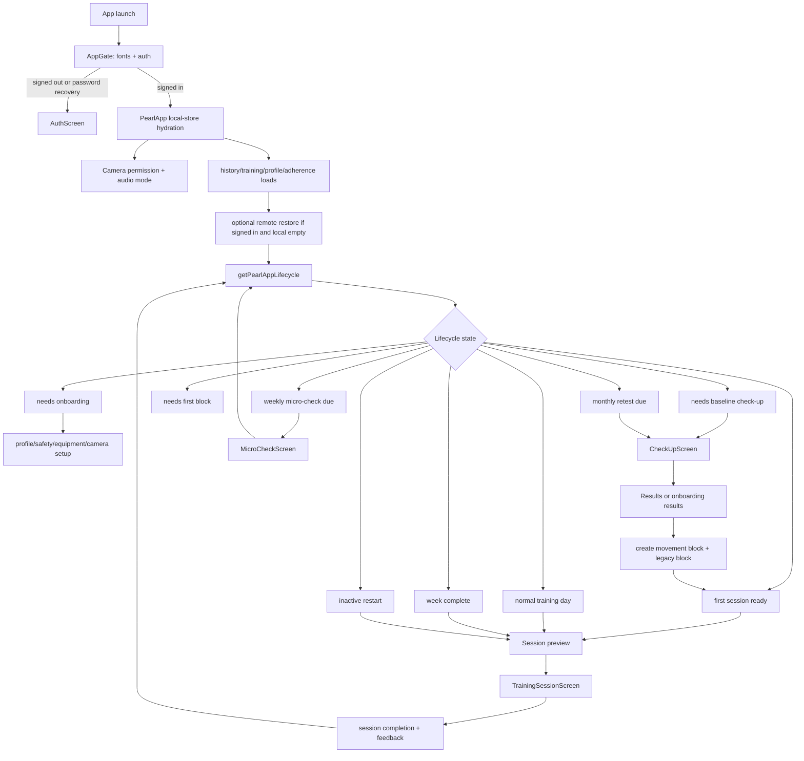
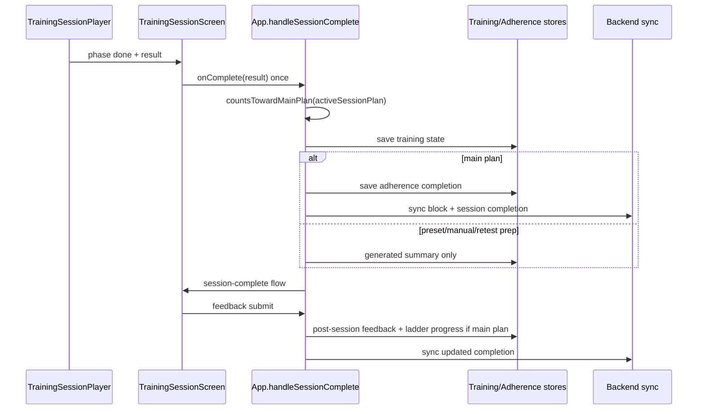
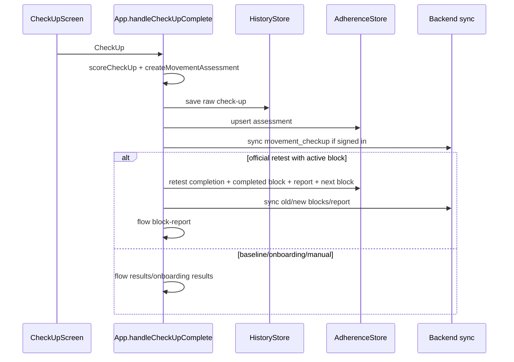

# Pearl Logic Audit Stage 0

Date: 2026-06-19  
Scope: production-readiness logic discovery and staged audit planning only.  
Status: no application code, tests, schemas, fixtures, config, dependencies, or generated assets were modified.

## 1. Executive summary

Pearl is implemented as a React Native/Expo app whose top-level runtime is coordinated by `App.tsx`. The app hydrates local file-backed stores, hydrates auth state, optionally restores remote Supabase state, computes a lifecycle state, and then routes into camera check-up, training, micro-check, onboarding, reports, settings, or tab screens. This is confirmed from runtime code in `AppGate` and `PearlApp` (`App.tsx:258-338`, `App.tsx:424-521`, `App.tsx:2051-2295`).

Major logic subsystems found: 18.

Distinct state machines found: 17. They include auth/app gating, lifecycle routing, onboarding step derivation, pose tracking, camera preflight, check-up orchestration, per-assessment controllers, micro-check runner, training-session player, rep cycle tracking, rep velocity tracking, hold tracking, timed-task tracking, max-ROM tracking, valid-time accumulation, set graders, and backend launch restore/sync guards.

Important persistent entities found: 13. Local entities include preferences/profile/onboarding, check-up history, training state, micro-checks, adherence state, recordings, and auth session. Backend entities include profiles, movement checkups, movement blocks, training state snapshots, training session completions, micro-checks, and block reports.

Material decision rules or threshold groups found: 83. These cover lifecycle gates, camera validity, preflight, pose reliability, movement thresholds, scoring, exercise filtering, progression, date rules, sync idempotency, and fallbacks. The detailed register is in section 12.

Existing test-suite shape: 75 `*.test.ts` / `*.test.tsx` files under `src/**/__tests__`, plus 4 replay fixture files under `src/replay/__tests__/fixtures`, with 588 `describe` / `it` / `test` occurrences found by static scan. Tests are strongest for pure state machines, scoring, pose primitives, replay fixtures, generation helpers, serializers, and backend mappers. They are weakest at cross-subsystem runtime interactions that pass through `App.tsx`, asynchronous navigation, account switching, device interruption, and physical camera/audio behavior.

Highest-risk areas to audit next:

1. Baseline/check-up validity can still feed onboarding and block creation paths. The onboarding results screen always exposes create-block action (`src/screens/OnboardingResultsScreen.tsx:21-70`), while invalid/low-confidence assessments can be created and routed to results (`App.tsx:1210-1339`, `src/pearlFlow/assessments.ts:68-76`).
2. Session completion semantics are not yet a single explicit contract. A session can reach `done` after skipped items, and `handleSessionComplete` records a plan completion when `countsTowardMainPlan` permits it (`src/training/sessionPlayer.ts:173-188`, `src/training/sessionPlayer.ts:457-462`, `App.tsx:1497-1590`).
3. Dynamic planning can see non-training completions as recent sessions. `App.tsx` passes all `adherence.completions` into planning (`App.tsx:1406-1438`), `recentSessionsFor` maps them all to completed sessions (`src/pearlFlow/sessionPlanning.ts:537-560`), and `getTemplateSelection` counts recent sessions by block (`src/training/workoutGeneration.ts:307-347`).
4. Equipment state is split between safety profile and legacy training equipment, with later generation applying both and deleting optional equipment from the safety-derived set (`App.tsx:1741-1781`, `src/pearlFlow/sessionPlanning.ts:646-671`).
5. Account sign-out and local-data deletion are separate flows. Normal sign-out does not clear local Pearl files (`src/components/AccountAuthCard.tsx:173-182`, `src/services/backend/AuthProvider.tsx:271-284`), while explicit clearing is a separate confirmed action (`src/components/AccountAuthCard.tsx:217-251`, `src/services/backend/accountDataService.ts:53-107`).

Limitations of Stage 0:

- This report is based on static code reading, targeted registry dumps, and test inventory. I did not run the full test suite or perform physical device camera/audio testing.
- Exercise-science validity is not asserted. Thresholds and progression rules are listed as implemented behavior and marked for product/domain review where appropriate.
- The app currently has a dirty worktree before this report was created. Stage 0 did not revert or alter those existing changes.

## 2. Repository evidence and source-of-truth hierarchy

Source-of-truth hierarchy used:

1. Runtime source code and app config.
2. Type definitions and serializers.
3. Tests and fixtures.
4. Product docs and comments.

Runtime entry points:

| Area | Evidence | Conclusion |
| --- | --- | --- |
| Native/Expo entry | `index.ts:1-8`, `app.json:1-46` | Confirmed from runtime code. Expo registers `App`; camera permissions and local pose module are active. |
| App bootstrap | `App.tsx:258-338`, `App.tsx:339-369` | Confirmed from runtime code. Fonts/auth/store readiness gate app rendering. |
| Auth provider | `src/services/backend/AuthProvider.tsx:80-172`, `src/services/backend/authService.ts:295-524` | Confirmed from runtime code. Supabase auth is active. |
| Navigation shell | `App.tsx:1963-2022`, `App.tsx:2236-2295`, `src/navigation/TabBar.tsx` | Confirmed from runtime code. Routing is primarily explicit flow state plus tab state, not a router library. |
| Camera flows | `App.tsx:173-175`, `App.tsx:2024-2049`, `App.tsx:2051-2233` | Confirmed from runtime code. Camera permission/audio gates wrap check-up, training, micro-check, and dev live flows. |

Business-logic modules:

| Subsystem | Authoritative modules |
| --- | --- |
| Lifecycle | `src/pearlFlow/appLifecycle.ts`, `src/adherence/dateUtils.ts`, `src/adherence/adherenceState.ts` |
| Onboarding | `src/onboarding/state.ts`, `src/screens/*Onboarding*`, `App.tsx:1027-1133` |
| Check-up orchestration | `src/checkup/checkup.ts`, `src/assessment/sessionController.ts`, `src/screens/CheckUpScreen.tsx` |
| Assessments | `src/movements/chairStand.ts`, `src/movements/balanceLadder.ts`, `src/movements/shoulderFlexion.ts`, `src/movements/hingeReach.ts`, `src/movements/tug.ts` |
| Pose/preflight | `src/pose/pipeline.ts`, `src/pose/chains.ts`, `src/pose/calibration.ts`, `src/pose/subjectValidity.ts`, `src/preflight/preflight.ts` |
| Scoring | `src/scoring/scoring.ts`, `src/scoring/norms.ts`, `src/pearlFlow/assessments.ts` |
| Exercise catalogue | `src/exercises/index.ts`, `src/exercises/registry.ts`, `src/exercises/ladders.ts`, `src/exercises/*.ts` |
| Workout generation | `src/training/workoutGeneration.ts`, `src/pearlFlow/sessionPlanning.ts`, `src/training/block.ts` |
| Training execution | `src/training/sessionPlayer.ts`, `src/exercises/setGraders.ts`, `src/exercises/validTime.ts`, `src/screens/TrainingSessionScreen.tsx` |
| Progression | `src/training/progression.ts`, `src/training/workoutGeneration.ts`, `src/training/validTimeProgression.ts`, `src/pearlFlow/sessionPlanning.ts` |
| Persistence | `src/history/store.ts`, `src/training/store.ts`, `src/profile/store.ts`, `src/adherence/store.ts` and serializers |
| Backend sync | `src/services/backend/*SyncService.ts`, `src/services/backend/restoreService.ts`, `src/services/backend/launchSyncGuards.ts` |

Stores:

| Store | File | Key/files | Conclusion |
| --- | --- | --- | --- |
| HistoryStore | `src/history/store.ts:50-68` | `checkup-*.json` | Confirmed from runtime code. Scans all JSON files and accepts only deserializable check-ups. |
| TrainingStore | `src/training/store.ts:23-62` | `training-state.json`, `microcheck-*.json` | Confirmed from runtime code. State and micro-check files share the same file adapter root. |
| ProfileStore | `src/profile/store.ts:12-30` | `preferences.json` | Confirmed from runtime code. Preferences are overwritten as one file. |
| AdherenceStore | `src/adherence/store.ts:9-26` | `adherence-state.json` | Confirmed from runtime code. Adherence state is one JSON envelope. |
| Supabase auth storage | `src/lib/supabase.ts:23-31` | AsyncStorage on native | Confirmed from runtime code. Auth session is separate from Pearl file stores. |

Backend modules:

| Backend area | Evidence | Active? |
| --- | --- | --- |
| Profile | `src/services/backend/profileService.ts`, `src/services/backend/profileSyncService.ts:96-133` | Active. App syncs profile/preferences after local changes (`App.tsx:567-616`). |
| Check-ups | `src/services/backend/checkupSyncService.ts:48-137` | Active. Recent local history is synced when signed in (`App.tsx:683-732`). |
| Blocks | `src/services/backend/blockSyncService.ts:54-204` | Active. Movement blocks sync from adherence state (`App.tsx:734-789`). |
| Training state | `src/services/backend/trainingStateSyncService.ts:38-125` | Active. Snapshot upsert by user id. |
| Session completions | `src/services/backend/sessionSyncService.ts:77-189` | Active. Syncs starter/standard/restart/retest_prep, skips micro_check and retest. |
| Micro-checks | `src/services/backend/microCheckSyncService.ts` | Active. Micro-check files sync separately. |
| Restore | `src/services/backend/restoreService.ts:191-347` | Active at signed-in launch when local state is empty (`App.tsx:424-521`). |
| Data export/account data | `src/services/backend/dataExportService.ts`, `src/services/backend/accountDataService.ts:53-112` | Active in account UI. |

Documentation/code contradiction:

| Topic | Documentation | Runtime code | Label |
| --- | --- | --- | --- |
| V1 backend/account scope | Project context says V1 is local-only, with prototype exceptions. | Supabase auth and sync are active imports and screens (`src/lib/supabase.ts:17-31`, `src/components/AccountAuthCard.tsx:157-182`, `App.tsx:371-521`, `App.tsx:567-981`). | Contradictory. Source code wins for this audit. |

## 3. End-to-end lifecycle map

Transition table:

| From | Trigger | Guards/data read | Writes | Destination | Evidence | Label |
| --- | --- | --- | --- | --- | --- | --- |
| Launch -> auth gate | App mount | `loading`, `isSignedIn`, `isPasswordRecovery` | none | `AuthScreen` or `PearlApp` | `App.tsx:258-278` | Confirmed from runtime code |
| PearlApp hydration | `useEffect` on mount | camera permission, audio config, four local stores | local React state | `localStoresReady` true | `App.tsx:339-369` | Confirmed from runtime code |
| Signed-in launch restore | auth/profile/local ready | local emptiness, flow null, not already attempted | writes restored local stores | `launchRestoreOutcome` | `App.tsx:424-521`, `src/services/backend/restoreService.ts:191-242` | Confirmed from runtime code |
| Lifecycle route | each render | profile, history, training, adherence, active block, date | none | `PearlAppLifecycleResult` | `App.tsx:1165-1175`, `src/pearlFlow/appLifecycle.ts:97-147` | Confirmed from runtime code |
| Start baseline | onboarding action | pending checkup type baseline | `pendingCheckup`, `flow` | camera setup/checkup | `App.tsx:1183-1207` | Confirmed from runtime code |
| Check-up complete | `CheckUpScreen.onComplete` | pending type, active block, history, adherence | history, assessment, block/report for retest | results or block report | `App.tsx:1210-1339` | Confirmed from runtime code |
| Create block | results CTA | visible result/score, profile prefs | training state, adherence block | block intro/onboarding block | `App.tsx:1352-1404` | Confirmed from runtime code |
| Start session | Today/Plan/Explore | active block, safety, prefs, completions, ladder progress | active session plan in memory | preview | `App.tsx:1406-1438` | Confirmed from runtime code |
| Begin session | preview CTA | active session plan | `sessionType`, `sessionIds`, `flow` | training camera | `App.tsx:1489-1495` | Confirmed from runtime code |
| Session complete | training player done | active plan, counts guard | training progress, adherence completion, generated summary | completion screen | `App.tsx:1497-1590` | Confirmed from runtime code |
| Feedback submit | completion screen | last completion, active plan | feedback, ladder progress, training state, sync | home | `App.tsx:1643-1739` | Confirmed from runtime code |
| Micro-check complete | micro-check runner done | active block optional | micro-check file, adherence completion | home | `App.tsx:1592-1640` | Confirmed from runtime code |
| Retest complete | official retest pending | active block | completes old block, report, next block | block report | `App.tsx:1256-1323` | Confirmed from runtime code |
| Sign out | account UI | auth context only | Supabase session cleared | auth screen | `src/components/AccountAuthCard.tsx:173-182`, `src/services/backend/AuthProvider.tsx:271-284` | Confirmed; local data persistence requires product decision |

Invalid or ambiguous lifecycle states:

- Invalid official assessment can exist and be selected by `latestOfficialAssessment` because it filters by official type but not `status === 'completed'` (`src/pearlFlow/assessments.ts:46-52`). Lifecycle's `hasOfficialAssessment` does filter completed status (`src/pearlFlow/appLifecycle.ts:356-358`). Label: contradictory.
- Active flow blocks remote restore and sets `launchRestoreOutcome` to `skipped_active_flow` (`App.tsx:424-438`). Because flow is in-memory, Stage 1 should audit whether any startup path can set flow before restore in a way that leaves remote state unhydrated. Label: ambiguous.
- Normal sign-out does not clear local Pearl files. A separate destructive flow does (`src/components/AccountAuthCard.tsx:217-251`). Label: requires product decision.

Restart/resume paths:

- Hydration restores persisted profile/history/training/micro-check/adherence stores, but not in-progress camera or training state (`App.tsx:339-369`, `src/training/sessionPlayer.ts:93-158`). Confirmed from runtime code.
- In-progress workout/check-up state is held in screen-local objects and refs, not persisted (`src/screens/TrainingSessionScreen.tsx:93-108`, `src/screens/MicroCheckScreen.tsx:47-103`). Inferred.

## 4. Master logic inventory

| ID | Subsystem | User entry point | Authoritative code | Inputs | Decisions | State mutations | Output | Existing tests | Trust impact | Audit priority |
| --- | --- | --- | --- | --- | --- | --- | --- | --- | --- | --- |
| L01 | App bootstrap/auth | app launch | `AppGate`, `AuthProvider` (`App.tsx:258-278`, `src/services/backend/AuthProvider.tsx:80-172`) | fonts, auth session/profile | signed out vs app | auth state | auth screen/app | backend auth component tests | Wrong user or wrong first screen | P0 |
| L02 | Local hydration | app launch | `PearlApp` load effect (`App.tsx:339-369`) | local stores | defaults on failure | React state | ready app state | store serializer tests | Lost/stale data | P0 |
| L03 | Remote restore | signed-in launch | `restoreRemoteStateIfLocalEmpty` (`src/services/backend/restoreService.ts:191-347`) | Supabase snapshot + local emptiness | restore/skip/timeout | stores | restored local state | `restoreService.test.ts` | Wrong account/progress recovery | P0 |
| L04 | Lifecycle routing | Today/Plan | `getPearlAppLifecycle` (`src/pearlFlow/appLifecycle.ts:97-147`) | profile/history/adherence/training/date | next state/action | none | lifecycle result | `appLifecycle.test.ts` | Wrong next action | P1 |
| L05 | Onboarding/profile | onboarding/settings | `deriveOnboardingStep`, App handlers (`src/onboarding/state.ts:18-45`, `App.tsx:1027-1133`) | life goal, safety, equipment | required steps | prefs/training equipment | onboarding route | `onboarding.test.ts` | Unsafe/incomplete setup | P0 |
| L06 | Check-up orchestrator | camera setup/check-up | `CheckUpOrchestrator` (`src/checkup/checkup.ts:117-319`) | landmarks, preflight, battery | phase, skip, completion | in-memory results | CheckUp | checkup tests | Misleading measurement | P0 |
| L07 | Pose/preflight | all camera flows | `PosePipeline`, `PreflightCheck` (`src/pose/pipeline.ts:152-230`, `src/preflight/preflight.ts:111-239`) | landmarks | tracking/ready/lighting | pipeline state | pose output/status | pose/preflight tests | Counting furniture/no person | P0 |
| L08 | Assessment measurements | check-up | movement definitions (`src/movements/*.ts`) | pose frames/body unit | reps/hold/ROM/time | grader state | item result | movement tests | Incorrect score | P0 |
| L09 | Scoring/results | results/progress | `scoreCheckUp`, `createMovementAssessment` (`src/scoring/scoring.ts:69-206`, `src/pearlFlow/assessments.ts:5-76`) | CheckUp | domain ages/weakest | assessments | score, focus | scoring tests | Wrong plan focus | P0 |
| L10 | Exercise catalogue | generation/practice | registry/ladders (`src/exercises/registry.ts:10-44`, `src/exercises/ladders.ts:81-750`) | exercise definitions | visible levels, links | none | catalogue | catalog tests | Unsupported/unsafe exercise | P0 |
| L11 | Block generation | create block/retest | `createMovementBlockFromAssessment`, legacy `buildBlock` (`src/adherence/blockService.ts:19-63`, `src/training/block.ts:108-170`) | assessment, prefs, equipment | focus/secondary/templates | blocks/training | active block | block tests | Wrong 4-week plan | P0 |
| L12 | Dynamic planning | Today/Plan/Explore | `planTodayPearlSession`, `generateTodaySession` (`src/pearlFlow/sessionPlanning.ts:94-191`, `src/training/workoutGeneration.ts:357-443`) | block, equipment, pain, readiness, progress | session/exercises | active plan memory | preview plan | sessionPlanning/workoutGeneration tests | Wrong session | P0/P1 |
| L13 | Training player | workout camera | `TrainingSessionPlayer` (`src/training/sessionPlayer.ts:93-463`) | exercise IDs, pose frames, audio busy | phase/set/rest/skip | in-memory result | TrainingSessionResult | sessionPlayer tests | Miscount/unsafe guidance | P0 |
| L14 | Set graders | workout active sets | `setGraders.ts` (`src/exercises/setGraders.ts:123-823`) | pose output | reps/hold/ROM/timer | grader state | SetResult | setGraders/validTime tests | Progression from bad data | P0 |
| L15 | Completion/progression | session complete/feedback | `handleSessionComplete`, `updateExerciseProgressionFromSession` (`App.tsx:1497-1590`, `src/pearlFlow/sessionPlanning.ts:424-456`) | result, feedback, plan | counts/progress | training/adherence | completion, ladder progress | progression/workout tests | Plan advances wrongly | P0 |
| L16 | Micro-check/retest/report | Today/Progress | `MicroCheckRunner`, retest path (`src/training/microCheck.ts:119-208`, `App.tsx:1256-1323`) | active block/date/result | due/report/next block | microchecks, completions, blocks, reports | trend/report | microCheck/adherence tests | Wrong report/retest | P1 |
| L17 | Persistence/sync | background effects | store and sync services | local state, auth, backend | sync/skip/retry | local files/Supabase | durable state | backend mapper tests | Duplicate/lost progress | P0 |
| L18 | Account/support/reminders/export | settings/account | `AccountAuthCard`, account/data services | auth, local files, support prefs | sign out/export/clear | auth/local files/prefs | account action | component/account tests | Wrong user/data trust | P0/P1 |

## 5. Subsystem logic contracts

### 5.1 App bootstrap, auth, hydration, and lifecycle

- Purpose: present the correct top-level experience for signed-out, new, returning, restored, and interrupted users.
- Authoritative entry point: `AppGate` and `PearlApp` (`App.tsx:258-338`).
- Inputs: auth state, fonts, camera permission, local history/training/profile/adherence/micro-checks, remote snapshot, today's date.
- Preconditions: Supabase env vars must exist because `requiredEnv` throws at import time (`src/lib/supabase.ts:7-23`).
- Outputs: an auth screen, a camera flow, a modal flow, or the tab shell.
- State mutations: loads local stores, updates React state, attempts remote restore, schedules sync effects (`App.tsx:339-521`, `App.tsx:567-981`).
- Invariants to audit: local hydration must complete before lifecycle actions; failed remote restore must not overwrite remote with empty defaults; sign-in state must not mix with previous local files.
- Failure modes: local store load falls back to defaults (`App.tsx:339-369`); remote restore can return timeout/failed (`src/services/backend/restoreService.ts:232-240`); env misconfiguration throws on import (`src/lib/supabase.ts:7-21`).
- Recovery behavior: launch retry scheduled for failed/signed-out syncs (`App.tsx:415-422`, `src/services/backend/launchSyncGuards.ts:31-37`).
- Current tests: backend restore and launch guards are tested (`src/services/backend/__tests__/restoreService.test.ts`, `src/services/backend/__tests__/launchSyncGuards.test.ts`); full `App.tsx` interaction is not directly tested.
- Unresolved assumptions: whether ordinary sign-out should preserve local Pearl data.

### 5.2 Onboarding, safety, profile, and preferences

- Purpose: collect minimum profile/safety context before baseline and block creation.
- Authoritative entry point: `deriveOnboardingStep` (`src/onboarding/state.ts:18-45`) plus App handlers (`App.tsx:1027-1133`).
- Inputs: `lifeGoal`, `safetyProfile`, selected equipment, onboarding flags, history, active block.
- Preconditions: life goal and safety profile are required before baseline according to lifecycle (`src/pearlFlow/appLifecycle.ts:360-362`).
- Outputs: onboarding step and saved preferences.
- State mutations: preferences file and, for safety/equipment handlers, training equipment fields (`App.tsx:1050-1113`).
- Invariants to audit: incomplete onboarding must not produce a workout; later equipment edits must affect future generation; safety restrictions must not be overridden by older equipment flags.
- Failure modes: profile save logs but does not surface persistence failure (`App.tsx:551-565`); onboarding results can be shown after low-confidence assessment (`App.tsx:1324-1339`).
- Recovery behavior: persisted onboarding state resumes via preferences (`src/profile/serialize.ts:176-193`).
- Current tests: `src/onboarding/__tests__/onboarding.test.ts`, `src/profile/__tests__/serialize.test.ts`.
- Unresolved assumptions: whether an unmeasured baseline should allow a plan.

### 5.3 Pose, camera preflight, and measurement readiness

- Purpose: turn native landmark events into reliable pose state and user-facing readiness.
- Authoritative entry point: `PosePipeline.process` (`src/pose/pipeline.ts:152-230`) and `PreflightCheck.update` (`src/preflight/preflight.ts:111-239`).
- Inputs: one landmark-array event per frame from native `PoseDetectionView`.
- Preconditions: plausible human validity and required limb-chain reliability.
- Outputs: tracking state, body-unit scale, interruptions, framing/lighting status.
- State mutations: pipeline reliability windows, warmup, subject-gone counters, calibration samples.
- Invariants to audit: no counting during warmup/preflight; subject leaving frame resets in-flight state; body-unit calibration must be stable before body-unit metrics.
- Failure modes: no subject, interrupted, poor lighting, unstable framing.
- Recovery behavior: warmup returns to tracking after stable subject; preflight samples again after failed lighting (`src/preflight/preflight.ts:126-177`).
- Current tests: pose pipeline, chains, calibration, subject validity, filters, preflight, prompt timing.
- Unresolved assumptions: thresholds require device/environment validation.

### 5.4 Movement Check-Up orchestration and assessments

- Purpose: run the monthly/baseline Movement Check-Up and produce raw measurements.
- Authoritative entry point: `CheckUpOrchestrator` (`src/checkup/checkup.ts:117-319`).
- Inputs: battery, landmarks, preflight, movement graders, user skip/retry/cancel.
- Preconditions: camera/audio permission gate in `App.tsx:2024-2049`.
- Outputs: `CheckUp` with item statuses and results.
- State mutations: in-memory item index, preflight, assessment controllers, result list.
- Invariants to audit: skipped/unmeasured items cannot be interpreted as reliable domains; beta TUG must not appear in default production battery; repeated completion must not duplicate history.
- Failure modes: setup issue latch, no-measurement flags, tracking interruptions, explicit skip.
- Recovery behavior: retry setup resets preflight/controller (`src/checkup/checkup.ts:136-142`); skip records skipped (`src/checkup/checkup.ts:144-152`).
- Current tests: `src/checkup/__tests__/*`, movement tests, replay fixtures.
- Unresolved assumptions: minimum valid data by assessment needs clinical/product review.

### 5.5 Scoring, interpretation, assessments, and block focus

- Purpose: map raw check-up metrics into domain scores, age bands, weakest domain, and adherence assessment records.
- Authoritative entry points: `scoreCheckUp` (`src/scoring/scoring.ts:192-206`) and `createMovementAssessment` (`src/pearlFlow/assessments.ts:5-76`).
- Inputs: completed `CheckUp`, scoring norm tables, profile only indirectly through UI; age/sex are not used in scoring.
- Preconditions: item must be `measured` and not flagged `no-measurement` to be usable (`src/scoring/scoring.ts:69-73`).
- Outputs: `CheckUpScore`, `MovementAssessment`.
- State mutations: history and adherence assessment insertion in `App.tsx:1210-1255`.
- Invariants to audit: invalid/low-confidence assessment must not drive official plan creation unless explicitly intended; manual/extra checks must not overwrite official results.
- Failure modes: missing domains produce unmeasured scores with `NaN` bounds (`src/scoring/scoring.ts:112-123`); no measured domain leaves `weakestDomain` null (`src/scoring/scoring.ts:192-206`).
- Recovery behavior: retake/manual options exist, but retake replacement semantics need deeper audit (`src/checkup/manualCheckup.ts:20-129`).
- Current tests: `src/scoring/__tests__/scoring.test.ts`.
- Unresolved assumptions: all norms and extrapolated bands require domain review.

### 5.6 Exercise catalogue and workout generation

- Purpose: select safe, playable, equipment-compatible exercises for a block/session.
- Authoritative entry points: `listExercises`, `getExercise`, `listExerciseLadders`, `generateTodaySession` (`src/exercises/registry.ts:10-44`, `src/exercises/ladders.ts:81-750`, `src/training/workoutGeneration.ts:357-443`).
- Inputs: block focus, safety/equipment, pain areas, readiness, ladder progress, recent completions, templates, optional-level flag.
- Preconditions: generated exercise IDs must exist in registry (`src/pearlFlow/sessionPlanning.ts:125-135`, `src/pearlFlow/sessionPlanning.ts:602-605`).
- Outputs: `PearlSessionPlan`.
- State mutations: none during generation; plan is held in App state.
- Invariants to audit: unavailable equipment and pain-excluded movements must not be selected; substitutions must not reintroduce the excluded reason; session must be playable by `TrainingSessionPlayer`.
- Failure modes: empty generated sessions fall back to legacy plan (`src/pearlFlow/sessionPlanning.ts:125-143`); unsupported generated IDs fall back.
- Recovery behavior: legacy fallback uses `training.nextSessionExercises` (`src/pearlFlow/sessionPlanning.ts:501-535`).
- Current tests: `workoutGeneration.test.ts`, `sessionPlanning.test.ts`, `catalog.test.ts`.
- Unresolved assumptions: exercise progression order/volume requires exercise-programming review.

### 5.7 Training-session execution and completion

- Purpose: run a voice-guided session with pose-supported measurement and save completion/progression data.
- Authoritative entry points: `TrainingSessionScreen`, `TrainingSessionPlayer`, `handleSessionComplete`, `handleSessionFeedback` (`src/screens/TrainingSessionScreen.tsx:82-237`, `src/training/sessionPlayer.ts:93-463`, `App.tsx:1497-1739`).
- Inputs: active session plan, exercise IDs, pose frames, voice busy flag, user pause/skip/retry/stop, feedback.
- Preconditions: camera/audio gate and active plan exists.
- Outputs: `TrainingSessionResult`, `TrainingSessionCompletion`, generated summary, optional ladder progress update.
- State mutations: training state, adherence completions, generated summaries, backend sync.
- Invariants to audit: skip/stop/invalid tracking semantics must be explicit; a session cannot complete twice; plan IDs, voice cues, visible exercise, detector, and saved result must align.
- Failure modes: setup timeout latches; stop cancels to home; skipped items are represented in result; force-close loses in-progress state.
- Recovery behavior: retry setup and pause/resume adjust timing (`src/training/sessionPlayer.ts:164-200`, `src/screens/TrainingSessionScreen.tsx:203-237`).
- Current tests: session player, set graders, progression, valid-time progression.
- Unresolved assumptions: whether completion should count when some/all items were skipped.

### 5.8 Persistence and backend sync

- Purpose: persist local state first, then optionally sync signed-in users to Supabase and restore on new installs.
- Authoritative entry points: stores and sync effects (`App.tsx:541-981`, `src/services/backend/*SyncService.ts`).
- Inputs: local state, auth user, remote rows.
- Preconditions: sync requires signed-in user; remote restore only when local state is empty.
- Outputs: local JSON, Supabase upserts, restored local state.
- State mutations: local files and remote tables.
- Invariants to audit: local writes before remote sync must be recoverable; retries must be idempotent; remote restore must not erase richer local state; previous-account local data must not leak into new account.
- Failure modes: local store save errors are logged but UI generally continues (`App.tsx:541-565`); backend sync failures log and retry guards may schedule launch retry.
- Recovery behavior: sync services use upsert keys and fingerprints (`src/services/backend/trainingStateSyncService.ts:35-87`, `src/services/backend/sessionSyncService.ts:68-158`).
- Current tests: backend sync mapper tests, restore tests, account data tests.
- Unresolved assumptions: source-of-truth conflict strategy between two devices is not a true merge in current code.

## 6. Check-Up and assessment map

### 6.1 Check-up battery

| Assessment | Active production default? | Evidence | Label |
| --- | --- | --- | --- |
| 30-second chair stand | Yes | `DEFAULT_BATTERY` includes `chair-stand-30s` (`src/checkup/checkup.ts:35-41`) | Confirmed from runtime code |
| Balance ladder | Yes | `DEFAULT_BATTERY` includes `balance-ladder` (`src/checkup/checkup.ts:35-41`) | Confirmed from runtime code |
| Shoulder flexion peak | Yes | `DEFAULT_BATTERY` includes `shoulder-flexion-peak` (`src/checkup/checkup.ts:35-41`) | Confirmed from runtime code |
| Hinge reach | Yes | `DEFAULT_BATTERY` includes `hinge-reach` (`src/checkup/checkup.ts:35-41`) | Confirmed from runtime code |
| Timed Up and Go | Beta hidden | `BETA_BATTERY_WITH_TUG` includes TUG, default battery does not (`src/checkup/checkup.ts:43-50`) | Beta-hidden path |

### 6.2 Check-up state machine

| Phase | Entry | Exit | Timers/fallbacks | Evidence |
| --- | --- | --- | --- | --- |
| intro | new orchestrator | first update/voice flow | none in orchestrator | `src/checkup/checkup.ts:52-81`, `src/checkup/checkup.ts:162-216` |
| transition | item change | dwell elapsed and voice not busy | 1500 ms transition dwell | `src/checkup/checkup.ts:67-81`, `src/checkup/checkup.ts:227-234` |
| setup/preflight | item setup | preflight ready/body unit | max framing 60000 ms setup issue | `src/checkup/checkup.ts:270-275`, `src/preflight/preflight.ts:46-76` |
| assessment controller | framing ready | countdown then active | controller config owns countdown/dwell | `src/assessment/sessionController.ts:71-77`, `src/assessment/sessionController.ts:137-237` |
| active measurement | countdown go | duration, grader complete, max active | max active 180000 ms | `src/assessment/sessionController.ts:201-223` |
| result/advance | controller result | linger/voice idle | result linger 800 ms | `src/assessment/sessionController.ts:226-237` |
| complete/done | all items done | finish | fills unreached as skipped | `src/checkup/checkup.ts:309-319` |

### 6.3 Per-assessment logic

| Assessment | View/equipment | Start/end | Key thresholds | Invalid/edge behavior | Evidence |
| --- | --- | --- | --- | --- | --- |
| Chair stand | side, 1 chain, chair | fixed 30 s capture; rep cycle through knee angle | up 155 deg, down 110 deg, velocity EMA 0.3, max 64 reps, push-off distance 0.15 BU | subject-gone resets velocity/side; no reps -> no-measurement; push-off is flag only | `src/movements/chairStand.ts:52-75`, `src/movements/chairStand.ts:114-216`, `src/movements/chairStand.ts:232-247` |
| Balance ladder | front, 2 chains, no equipment but safety copy says counter | staged holds | get-ready 3000 ms, stages 10/10/10/10/12 s, single-leg lift 0.18 BU, step-out 0.55 BU, debounce 4 frames | subject-gone interrupt; single-leg metric `NaN` if not attempted/interrupted | `src/movements/balanceLadder.ts:79-94`, `src/movements/balanceLadder.ts:135-271`, `src/movements/balanceLadder.ts:289-302` |
| Shoulder flexion | side, 1 chain, none | fixed 9 s capture | EMA 0.3, valid capture 3000 ms, position angle >=35 deg | fallback peak can be returned even if valid-time primary incomplete | `src/movements/shoulderFlexion.ts:42-53`, `src/movements/shoulderFlexion.ts:92-144`, `src/movements/shoulderFlexion.ts:159-173` |
| Hinge reach | side, 1 chain, none | fixed 9 s capture | EMA 0.3, valid capture 3000 ms, trunk angle <=165 deg | fallback reach can be returned even if valid-time primary incomplete; reach can be negative if landmarks put wrist below floor | `src/movements/hingeReach.ts:39-49`, `src/movements/hingeReach.ts:88-147`, `src/movements/hingeReach.ts:162-176` |
| TUG | side, 1 chain, chair | seated -> seat-off -> walking -> turn -> reseat | stand knee 150/165 deg, seat 120 deg, hip EMA 0.3, walk velocity 0.25 BU/s, turn excursion 1.2 BU, short path 1.6 BU | beta hidden; incomplete/short-path/no-measurement flags | `src/movements/tug.ts:45-80`, `src/movements/tug.ts:104-221`, `src/movements/tug.ts:240-253` |

### 6.4 Measurement pipeline

- Pose validity checks core visibility, bounding box, torso/leg proportions, and torso length (`src/pose/subjectValidity.ts:25-47`, `src/pose/subjectValidity.ts:65-134`). Confirmed from runtime code.
- Chain reliability is smoothed over a 15-frame window and divides by full window length (`src/pose/chains.ts:34-79`). Confirmed from runtime code.
- Tracking requires plausible subject plus enough reliable chains, then 1500 ms warmup before tracking (`src/pose/pipeline.ts:45-79`, `src/pose/pipeline.ts:152-230`). Confirmed from runtime code.
- Body unit is calibrated from hip-to-ankle median over 45 stable samples (`src/pose/calibration.ts:14-31`, `src/pose/calibration.ts:58-103`). Confirmed from runtime code.
- Preflight checks body size/centering/stability and 2000 ms detection quality sample (`src/preflight/preflight.ts:46-76`, `src/preflight/preflight.ts:111-239`). Confirmed from runtime code.

### 6.5 Scoring pipeline and check-up type semantics

- `scoreCheckUp` ignores any item not `measured` or flagged `no-measurement` (`src/scoring/scoring.ts:69-73`). Confirmed from runtime code.
- Strength uses chair stand reps as primary and rise velocity as a row/detail (`src/scoring/scoring.ts:125-142`). Requires exercise-science review.
- Balance uses single-leg hold as primary; TUG is only supporting row when present (`src/scoring/scoring.ts:144-170`). Requires exercise-science review.
- Mobility uses shoulder flexion as the domain score and hinge reach as detail (`src/scoring/scoring.ts:172-190`). Requires exercise-science review.
- Weakest domain is the highest age midpoint among measured domains, with tie behavior determined by domain iteration order and `>` comparison (`src/scoring/scoring.ts:192-206`). Confirmed from runtime code.
- `beginCheckUp` defaults to `manual_extra` if any latest assessment exists, otherwise `baseline`; official types are baseline, baseline retake, and official retest (`App.tsx:1183-1198`, `src/pearlFlow/assessments.ts:42-44`). Confirmed from runtime code.
- Retest completion can mark the current block completed, create a report, and create the next block in one handler (`App.tsx:1256-1323`). Confirmed from runtime code.
- Weekly micro-check is separate from full check-up and is not part of `DEFAULT_BATTERY` (`src/training/microCheck.ts:50-66`, `src/pearlFlow/microCheck.ts:5-20`). Confirmed from runtime code.

Known ambiguities:

- Baseline retake replacement is modeled in `manualCheckup.ts`, but Stage 0 did not find a complete replacement path in `App.tsx`; `handleCheckUpComplete` appends history (`App.tsx:1236-1252`). Label: ambiguous.
- An invalid official assessment can be latest official in one helper but not count as baseline in lifecycle (`src/pearlFlow/assessments.ts:46-52`, `src/pearlFlow/appLifecycle.ts:356-358`). Label: contradictory.
- TUG exists and is tested, but is not in production default battery. Label: beta-hidden.

## 7. Exercise catalogue and progression map

The active exercise registry imports definitions in `src/exercises/index.ts:8-22` and exports 37 exercise IDs in `src/exercises/index.ts:24-63`. Duplicate registration throws in `src/exercises/registry.ts:10-44`. Ladder metadata is authoritative for V1/beta exposure and lives in `src/exercises/ladders.ts:81-750`.

### 7.1 Complete exercise matrix

| ID | Name | Family | Level | Slot | Type | Equipment | Camera | Prescription | Progression/regression/substitute | Production eligibility |
| --- | --- | --- | --- | --- | --- | --- | --- | --- | --- | --- |
| `sts-cushion` | Cushion Sit-to-Stand | sit-to-stand | 1 | lower-push | reps | chair+cushion | side | 2x8, rest 45s | progress `sts-standard` | v1 core via ladder |
| `sts-standard` | Sit-to-Stand | sit-to-stand | 2 | lower-push | reps | chair | side | 3x10, rest 45s | progress `sts-slow-eccentric`, regress `sts-cushion` | v1 core |
| `sts-slow-eccentric` | Slow-Lower Sit-to-Stand | sit-to-stand | 3 | lower-push | reps | chair | side | 3x8, rest 60s | progress `sts-power`, regress `sts-standard` | v1 core |
| `sts-power` | Power Sit-to-Stand | sit-to-stand | 4 | lower-push | reps | chair | side | 3x12, rest 75s | progress `loaded-sit-to-stand`, regress `sts-slow-eccentric` | v1 core |
| `loaded-sit-to-stand` | Loaded Sit-to-Stand | sit-to-stand | 5 | lower-push | reps | chair+backpack_or_weight | side | 3x8, rest 75s | regress/substitute `sts-power` | v1 optional |
| `squat-supported` | Supported Squat | squat | 1 | lower-push | reps | chair | side | 2x10, rest 45s | progress `squat-free` | v1 core via ladder, but ladder also requires counter |
| `squat-free` | Squat | squat | 2 | lower-push | reps | none | side | 3x12, rest 60s | progress `squat-slow-eccentric`, regress `squat-supported` | v1 core |
| `squat-slow-eccentric` | Slow-Lower Squat | squat | 3 | lower-push | reps | none | side | 3x8, rest 60s | progress `squat-loaded`, regress `squat-free` | v1 optional |
| `squat-loaded` | Loaded Squat | squat | 4 | lower-push | reps | backpack_or_weight | side | 3x8, rest 75s | progress `chair-supported-split-squat`, regress/substitute `squat-slow-eccentric` | v1 optional |
| `chair-supported-split-squat` | Chair-Supported Split Squat | squat | 5 | lower-push | reps | chair | side | 2x8, rest 75s | regress `squat-loaded` | v1 optional, ladder also requires counter |
| `step-up` | Step-Up | step-up | 1 | power | reps | stair | side | 3x12, rest 60s | substitute `sts-standard` | v1 core |
| `heel-raise-supported` | Supported Heel Raise | heel-raise | 1 | lower-push | reps | wall | side | 2x15, rest 40s | progress `heel-raise-free` | v1 core, ladder also allows counter |
| `heel-raise-free` | Heel Raise | heel-raise | 2 | lower-push | reps | none | side | 3x18, rest 40s | progress `toe-raise-supported`, regress `heel-raise-supported` | v1 core |
| `toe-raise-supported` | Supported Toe Raise | heel-raise | 3 | lower-push | timer | wall | side | 2x30s, rest 30s | regress `heel-raise-free` | v1 core, ladder also allows counter |
| `glute-bridge-hold` | Bridge Hold | glute-bridge | 1 | hinge | hold | floor | side | 3x20s, rest 40s | progress `glute-bridge-reps` | v1 core, ladder side_oblique |
| `glute-bridge-reps` | Glute Bridge | glute-bridge | 2 | hinge | reps | floor | side | 3x12, rest 45s | regress `glute-bridge-hold` | v1 core, ladder side_oblique |
| `push-up-wall` | Wall Push-Up | push-up | 1 | upper-push | reps | wall | side | 2x10, rest 45s | progress `push-up-incline` | v1 core |
| `push-up-incline` | Incline Push-Up | push-up | 2 | upper-push | reps | chair | side | 3x10, rest 50s | progress `push-up-standard`, regress `push-up-wall` | v1 core, ladder also allows counter |
| `push-up-standard` | Push-Up | push-up | 3 | upper-push | reps | floor | side | 3x8, rest 60s | regress `push-up-incline` | v1 optional |
| `overhead-reach` | Overhead Reach | overhead | 1 | pull-reach | reps | none | side | 2x12, rest 40s | progress `overhead-press-band` | v1 core |
| `overhead-press-band` | Band Overhead Press | overhead | 2 | pull-reach | reps | long_band | side | 3x12, rest 50s | regress/substitute `overhead-reach` | v1 core |
| `hip-hinge-wall` | Wall-Tap Hinge | hip-hinge | 1 | hinge | reps | wall | side | 2x10, rest 45s | progress `hip-hinge-free` | v1 core |
| `hip-hinge-free` | Hip Hinge | hip-hinge | 2 | hinge | reps | none | side | 3x12, rest 45s | regress `hip-hinge-wall` | v1 core |
| `balance-feet-together-hold` | Feet-Together Hold | balance | 1 | balance | hold | none | front | 3x20s, rest 30s | progress `balance-tandem-hold` | v1 core, ladder requires counter |
| `balance-tandem-hold` | Tandem Hold | balance | 2 | balance | hold | none | front | 3x20s, rest 30s | progress `balance-single-leg-hold`, regress `balance-feet-together-hold` | v1 core, ladder requires counter |
| `balance-single-leg-hold` | Single-Leg Hold | balance | 3 | balance | hold | none | front | 3x15s, rest 30s | regress `balance-tandem-hold` | v1 core, ladder requires counter |
| `seated-hamstring-reach` | Seated Hamstring Reach | hamstring-reach | 1 | mobility | rom | chair | side | 2x12s capture, rest 20s | none | v1 core |
| `neck-rotation` | Neck Rotations | neck-rotation | 1 | mobility | rom | none | front | 1x14s capture, rest 15s | none | v1 optional, ladder not_required |
| `loaded-march` | March in Place | march | 1 | power | reps | none | side | 3x16, rest 45s | none | v1 core in lateral ladder |
| `seated-band-row` | Seated Band Row | pull-upper-back | 1 | pull-reach | reps | chair+long_band | side_oblique | 2x10, rest 45s | progress `standing-band-row`, substitute `overhead-reach` | v1 core |
| `standing-band-row` | Standing Band Row | pull-upper-back | 2 | pull-reach | reps | long_band | side_oblique | 3x10, rest 50s | progress `band-pull-apart`, regress `seated-band-row`, substitute `overhead-reach` | v1 core, ladder also requires door_anchor |
| `band-pull-apart` | Band Pull-Apart | pull-upper-back | 3 | pull-reach | timer | long_band | front | 2x30s, rest 40s | regress `standing-band-row`, substitute `overhead-reach` | v1 core |
| `supported-side-step` | Supported Side Step | lateral-stability | 1 | balance | timer | counter | front | 2x30s, rest 30s | progress `mini-band-lateral-walk` | v1 core |
| `mini-band-lateral-walk` | Mini-Band Lateral Walk | lateral-stability | 2 | balance | timer | mini_band | front | 2x30s, rest 35s | regress/substitute `supported-side-step` | v1 optional |
| `thoracic-rotation` | Thoracic Rotation | mobility-flexibility | 1 | mobility | timer | none | front | 2x30s, rest 20s | none | v1 core, ladder says chair |
| `supported-hip-flexor-stretch` | Supported Hip Flexor Stretch | mobility-flexibility | 2 | mobility | timer | chair | side | 2x30s, rest 15s | none | v1 core, ladder also requires counter |
| `wall-calf-stretch` | Wall Calf Stretch | mobility-flexibility | 3 | mobility | timer | wall | side | 2x30s, rest 15s | none | v1 core |

Notes:

- The registry dump confirms 37 exercises. The matrix above is generated from the active registry/ladders, not from docs. Label: confirmed from runtime code.
- Exercise definitions often have 1-based `level`, while ladder levels are 0-based. Label: product-logic ambiguity because UI may show ladder levels while player uses definitions (`src/exercises/types.ts:120-143`, `src/exercises/ladders.ts:25-41`).
- Several exercise definitions and ladder levels disagree on equipment or camera view, for example balance definitions require `none` while ladder levels require `counter`; glute bridge definitions use side view while ladder levels use side_oblique. Label: product-logic/UX contradiction requiring audit.

### 7.2 Progression ladders

There are 11 ladders: sit-to-stand, squat, step-up, heel-toe-raise, push, pull-upper-back, hinge-glutes, shoulder-reach-press, balance, lateral-stability, mobility-flexibility. Ladder release filtering is by level release status, not by exercise definition release status (`src/training/workoutGeneration.ts:958-962`, `src/exercises/ladders.ts:81-750`).

### 7.3 Substitution graph and constraints

- Missing equipment substitutions are direct exercise `substituteId` links in definitions and are used by legacy block resolution (`src/training/block.ts:133-160`). Confirmed from runtime code.
- Dynamic generation primarily selects ladder levels by equipment/pain/readiness rather than walking definition `substituteId` links (`src/training/workoutGeneration.ts:728-776`). Confirmed from runtime code.
- Pain-area exclusions are centralized in `isPainContraindicated` (`src/training/workoutGeneration.ts:984-1019`). Confirmed from runtime code.
- Equipment support is duplicated in `workoutGeneration.ts`, `sessionPlanning.ts`, and `exploreViewModel.ts` (`src/training/workoutGeneration.ts:964-982`, `src/pearlFlow/sessionPlanning.ts:673-687`, `src/pearlFlow/exploreViewModel.ts:235-260`). Label: P3 maintainability plus P1 correctness risk if they diverge.

## 8. Workout-generation and session-planning map

Data flow from result to block:

1. `scoreCheckUp` returns domain scores and weakest domain (`src/scoring/scoring.ts:192-206`).
2. `createMovementAssessment` maps score to `MovementAssessment` (`src/pearlFlow/assessments.ts:5-76`).
3. `createMovementBlockFromAssessment` creates active movement block using assessment focus and life-goal secondary domains (`src/adherence/blockService.ts:19-63`).
4. Legacy `buildBlock` creates `TrainingState.block` with 12 session plans and legacy next-session IDs (`src/training/block.ts:108-170`).
5. Dynamic `planTodayPearlSession` converts `MovementBlock` to dynamic block/templates at session-planning time (`src/pearlFlow/sessionPlanning.ts:94-191`, `src/pearlFlow/sessionPlanning.ts:689-707`).

Block-generation rules:

- 4 weeks, 3 sessions/week, 12 total sessions in both dynamic and legacy paths (`src/training/workoutGeneration.ts:278-299`, `src/training/block.ts:108-126`). Confirmed from runtime code.
- Focus defaults to strength if there is no measured score/domain in dynamic block creation (`src/training/workoutGeneration.ts:554-573`) and movement block service maps null-like domains to strength (`src/adherence/blockService.ts:9-13`). Requires product decision.
- Retest date is 28 days after start (`src/adherence/blockService.ts:19-63`, `src/training/workoutGeneration.ts:278-299`). Confirmed from runtime code.

Session-generation rules:

- Template selection filters recent sessions by block, computes completed overall/this week, and can return no template when block/week complete (`src/training/workoutGeneration.ts:307-347`). Confirmed from runtime code.
- `generateTodaySession` applies readiness/template, selects exercises by slot, avoids duplicate exercise IDs, records skipped slots, and estimates duration (`src/training/workoutGeneration.ts:357-443`). Confirmed from runtime code.
- Exercise selection searches preferred ladder/fallback ladders and moves down then up from desired level (`src/training/workoutGeneration.ts:728-796`). Confirmed from runtime code.
- Desired level uses ladder progress and drops one level for beginner/low-energy/pain states (`src/training/workoutGeneration.ts:778-789`). Confirmed from runtime code.
- Optional V1 levels are only included when `includeOptionalLevels` is true (`src/training/workoutGeneration.ts:958-962`). Confirmed from runtime code.
- Pain exclusions happen before exercise selection returns a level (`src/training/workoutGeneration.ts:984-1019`). Confirmed from runtime code.
- Readiness can compact short sessions and reorder mobility first for stiffness/pain (`src/training/workoutGeneration.ts:927-956`). Confirmed from runtime code.

Adjustment and substitution order:

1. `planTodayPearlSession` derives session type/readiness/pain/preset (`src/pearlFlow/sessionPlanning.ts:94-100`, `src/pearlFlow/sessionPlanning.ts:607-644`).
2. It resolves available equipment from safety profile plus legacy equipment flags (`src/pearlFlow/sessionPlanning.ts:646-671`).
3. Dynamic generator filters by release, equipment, pain, and safety (`src/training/workoutGeneration.ts:753-776`, `src/training/workoutGeneration.ts:958-1019`).
4. If dynamic session is empty/unsupported, session planning falls back to legacy next-session IDs (`src/pearlFlow/sessionPlanning.ts:125-143`, `src/pearlFlow/sessionPlanning.ts:501-535`).

Duration/volume logic:

- Beginner prescriptions can reduce work based on intensity/readiness (`src/training/workoutGeneration.ts:814-897`). Confirmed from runtime code.
- Session duration estimate clamps to template minutes and at least 12 minutes unless short-on-time is 10 minutes (`src/training/workoutGeneration.ts:1062-1070`). Confirmed from runtime code.
- Training player actual time is the sum of preflight/instructions/countdowns/sets/rests, so actual duration can exceed estimate when setup is slow. Inferred from `src/training/sessionPlayer.ts:292-443`.

Determinism:

- Stage 0 found no randomness in workout generation; selection is deterministic given inputs, array order, and date. Label: confirmed from runtime code.
- Date input is not fully respected in `plannedDateKey`, which uses `new Date()` (`src/pearlFlow/sessionPlanning.ts:856-858`). Label: software correctness risk for tests/backdated planning.

Failure and fallback paths:

- No active movement block or dynamic failure produces legacy fallback plan (`src/pearlFlow/sessionPlanning.ts:186-191`, `src/pearlFlow/sessionPlanning.ts:501-535`).
- Empty generated session can still be adapted for preview if fallback has empty legacy IDs; Stage 5 should assert no user-facing empty session can start. Label: requires further audit.

## 9. Training-player state machines

### 9.1 Session-level orchestration

| State | Entry | Exit | Timers | User actions | Evidence |
| --- | --- | --- | --- | --- | --- |
| intro | player constructed | intro spoken and voice idle | none | stop only at screen level | `src/training/sessionPlayer.ts:203-224` |
| transition | item start/change | turn/next cue done, dwell elapsed | transition dwell 1500 ms | cannot skip during transition | `src/training/sessionPlayer.ts:273-305`, `src/screens/TrainingSessionScreen.tsx:190-197` |
| preflight | transition settled | ready + body unit | max framing 60000 ms | retry, skip, help, pause, stop | `src/training/sessionPlayer.ts:307-343`, `src/screens/TrainingSessionScreen.tsx:316-333` |
| instructions | preflight ready | voice idle + 2000 ms dwell + tracking | post instructions dwell 2000 ms | repeat, skip, pause, stop | `src/training/sessionPlayer.ts:345-356` |
| countdown | start countdown | `go` cue initializes grader | 1000 ms per step | skip/pause possible through screen | `src/training/sessionPlayer.ts:358-387` |
| set | `go` | grader complete, fixed clock, or safety cap | set duration or 120000 ms safety | skip/pause/stop | `src/training/sessionPlayer.ts:390-421` |
| rest | set complete, more sets | rest duration elapsed and voice idle | exercise rest seconds | pause/skip/stop | `src/training/sessionPlayer.ts:423-443` |
| complete | all items advanced | completion cue spoken and voice idle | none | controls hidden | `src/training/sessionPlayer.ts:243-252` |
| done | finish called | screen calls `onComplete` once | none | none | `src/screens/TrainingSessionScreen.tsx:142-147` |

### 9.2 Rep-based exercises

- `RepsSetGrader` uses `RepVelocityTracker` with angle hysteresis and body-unit velocity (`src/exercises/setGraders.ts:89-143`, `src/exercises/setGraders.ts:146-223`).
- Measuring requires tracking, pose, and body unit (`src/exercises/setGraders.ts:168-175`).
- Subject-gone resets in-flight velocity/cycle state and unlocks side selection (`src/exercises/setGraders.ts:159-165`). Confirmed from runtime code.
- Set completes at target reps or velocity autoregulation (`src/exercises/setGraders.ts:201-221`). Requires exercise-programming review.
- `finish` flags no-measurement when reps are zero (`src/exercises/setGraders.ts:225-240`).

### 9.3 Hold and valid-time exercises

- Non-valid-time holds use `HoldTracker`, start/end debounce, target hold, sway capture (`src/exercises/setGraders.ts:283-341`, `src/grading/hold.ts:15-150`).
- Valid-time holds count only accumulated valid position/tracking time and can complete via valid time or safety cap (`src/exercises/setGraders.ts:344-396`, `src/exercises/validTime.ts:130-230`).
- Subject-gone interrupts non-valid-time holds; valid-time holds count tracking loss through the accumulator (`src/exercises/setGraders.ts:312-323`). Confirmed from runtime code.

### 9.4 Timed drills

- `TimerSetGrader` either uses player-owned wall clock or valid-time timer (`src/exercises/setGraders.ts:686-823`).
- Without valid-time, it measures elapsed time once the set starts and does not require continuing pose reliability (`src/exercises/setGraders.ts:733-805`). Product decision required for camera-assisted but clock-only drills.
- With valid-time, predicates include subject-visible, front-upright, front-lateral, side-stretch (`src/exercises/setGraders.ts:614-627`, `src/exercises/setGraders.ts:747-767`).

### 9.5 ROM capture

- `RomSetGrader` records both a valid-time ROM and a fallback ROM (`src/exercises/setGraders.ts:454-527`).
- `finish` returns primary peak if finite, otherwise fallback peak, and only flags no-measurement when both are NaN (`src/exercises/setGraders.ts:568-591`). Label: product-logic ambiguity.
- Valid-time seated hamstring predicate requires value <=165 and knee angle >=135 (`src/exercises/setGraders.ts:541-551`). Requires exercise-science review.

## 10. Progression, lifecycle, and re-test map

### 10.1 Completion semantics

| Case | Current implemented behavior | Evidence | Label |
| --- | --- | --- | --- |
| Fully completed main session | Counts toward plan, saves training/adherence, syncs completion | `App.tsx:1497-1590` | Confirmed |
| Skipped exercise within session | Item status is `skipped`; player still finishes session | `src/training/sessionPlayer.ts:173-188`, `src/training/sessionPlayer.ts:457-462` | Confirmed; requires product decision |
| Stop/early exit | `onCancel` returns home without completion | `src/screens/TrainingSessionScreen.tsx:234-237`, `App.tsx:2118-2123` | Confirmed |
| Extra/preset/manual session | `countsTowardMainPlan` false for preset/manual and retest_prep | `src/pearlFlow/sessionPlanning.ts:282-287` | Confirmed |
| Null session plan | `countsTowardMainPlan(null)` returns true | `src/pearlFlow/sessionPlanning.ts:282-287` | Requires audit |
| Feedback skipped | Legacy session count already advanced; dynamic ladder progress waits for feedback path | `App.tsx:1506-1508`, `App.tsx:1643-1739` | Product-logic ambiguity |

### 10.2 Progression rules

- Legacy progression updates in `recordCompletedSession` immediately on completion and increments `completedSessions` (`src/training/state.ts:36-51`). Apparently legacy but still active through `App.tsx:1506-1508`.
- Dynamic ladder progression updates in `handleSessionFeedback` by calling `updateExerciseProgressionFromSession` only when `countsTowardMainPlan` is true (`App.tsx:1689-1705`, `src/pearlFlow/sessionPlanning.ts:424-456`). Confirmed from runtime code.
- `completedExerciseResultsForPlan` treats missing item as completed unless override says otherwise (`src/pearlFlow/sessionPlanning.ts:568-600`). Requires audit.
- Valid-time progression signals are strong, completed_with_resets, incomplete, tracking_uncertain, etc. with thresholds for pause count, tracking loss, and wall clock (`src/training/validTimeProgression.ts:41-103`). Requires domain/product review.

### 10.3 Weekly micro-check logic

- Lifecycle shows weekly micro-check when sessions this week are more than 0 and less than target and no micro-check completed this week (`src/pearlFlow/appLifecycle.ts:337-344`). Confirmed from runtime code.
- Micro-check type follows active block focus: strength -> chair power, balance -> single-leg, mobility -> mobility reach (`src/pearlFlow/microCheck.ts:5-20`). Confirmed.
- Micro-check completion can record an adherence completion of type `micro_check` and sync a micro-check row (`App.tsx:1592-1640`). Confirmed.
- Session planning currently receives all adherence completions and can map micro-check completions into recentSessions (`App.tsx:1406-1438`, `src/pearlFlow/sessionPlanning.ts:537-560`). Label: software correctness risk.

### 10.4 Monthly re-test and reports

- Retest due logic requires active block completed, completed sessions >= total, elapsed >= 28 days, due date today, or legacy block complete (`src/pearlFlow/appLifecycle.ts:308-322`). Confirmed.
- Official retest completion records assessment, records retest completion, marks block completed, generates milestones/report, creates next movement block and legacy block, persists and syncs (`App.tsx:1256-1323`). Confirmed.
- `getRetestDueSummary` can show retest due when active block completed or due date is today/past (`src/pearlFlow/progressViewModel.ts:167-205`). Confirmed.
- Stage 7 should audit crash windows between old-block completion, report generation, and next-block creation. Current code does this in one long async handler with several local/remote writes (`App.tsx:1256-1323`). Label: missing testability/observability.

### 10.5 Lapse and restart

- `getAdherenceState` returns inactive states based on completed training sessions and days since last completion (`src/adherence/adherenceState.ts:12-34`). Confirmed.
- Lifecycle clean-slate prompt uses 14 inactive days based on active block completion/start or legacy last session (`src/pearlFlow/appLifecycle.ts:324-335`). Confirmed.
- Restart sessions are generated via preset gentle restart or lower readiness (`src/pearlFlow/sessionPlanning.ts:607-644`). Confirmed.

## 11. Persistence and sync map

| Entity | Local representation | Backend representation | Identifier/upsert key | Writers | Readers | Source of truth | Offline behavior | Idempotency risk |
| --- | --- | --- | --- | --- | --- | --- | --- | --- |
| Auth session | AsyncStorage via Supabase | Supabase auth | Supabase user id | Supabase client/auth actions | `AuthProvider`, sync services | Supabase auth | session persists locally | local Pearl files are independent of auth |
| Preferences/profile/onboarding | `preferences.json` | `profiles` row plus `profile_json` fields | user id | `ProfileStore.save`, profile sync | `ProfileStore.load`, `mergeRemoteProfileIntoLocal` | local first, remote restore when empty | local works signed out | ordinary sign-out leaves local prefs |
| Check-up history | `checkup-*.json` | `movement_checkups` | user+local_checkup_id | `HistoryStore.save`, checkup sync | history load, scoring/progress/restore | local raw check-up | saved before sync | repeated local startedAt may collide |
| Movement assessments | adherence `assessments[]` | derived from `movement_checkups` on restore | local id/checkup id | `upsertAssessment` in App | lifecycle/block service | local adherence | local only until checkup row sync | invalid official assessment selection risk |
| Movement blocks | adherence `blocks[]` | `movement_blocks` | user+local_block_id | block creation/retest/sync | lifecycle/planning/progress/restore | local active block | local works offline | report/next-block crash window |
| Legacy training state | `training-state.json` | `training_state.state_json` | user id | training store/sync | planning/progression/restore | local snapshot | local works offline | two-device last-write-wins |
| Ladder progress | inside training state | inside `training_state.state_json` | ladder id inside snapshot | feedback handler | dynamic planner/progress/explore | local snapshot | local works offline | feedback omission prevents dynamic progress |
| Generated session summaries | inside training state | compact recent summaries in `training_state` and session summaries | generated session id | completion/feedback handlers | planning/progress/restore | local snapshot + session rows | recent only remote snapshot | older context gaps |
| Session completions | adherence `completions[]` | `training_session_completions` | user+local_session_id | `handleSessionComplete`, feedback sync | lifecycle/planning/progress/restore | local adherence | saved before sync | non-training completions leak into planner |
| Micro-checks | `microcheck-*.json` | `micro_checks` | user+local_micro_check_id | MicroCheck handler/sync | trends/restore | local file | saved before sync | separate from completion sync |
| Block reports | adherence `reports[]` | `movement_block_reports` | user+local_report_id | retest handler/sync | progress/report UI/restore | local adherence | saved before sync | duplicate report on repeated retest handler |
| Support/reminder prefs | preferences + adherence supportConnections | profile/adherence JSON only where synced | local ids | settings handlers | settings/profile | local prototype | no OS notification scheduling | product scope ambiguity |
| Recordings | dev recordings directory | no backend | file name | recorder in dev camera screens | replay tooling | local dev only | dev only | not cleared by auth sign-out unless explicit local clear |

Session completion sequence:

Check-up completion sequence:

## 12. Decision-rule and threshold register

Coverage column uses "direct" for direct tests found by subsystem naming, "partial" for adjacent tests, and "unknown" where Stage 0 did not inspect assertions deeply.

| ID | Rule/value | Source and consumers | Centralized/duplicated/test coverage | Consequence if wrong | Review |
| --- | --- | --- | --- | --- | --- |
| DR-001 | Camera flows set: checkup/training/microcheck/dev-assessment/dev-live | `App.tsx:173-175`, flow renderer | Centralized; unknown | Wrong permission gate | Software |
| DR-002 | Launch sync retry delay 5000 ms | `App.tsx:175`, `App.tsx:415-422` | Centralized; partial backend tests | Missed/doubled retry | Software |
| DR-003 | Store load failure falls back to empty/default state | `App.tsx:339-369` | Duplicated by store defaults; partial | Silent data disappearance | Product/software |
| DR-004 | Profile sync debounce 750 ms | `App.tsx:567-608` | Local; unknown | Stale remote profile | Software |
| DR-005 | Official progress types baseline/baseline_retake/official_retest | `App.tsx:1183-1198`, `src/pearlFlow/assessments.ts:42-44` | Duplicated; partial | Manual check affects plan | Product |
| DR-006 | Lifecycle order: onboarding, baseline, block, retest, restart, first session, week complete, micro-check, normal | `src/pearlFlow/appLifecycle.ts:97-147` | Centralized; direct | Wrong next action | Product |
| DR-007 | Weekly micro-check due when sessions this week >0 and < target and no micro-check | `src/pearlFlow/appLifecycle.ts:337-344` | Centralized; direct | Too many/missing micro-checks | Product |
| DR-008 | Retest prompt gates: active block completed, sessions >= total, days >=28, due date today, legacy complete | `src/pearlFlow/appLifecycle.ts:308-322` | Centralized-ish; direct | Early/late retest | Product |
| DR-009 | Inactive restart after 14 days | `src/pearlFlow/appLifecycle.ts:324-335`, `src/adherence/adherenceState.ts:12-34` | Duplicated; direct | Wrong restart/lapse | Product |
| DR-010 | Completed training session types: starter, standard, restart | `src/adherence/dateUtils.ts:45-52` | Centralized; direct | Optional sessions count | Product |
| DR-011 | Pose reliability window 15 frames | `src/pose/pipeline.ts:45-79`, `src/pose/chains.ts:51-79` | Centralized; direct | false tracking | Device/domain |
| DR-012 | Reliability threshold 0.5 | `src/pose/pipeline.ts:45-79`, `src/pose/chains.ts:34-35` | Centralized; direct | side/front failures | Device/domain |
| DR-013 | Warmup 1500 ms | `src/pose/pipeline.ts:45-79` | Centralized; direct | count unstable frames | Device |
| DR-014 | Subject gone after 10 frames | `src/pose/pipeline.ts:45-79` | Centralized; direct | double count on re-entry | Software/device |
| DR-015 | Warmup absence 8 frames | `src/pose/pipeline.ts:45-79` | Centralized; direct | stuck warmup | Software |
| DR-016 | Frame gap interruption 500 ms | `src/pose/pipeline.ts:45-79` | Centralized; direct | stale frame count | Software |
| DR-017 | Calibration samples 45 | `src/pose/calibration.ts:14-31` | Centralized; direct | bad body-unit scale | Device/domain |
| DR-018 | Calibration hip speed <=0.15 BU/s | `src/pose/calibration.ts:14-31`, `src/pose/calibration.ts:58-103` | Centralized; direct | bad scaling | Domain |
| DR-019 | Subject validity bbox diagonal min 0.18 | `src/pose/subjectValidity.ts:25-47` | Centralized; direct | furniture/person miss | Device |
| DR-020 | Subject torso/leg ratio 0.3 to 2.0 | `src/pose/subjectValidity.ts:25-47` | Centralized; direct | invalid subject accepted | Device/domain |
| DR-021 | Preflight edge margin 0.04 | `src/preflight/preflight.ts:46-76` | Centralized; direct | bad framing | UX/device |
| DR-022 | Preflight body height 0.45 to 0.85 | `src/preflight/preflight.ts:46-76` | Centralized; direct | bad distance | UX/device |
| DR-023 | Preflight center band 0.25 | `src/preflight/preflight.ts:46-76` | Centralized; direct | off-center setup | UX/device |
| DR-024 | Preflight stable 500 ms | `src/preflight/preflight.ts:46-76` | Centralized; direct | early start | Device |
| DR-025 | Preflight sample 2000 ms | `src/preflight/preflight.ts:46-76` | Centralized; direct | lighting/tracking false pass | Device |
| DR-026 | Preflight mean visibility >=0.6 | `src/preflight/preflight.ts:46-76` | Centralized; direct | low-light pass/fail | Device |
| DR-027 | Preflight max jitter <=0.008 | `src/preflight/preflight.ts:46-76` | Centralized; direct | shaky setup | Device |
| DR-028 | Check-up transition dwell 1500 ms | `src/checkup/checkup.ts:67-81` | Centralized; direct | voice/visual mismatch | UX |
| DR-029 | Check-up max framing 60000 ms | `src/checkup/checkup.ts:67-81`, `src/checkup/checkup.ts:270-275` | Centralized; direct | user trapped | UX |
| DR-030 | Assessment prompt repeat 10000 ms | `src/assessment/sessionController.ts:71-77` | Centralized; direct | over/under prompting | UX |
| DR-031 | Assessment instruction dwell 2500 ms | `src/assessment/sessionController.ts:71-77` | Centralized; direct | premature countdown | UX |
| DR-032 | Assessment countdown step 1000 ms | `src/assessment/sessionController.ts:71-77` | Centralized; direct | timing mismatch | UX |
| DR-033 | Assessment max active 180000 ms | `src/assessment/sessionController.ts:71-77`, `src/assessment/sessionController.ts:201-223` | Centralized; direct | stuck assessment | UX |
| DR-034 | Chair stand duration 30000 ms | `src/movements/chairStand.ts:232-247` | Movement-local; direct | score invalid | Domain |
| DR-035 | Chair stand knee up/down 155/110 deg | `src/movements/chairStand.ts:52-75` | Movement-local; direct | rep miscount | Domain |
| DR-036 | Chair stand velocity EMA 0.3 | `src/movements/chairStand.ts:52-75` | Movement-local; direct | velocity trend noisy | Domain |
| DR-037 | Chair stand push-off 0.15 BU, 50 percent frames | `src/movements/chairStand.ts:52-75` | Movement-local; partial | false hand-push flag | Product/domain |
| DR-038 | Balance get-ready 3000 ms | `src/movements/balanceLadder.ts:79-94` | Movement-local; direct | false start | UX/domain |
| DR-039 | Balance stages 10/10/10/10/12 s | `src/movements/balanceLadder.ts:79-85` | Movement-local; direct | incompatible norms | Domain |
| DR-040 | Balance lift 0.18 BU and step-out 0.55 BU | `src/movements/balanceLadder.ts:87-94` | Movement-local; direct | hold termination wrong | Domain |
| DR-041 | Balance debounce 4 frames | `src/movements/balanceLadder.ts:87-94` | Movement-local; direct | jitter breaks hold | Domain |
| DR-042 | Shoulder capture 9000 ms, valid 3000 ms, angle >=35 deg | `src/movements/shoulderFlexion.ts:42-53`, `src/movements/shoulderFlexion.ts:105-126` | Movement-local; direct | unrepresentative ROM | Domain |
| DR-043 | Hinge capture 9000 ms, valid 3000 ms, trunk <=165 deg | `src/movements/hingeReach.ts:39-49`, `src/movements/hingeReach.ts:100-128` | Movement-local; direct | unrepresentative reach | Domain |
| DR-044 | TUG walk velocity 0.25 BU/s, excursion 1.2 BU, short path 1.6 BU | `src/movements/tug.ts:45-80` | Beta; direct | beta score invalid | Domain |
| DR-045 | Score usability: measured and no no-measurement flag | `src/scoring/scoring.ts:69-73` | Centralized; direct | invalid score | Software/product |
| DR-046 | Age band +/-4 years, +/-6 estimated | `src/scoring/scoring.ts:96-110` | Centralized; direct | false precision | Product/domain |
| DR-047 | Strength unmeasured when reps <=0 | `src/scoring/scoring.ts:125-142` | Centralized; direct | missing strength | Product/domain |
| DR-048 | Mobility score ignores hinge as primary | `src/scoring/scoring.ts:172-190` | Centralized; direct | focus may miss hinge weakness | Domain |
| DR-049 | Weakest tie uses domain order and `>` | `src/scoring/scoring.ts:192-206` | Centralized; partial | arbitrary focus | Product |
| DR-050 | Assessment confidence high/medium/low by measured domain count | `src/pearlFlow/assessments.ts:68-76` | Centralized; partial | invalid assessment trusted | Product |
| DR-051 | Training block 4 weeks, 3/wk, 12 sessions | `src/training/workoutGeneration.ts:278-299`, `src/training/block.ts:108-126` | Duplicated; direct | plan cadence wrong | Product |
| DR-052 | Dynamic recent session limit 4 | `src/training/workoutGeneration.ts:213-215` | Centralized; direct | rotation/progression skew | Product |
| DR-053 | Week/session complete by completion counts | `src/training/workoutGeneration.ts:307-347` | Centralized; direct | wrong session selected | Product |
| DR-054 | Optional levels filtered unless includeOptional | `src/training/workoutGeneration.ts:958-962` | Centralized; direct | advanced exercises appear | Safety/product |
| DR-055 | Pain exclusions by area | `src/training/workoutGeneration.ts:984-1019` | Centralized; direct | painful exercise selected | Safety/domain |
| DR-056 | Equipment support mapping | `src/training/workoutGeneration.ts:964-982`, duplicates | Duplicated; direct/partial | unavailable exercise | Safety/product |
| DR-057 | Beginner/low-energy/pain desired level drops | `src/training/workoutGeneration.ts:778-789` | Centralized; direct | too hard/easy | Domain |
| DR-058 | Search order down then up | `src/training/workoutGeneration.ts:791-796` | Centralized; direct | unsafe fallback | Domain |
| DR-059 | Readiness short-on-time compacting | `src/training/workoutGeneration.ts:927-949` | Centralized; direct | too long/wrong focus | Product |
| DR-060 | Estimate short-on-time 10 min; otherwise clamp | `src/training/workoutGeneration.ts:1062-1070` | Centralized; direct | misleading duration | UX |
| DR-061 | Default equipment chair+wall | `src/training/workoutGeneration.ts:1113-1117`, `src/pearlFlow/sessionPlanning.ts:646-671` | Duplicated; direct | unsafe assumption | Safety/product |
| DR-062 | Training prompt repeat 10000 ms | `src/training/sessionPlayer.ts:71-89` | Centralized; direct | over/under prompting | UX |
| DR-063 | Training instruction dwell 2000 ms | `src/training/sessionPlayer.ts:71-89` | Centralized; direct | premature set | UX |
| DR-064 | Training max framing 60000 ms | `src/training/sessionPlayer.ts:71-89`, `src/training/sessionPlayer.ts:323-327` | Centralized; direct | user trapped | UX |
| DR-065 | Set safety cap 120000 ms | `src/training/sessionPlayer.ts:71-89`, `src/training/sessionPlayer.ts:401-420` | Centralized; direct | stuck set | Safety/UX |
| DR-066 | Reps set completes at target or autoregulation | `src/exercises/setGraders.ts:213-221` | Centralized; direct | under/over work | Domain |
| DR-067 | Hold target and debounces per exercise config | `src/exercises/setGraders.ts:267-300` | Exercise-local; direct | hold validity | Domain |
| DR-068 | Valid-time timing 750/500/1000/1500 ms and safety 3x target | `src/exercises/validTime.ts:57-80` | Centralized; direct | valid-time trust | Domain/product |
| DR-069 | ROM fallback peak if valid-time primary missing | `src/exercises/setGraders.ts:568-591` | Centralized; direct | invalid ROM accepted | Product/domain |
| DR-070 | Timer clock-only counts elapsed after set start | `src/exercises/setGraders.ts:733-805` | Centralized; direct | out-of-frame time counts | Product |
| DR-071 | `countsTowardMainPlan`: retest_prep/preset/manual false, null true | `src/pearlFlow/sessionPlanning.ts:282-287` | Centralized; direct | wrong plan advancement | Product |
| DR-072 | Dynamic progression only for dynamic plan and feedback path | `App.tsx:1689-1705`, `src/pearlFlow/sessionPlanning.ts:424-456` | Split; partial | no progression after no feedback | Product |
| DR-073 | Completed exercise default true if missing result | `src/pearlFlow/sessionPlanning.ts:568-600` | Centralized; unknown | progression from missing data | Software/product |
| DR-074 | Valid-time progression pause/tracking thresholds | `src/training/validTimeProgression.ts:41-103` | Centralized; direct | wrong level changes | Domain |
| DR-075 | Generated summaries capped at 50 | `src/training/dynamicState.ts:52-60` | Centralized; direct | lost planning context | Product/software |
| DR-076 | Training sync recent generated summaries cap 20 | `src/services/backend/trainingStateSyncService.ts:33-34`, `src/services/backend/trainingStateSyncService.ts:115-121` | Centralized; direct | restore loses older context | Product/software |
| DR-077 | Velocity history sync cap 20 | `src/services/backend/trainingStateSyncService.ts:33-34`, `src/services/backend/trainingStateSyncService.ts:127-139` | Centralized; direct | progression restore mismatch | Product |
| DR-078 | Session sync excludes micro_check and retest | `src/services/backend/sessionSyncService.ts:18-75` | Centralized; direct | missing/duplicate rows | Software |
| DR-079 | Session sync limit recent 20 | `src/services/backend/sessionSyncService.ts:160-187` | Centralized; direct | older offline completions not catch-up synced | Software/product |
| DR-080 | Remote restore timeout 8000 ms | `src/services/backend/restoreService.ts:180-204` | Centralized; direct | launch restore skipped/failed | Software |
| DR-081 | Restore only if local state empty | `src/services/backend/restoreService.ts:191-199`, `src/services/backend/restoreService.ts:298-305` | Centralized; direct | local/remote conflict | Product |
| DR-082 | Upsert fingerprint skips duplicate sync | `src/services/backend/trainingStateSyncService.ts:35-87`, `src/services/backend/sessionSyncService.ts:68-158` | Per service; direct | duplicate or missed update | Software |
| DR-083 | Account deletion cloud deferred; local clear separate | `src/services/backend/accountDataService.ts:34-112`, `src/components/AccountAuthCard.tsx:217-251` | Centralized; direct | user expects cloud deletion | Product/legal |

## 13. Existing automated-test coverage map

Static inventory: 75 test files and 4 replay fixture files under `src/**/__tests__`.

| Subsystem | Test files | Behavior actually proven at Stage 0 granularity | Important untested branches / false-confidence risks |
| --- | --- | --- | --- |
| Adherence/lifecycle | `src/adherence/__tests__/adherence.test.ts`, `sessionCompletionFeedback.test.ts`, `src/pearlFlow/__tests__/appLifecycle.test.ts` | Date/progress state rules, completion feedback helpers, lifecycle outputs | Full `App.tsx` mutation order and remote restore races not tested |
| Check-up orchestration | `src/checkup/__tests__/checkup.test.ts`, `checkupFlow.integration.test.ts`, `copy.test.ts`, `src/assessment/__tests__/sessionController.test.ts` | Phase progression, integration flow, copy guardrails, controller timing | Physical camera/audio timing and duplicate completion through React callbacks |
| Movement graders | `src/movements/__tests__/*.test.ts` | Chair stand, balance ladder, shoulder, hinge, TUG local behavior | Cross-assessment score/block effects; real-device lighting/framing |
| Pose/preflight | `src/pose/__tests__/*.test.ts`, `src/preflight/__tests__/*.test.ts` | Filters, chains, calibration, validity, pipeline, prompts | Multi-person scenes, low FPS, OS camera failure, native module errors |
| Grading primitives | `src/grading/__tests__/*.test.ts` | Rep, velocity, hold, timed task, max ROM primitives | Full exercise catalog mapping to primitives |
| Exercises/set graders | `src/exercises/__tests__/catalog.test.ts`, `setGraders.test.ts`, `validTime.test.ts`, `autoregulation.test.ts` | Registry/catalog guardrails, set grader behavior, valid-time | Definition-vs-ladder metadata contradictions; all 37 exercise pathways |
| Workout/session planning | `src/training/__tests__/workoutGeneration.test.ts`, `src/pearlFlow/__tests__/sessionPlanning.test.ts`, `src/training/__tests__/freshUser.integration.test.ts` | Generator and planning helpers | `App.tsx` passing all completions into planning; stale preview/start interactions |
| Training player/progression | `src/training/__tests__/sessionPlayer.test.ts`, `progression.test.ts`, `validTimeProgression.test.ts`, `autoregulationFlow.test.ts`, `block.test.ts`, `microCheck.test.ts` | Player states, progression helpers, valid-time signals, legacy blocks, micro-check runner | Completion semantics across skipped items and feedback omission |
| Persistence | `src/history/__tests__/history.test.ts`, `src/training/__tests__/store.test.ts`, `src/profile/__tests__/serialize.test.ts` | Serialization and store behavior | Partial writes, corrupt same-root JSON interactions beyond deserialize skip |
| Backend | `src/services/backend/__tests__/*` | Mapper/upsert behavior, restore, launch guards, export/account clear | Real Supabase RLS/rejection/network/auth expiry; two devices; local user switching |
| UI/view models | `src/components/__tests__/AccountAuthCard.test.ts`, `src/pearlFlow/__tests__/*ViewModel.test.ts`, `src/navigation/__tests__/TabBar.test.ts`, `src/screens/__tests__/recordingViewport.test.ts` | Copy/view model and account UI components | Visual/voice/detector ID alignment in live flows |
| Replay | `src/replay/__tests__/noiseFloor.test.ts`, `replayFixtures.test.ts`, fixtures | Headless replay harness can assert outputs for stored JSONL frames | Fixture library is small; no chair stand/balance adverse home recordings yet |
| Render/visual state | `src/render/__tests__/*.test.ts` | Skeleton/avatar geometry/config state | Only relevant to logic when it miscommunicates measurement state |

Business rules with no direct full-path test found:

- Baseline invalid/low-confidence result cannot create a block.
- All skipped/mostly skipped session cannot advance main plan.
- Weekly micro-check/retest completions cannot influence dynamic A/B/C selection.
- Ordinary sign-out followed by different user sign-in cannot display previous user's local state.
- Retest crash window cannot create duplicate report/next block.
- Equipment/safety edits after onboarding cannot be overridden by stale legacy equipment.
- Dynamic progression idempotency by completion ID.

## 14. Scenario-dimension and coverage strategy

High-dimensional inputs:

| Dimension | Equivalence classes to use |
| --- | --- |
| User/account | signed out, signed in empty local, signed in non-empty local, previous-user local data, restored remote |
| Onboarding | no goal, no safety, no equipment, camera step, baseline pending, results, complete |
| Baseline/check-up | no history, measured all domains, one missing domain, no measured domains, manual extra, official retest |
| Block | none, active week 1, active mid-block, week complete, complete pending retest, completed with report, next block |
| Time | same day repeated session, week boundary, retest date, late retest, inactive 7/14+ days, timezone shift |
| Equipment | chair+wall only, no optional, stair, band, mini band, load, contradictory safety/training flags |
| Pain/readiness | none, knee/hip/back/shoulder/ankle/neck/other, shorter, gentler, no equipment |
| Session type | starter, standard, restart, retest_prep, preset extra, manual practice |
| Session result | all complete, one skipped exercise, all skipped, invalid tracking, stop before result, force-close |
| Sync | offline local only, local write before failed sync, retry, restore on empty install, two devices, backend partial rows |
| Pose | no subject, warmup, interruption, reacquisition, poor lighting, low FPS, subject leaves before finish |
| Feature release | v1_core only, include optional, beta TUG/dev flows |

Recommended strategy:

- Table-driven tests: lifecycle state ordering, check-up type matrix, equipment/pain selection, countsTowardMainPlan semantics, retest due dates, sign-out/local-data expectations.
- Property-based tests: generated sessions always contain registered playable exercise IDs, available equipment only, no pain-excluded ladder, no duplicate exercises unless explicit, finite positive volume/duration.
- Model-based/state-machine tests: `CheckUpOrchestrator`, `TrainingSessionPlayer`, `MicroCheckRunner`, and `App` lifecycle transitions using abstract events.
- Integration tests: baseline -> score -> block -> first session -> completion -> next session; official retest -> report -> next block; offline completion -> retry sync; account clear/sign-out.
- Replay tests: adverse pose recordings for side-view chair stand, balance foot touchdown, subject-gone mid-rep, poor framing, lighting failure.
- Physical-device tests: native camera permission changes, app backgrounding, audio interruption, low light, real chair stand velocity, iOS/Android release builds.

## 15. Preliminary risk register

| Risk ID | Priority | Subsystem | Evidence | Potential user impact | Current protection | Why further audit is needed |
| --- | --- | --- | --- | --- | --- | --- |
| R-001 | P0 | Onboarding/check-up | `App.tsx:1210-1339`, `src/screens/OnboardingResultsScreen.tsx:21-70`, `src/pearlFlow/assessments.ts:68-76` | User can receive a plan from unmeasured or invalid baseline | Assessment confidence/status exists | Establish whether create-block must be gated by measured domains |
| R-002 | P0 | Session completion | `src/training/sessionPlayer.ts:173-188`, `src/training/sessionPlayer.ts:457-462`, `App.tsx:1497-1590` | Skipped or invalid session can count as complete | Item-level skipped status; progression filters some skipped data | Define completed-session contract and assert it end to end |
| R-003 | P0 | Account/local data | `src/components/AccountAuthCard.tsx:173-182`, `src/services/backend/AuthProvider.tsx:271-284`, `src/services/backend/accountDataService.ts:53-107` | Different signed-in user may see previous local progress | Explicit local-clear flow exists | Decide product intent and test user switching |
| R-004 | P1 | Dynamic planning | `App.tsx:1406-1438`, `src/pearlFlow/sessionPlanning.ts:537-560`, `src/training/workoutGeneration.ts:307-347` | Micro-check/retest completion may advance session rotation/week state | `blockProgress` filters training sessions elsewhere | Confirm generator recentSessions must filter by session type |
| R-005 | P1 | Equipment/safety | `App.tsx:1741-1781`, `src/pearlFlow/sessionPlanning.ts:646-671` | User's edited equipment may be silently overridden | Some handlers sync safety and training flags together | Audit all equipment edit paths and canonical source |
| R-006 | P1 | Assessment officialness | `src/pearlFlow/assessments.ts:46-52`, `src/pearlFlow/appLifecycle.ts:356-358` | Invalid official assessment can influence latest-assessment-dependent paths | Lifecycle filters completed official assessments | Align official/latest semantics |
| R-007 | P1 | Progression | `App.tsx:1506-1508`, `App.tsx:1643-1739`, `src/training/state.ts:36-51` | User who skips feedback may advance session count without dynamic ladder progress | Legacy session count persists | Decide whether feedback is required for dynamic progression |
| R-008 | P1 | ROM/valid-time | `src/movements/shoulderFlexion.ts:115-144`, `src/movements/hingeReach.ts:118-147`, `src/exercises/setGraders.ts:568-591` | ROM result can look measured despite failing valid-position duration | Fallback prevents no-result dead end | Decide if fallback is display-only or scoreable |
| R-009 | P1 | Next block | `App.tsx:1848-1890` | Next block may be created from latest manual extra rather than official retest | Retest path creates next block automatically | Define allowable sources for next block |
| R-010 | P1 | Restore/sync | `src/services/backend/trainingStateSyncService.ts:115-121`, `src/services/backend/restoreService.ts:322-328` | Restored app may lack older generated context | Restore records gaps | Decide acceptable restore fidelity |
| R-011 | P1 | Retest/report atomicity | `App.tsx:1256-1323` | Crash between writes can leave completed retest without report/next block or duplicate report | Local writes are sequential | Need idempotent transaction model or compensating tests |
| R-012 | P1 | Fallback planning | `src/pearlFlow/sessionPlanning.ts:125-143`, `src/pearlFlow/sessionPlanning.ts:501-535` | Dynamic failure may yield plausible but unintended legacy session | Fallback warning in dev | Define when fallback is acceptable in production |
| R-013 | P2 | Planning date | `src/pearlFlow/sessionPlanning.ts:856-858` | Backdated/tests/week-boundary planning can get wrong plannedDateKey | Other date helpers accept `today` | Audit date/timezone handling |
| R-014 | P2 | Micro-check UX | `src/training/microCheck.ts:119-208`, `src/screens/MicroCheckScreen.tsx:47-159` | User can be stuck if preflight never becomes ready | App navigation/back may exist outside screen | Add setup timeout/cancel semantics if required |
| R-015 | P2 | History store | `src/history/store.ts:50-68` | Shared JSON root means unrelated files are scanned and silently skipped | Deserializer rejects non-checkups | Verify no file naming collision affects history |
| R-016 | P2 | Timer drills | `src/exercises/setGraders.ts:733-805` | Clock-only drill can complete while pose is unreliable after set starts | Valid-time exists for some drills | Decide which drills may be clock-only |
| R-017 | P3 | Duplicated rules | `src/training/workoutGeneration.ts:964-982`, `src/pearlFlow/sessionPlanning.ts:673-687`, `src/pearlFlow/exploreViewModel.ts:235-260` | Drift between explore display and generator | Some tests cover helpers | Consolidation can be considered after correctness audit |

Risk count: P0 = 3, P1 = 9, P2 = 4, P3 = 1.

## 16. Unknowns and product decisions

| Topic | Current behavior | Why intent is unclear | Decision required | Depends on stage |
| --- | --- | --- | --- | --- |
| Invalid baseline -> plan | Low-confidence/invalid assessment can be routed to onboarding results; onboarding create-block button is always present | Product may prefer retake over dead-end, but plan trust depends on valid baseline | Minimum measured domains/confidence for block creation | Stages 2, 3, 7 |
| Skipped exercise -> completed session | Player records skipped item but session can complete and count | Could be compassionate UX or plan-progress bug | Define completion threshold for weekly/progression credit | Stages 6, 7 |
| Feedback required for progression | Dynamic progression occurs on feedback submit, legacy count occurs on completion | Feedback screen may be skipped/closed | Is progression allowed without feedback? | Stage 7 |
| Normal sign-out local data | Sign-out does not clear local Pearl stores | Local-first product may intend device continuity, but multi-account trust risk is high | Should local data be scoped to user or cleared/hidden on sign-out? | Stage 8 |
| ROM fallback scoring | Fallback peak can score when valid-time failed | May protect against overly strict position rules, but can trust invalid capture | Should fallback be scoreable, display-only, or flagged unmeasured? | Stages 2, 3 |
| Manual extra check-ups | Manual extra saves to history and can be latest history | Useful history vs official plan-update semantics unclear | Which check-up types can affect next block/progress cards? | Stages 3, 7 |
| Equipment canonical source | Safety profile and `training.equipment` both affect generation | Edits can diverge and later delete optional equipment | Choose canonical equipment model | Stage 4/5 |
| Clock-only drills | Some timers do not require continued tracking after start | Could be deliberate low-friction camera-assisted training | Which exercise kinds require valid time? | Stage 6/domain review |
| TUG beta | TUG is implemented/tested but not default | Could re-enter through dev/beta future flows | Release criteria and scoring role for TUG | Stage 2/3 |
| Remote/local conflict | Remote restore skips when local has meaningful data | No merge policy for two devices or stale local data | Local-wins, remote-wins, merge, or user choice? | Stage 8 |

## 17. Proposed multi-stage audit plan

### Stage 1. Static contradictions, invariants, and dead-path audit

- Scope: route inventory, active/beta/debug/dead paths, duplicated rules, catalogue metadata contradictions.
- Main risks: hidden beta paths, duplicate equipment logic, invalid latest assessment, legacy/dynamic split.
- Files/modules: `App.tsx`, `src/pearlFlow/*`, `src/exercises/*`, `src/training/block.ts`, `src/training/workoutGeneration.ts`.
- Questions: which code is active production, which is debug, which is legacy but still reachable?
- Tests to add later: invariant tests for route reachability and catalogue metadata consistency.
- Fixtures/simulators: registry dump helper.
- Dependencies: none.
- Exit criteria: active path map signed off, every dead/legacy path labeled.
- Priority: P0.

### Stage 2. Movement Check-Up orchestration and measurement audit

- Scope: `CheckUpOrchestrator`, `AssessmentSessionController`, preflight, pose pipeline, all movement graders including beta TUG.
- Main risks: invalid measurements, pose loss, setup timeout, voice/visual drift.
- Files/modules: `src/checkup`, `src/assessment`, `src/movements`, `src/pose`, `src/preflight`.
- Questions: exactly when is each result measured/unmeasured/skipped, and how do interruption/retry/cancel behave?
- Tests to add later: model-based phase tests, replay fixtures for adverse movement cases.
- Fixtures/simulators: JSONL recordings for chair stand, balance touchdown, subject-gone, low light.
- Dependencies: Stage 1 path labeling.
- Exit criteria: every assessment has an explicit validity contract and replay coverage target.
- Priority: P0.

### Stage 3. Check-Up scoring and interpretation audit

- Scope: norms, scoring, weakest domain, MovementAssessment, check-up types.
- Main risks: invalid baseline, wrong weakest domain, manual check-up contaminating official progress.
- Files/modules: `src/scoring`, `src/pearlFlow/assessments.ts`, `src/checkup/manualCheckup.ts`, result screens.
- Questions: what is the minimum evidence for each domain and which check-up types can alter plans?
- Tests to add later: matrix tests for missing/skipped/invalid domains and official/manual retakes.
- Fixtures/simulators: synthetic CheckUp builders.
- Dependencies: Stage 2 validity contracts.
- Exit criteria: official/non-official semantics are testable and product-approved.
- Priority: P0.

### Stage 4. Exercise catalogue and exercise-programming audit

- Scope: 37 exercises, 11 ladders, substitutions, equipment, pain exclusions, release statuses.
- Main risks: unsuitable exercise, missing equipment, unsafe progression.
- Files/modules: `src/exercises`, `src/training/workoutGeneration.ts`.
- Questions: are all V1 core exercises safe, playable, accurately labeled, and reachable as intended?
- Tests to add later: catalogue invariant/property tests.
- Fixtures/simulators: full catalogue matrix generated from registry.
- Dependencies: Stage 1 metadata contradictions.
- Exit criteria: product/domain review status recorded for every ladder and threshold.
- Priority: P0.

### Stage 5. Dynamic block and workout-generation audit

- Scope: block creation, A/B/C templates, session generation, readiness/pain/equipment, deterministic outputs.
- Main risks: empty/unsupported sessions, optional session effects, wrong focus balance.
- Files/modules: `src/training/workoutGeneration.ts`, `src/pearlFlow/sessionPlanning.ts`, `src/adherence/blockService.ts`.
- Questions: do generated sessions satisfy equipment, pain, release, player, volume, and duration invariants?
- Tests to add later: property-based generated-session tests across compact scenario dimensions.
- Fixtures/simulators: seeded matrix inputs; no randomness found but date injection needed.
- Dependencies: Stages 3 and 4.
- Exit criteria: all generator invariants pass over scenario matrix.
- Priority: P0.

### Stage 6. Training-session state-machine and guidance audit

- Scope: session player, set graders, screen controls, pause/resume/skip/stop, voice/visual/detector alignment.
- Main risks: miscount, stuck user, stale callbacks, completion in wrong state.
- Files/modules: `src/training/sessionPlayer.ts`, `src/screens/TrainingSessionScreen.tsx`, `src/exercises/setGraders.ts`, `src/exercises/validTime.ts`.
- Questions: can reps/time/ROM leak across phases, and what exactly counts as completion?
- Tests to add later: model-based session player tests, skip/partial/pose-loss integration tests.
- Fixtures/simulators: fake pose-frame streams for each execution kind.
- Dependencies: Stage 4 catalogue validity.
- Exit criteria: session completion contract is explicit and tested.
- Priority: P0.

### Stage 7. Progression, weekly micro-check, re-test, and lifecycle audit

- Scope: completions, progression, micro-check due, retest due, reports, next block, lapse/restart.
- Main risks: optional/micro-check advancing main plan, duplicate report, progression from bad evidence.
- Files/modules: `App.tsx`, `src/adherence`, `src/pearlFlow`, `src/training/progression.ts`, `src/training/validTimeProgression.ts`.
- Questions: are all counters using the same session-type filters and idempotent completion IDs?
- Tests to add later: lifecycle transition and completion idempotency tests.
- Fixtures/simulators: persisted states across week/retest/lapse boundaries.
- Dependencies: Stage 6 completion contract.
- Exit criteria: no ambiguous completion type can affect plan unless product-approved.
- Priority: P0.

### Stage 8. Persistence, interruption, offline, and sync audit

- Scope: stores, serializers, local writes, backend upserts, restore, account clear/sign-out, two-device behavior.
- Main risks: data loss, duplication, wrong user data, remote/local conflicts.
- Files/modules: `src/history`, `src/training/store.ts`, `src/profile`, `src/adherence`, `src/services/backend`.
- Questions: what is source of truth for each entity and what happens after every interrupted write/sync?
- Tests to add later: offline/retry/idempotency restore tests and account switching tests.
- Fixtures/simulators: fake Supabase with partial failures and stale rows.
- Dependencies: Stage 7 entity semantics.
- Exit criteria: repeated sync/restore cannot duplicate or misassign official progress.
- Priority: P0.

### Stage 9. Adversarial simulation, property-based, and model-based testing

- Scope: compact scenario space across lifecycle, generation, session execution, sync.
- Main risks: emergent cross-subsystem bugs.
- Files/modules: test harnesses across `src/pearlFlow`, `src/training`, `src/checkup`, `src/services/backend`.
- Questions: do invariants hold over generated combinations?
- Tests to add later: property/model tests and replay harness expansion.
- Fixtures/simulators: state-machine simulator, check-up/session event generators, replay library.
- Dependencies: Stages 1-8 contracts.
- Exit criteria: P0/P1 invariants are automated or explicitly device-only.
- Priority: P0/P1.

### Stage 10. Production beta acceptance and limited physical-device verification

- Scope: Android/iOS camera/audio/release behavior, low light, app backgrounding, real home setup.
- Main risks: native camera/audio interruptions and pose reliability not visible in unit tests.
- Files/modules: native pose module, camera screens, audio config, replay recorder.
- Questions: do device observations match model assumptions?
- Tests to add later: device checklist and recordings turned into replay fixtures.
- Fixtures/simulators: physical device recordings.
- Dependencies: Stage 9 automated acceptance.
- Exit criteria: all device-only exceptions have recordings, written outcomes, and acceptance owner.
- Priority: P0/P1.

## 18. Production logic exit criteria

Before beta:

1. Every P0 rule has either direct automated coverage or a documented device-only test with owner and evidence.
2. Every state machine has valid-transition, invalid-transition, interruption, retry, and completion coverage.
3. Check-up result validity gates block creation according to explicit product/domain rules.
4. Official, manual, micro-check, retest, and debug check-up types cannot contaminate each other.
5. Every generated session contains only registered, player-supported, V1-eligible exercises for the user's equipment/pain/readiness.
6. Session completion is idempotent and cannot be triggered twice by stale callbacks or repeated sync.
7. Skipped, incomplete, invalid-tracking, extra, preset, restart, and retest-prep sessions have explicit count/progression semantics.
8. Progression cannot occur from missing, invalid, skipped, or duplicate completion evidence unless explicitly intended.
9. Weekly micro-check and monthly retest counters use the same completion filters everywhere.
10. Retest/report/next-block creation is recoverable after interruption and cannot create duplicate active blocks or reports.
11. Local persistence and backend sync have tested behavior for offline writes, retries, auth expiration, restore, and account switching.
12. Ordinary sign-out/local-data clearing behavior is product-approved and tested.
13. Voice prompt, visible exercise, pose detector, exercise ID, and saved completion remain aligned across every session state.
14. All exercise-science assumptions, including norms, thresholds, progression criteria, pain exclusions, and valid-time rules, have explicit review status.
15. Every beta-hidden/debug path is gated and tested to remain hidden from production users.
16. App restart from every major check-up/workout state lands in a safe, understandable state.
17. Stale or partially migrated persisted data cannot silently create a plausible but incorrect plan.
18. The final acceptance suite includes replay fixtures for the highest-risk pose failures and a concise physical-device checklist.
