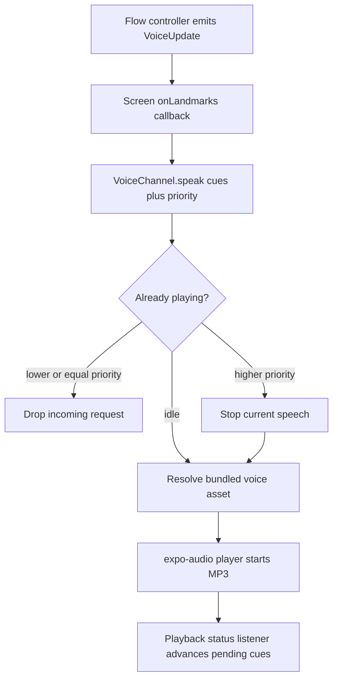

# Pearl Voice Cue Inventory

Audit date: 2026-06-24

Scope: every traced spoken voice cue used by Pearl during a training session, the full Movement Check-Up, and the weekly micro check-up. This includes setup prompts, camera-readiness prompts, transition cues, countdown cues, assessment and exercise instructions, result cues, training safety cues, generated number cues, and inactive/generated cues discovered in the same cue surface.

Production code changed: no. This audit only writes `docs/audits/PEARL_VOICE_CUE_INVENTORY.md` and `docs/audits/PEARL_VOICE_CUE_INVENTORY.json`.

## Executive Summary

- Distinct spoken cue templates audited: 110.
- Static spoken strings: 109. Dynamic spoken templates: 1 (`num-{n}` covers 0..40).
- Active or conditionally active cue templates: 104. Inactive, unreachable, or uncertain default-runtime cue templates: 6.
- Disjoint inventory counts: Shared 14, Training-only 65, Movement Check-Up-only 27, Micro check-up-only 4.
- Flow membership counts, with shared cues counted in each applicable flow: Training 79, Movement Check-Up 40, Micro check-up 16, Shared 14.
- Generated spoken assets observed: 300 MP3 files under `assets/audio/voice/`, 150 per voice (`clara`, `marcus`). The higher asset count comes from per-number MP3 files and two voices.
- Non-speech audio observed in these flows: `assets/audio/sfx/rep-credit.wav`, emitted as SFX on counted reps and not included as a voice cue.

## Source Index

- App.tsx:651-665 audio configuration at app startup and camera/audio readiness gate.
- App.tsx:3343-3360 camera readiness gate; App.tsx:3486-3490 micro-check type selection.
- scripts/generate-audio.ts:42-177 ordinary voice line definitions.
- scripts/generate-audio.ts:180-190 number cue generation.
- scripts/generate-audio.ts:192 safety cue merge into generation lines.
- src/audio/cues.ts:1-193 cue id types, safety cue id union, numberCue().
- src/audio/manifest.ts bundled voice audio asset manifest.
- src/audio/safetyAudio.ts safety voice line metadata export.
- src/audio/safetyAudioManifest.ts safety cue asset id mapping.
- src/audio/voicePlayer.ts:27-40 configureSessionAudio().
- src/audio/voicePlayer.ts:107-182 VoiceChannel speech queue/drop/interrupt/playback implementation.
- src/audio/voicePlayer.ts:184-220 SfxChannel rep-credit playback.
- src/profile/voices.ts Clara/Marcus voice definitions and ElevenLabs ids for build-time generation.
- src/preflight/preflight.ts preflight prompt selection, lighting sample, setup success.
- src/preflight/movementCameraReadiness.ts movement-specific camera readiness and orientation prompts.
- src/preflight/promptTiming.ts prompt repeat suppression.
- src/assessment/sessionController.ts per-assessment setup, countdown, active, end, result cue emission.
- src/checkup/checkup.ts Movement Check-Up battery, intro, transitions, completion.
- src/movements/chairStand.ts chair stand instructions, end cue, result cues.
- src/movements/balanceLadder.ts balance instructions, stance/eyes stage cues, result cues.
- src/movements/shoulderFlexion.ts shoulder instructions, end cue, result cue.
- src/movements/hingeReach.ts hinge instructions, end cue, result cue.
- src/movements/tug.ts Timed Up and Go beta/custom battery instructions and result cue.
- src/movements/chairRiseV2.ts V2 chair-rise protocol using existing chair cues.
- src/movements/oneLegBalanceV2.ts V2 one-leg balance protocol using existing balance cues.
- src/movements/activeShoulderReachV2.ts V2 active shoulder protocol using existing shoulder cues.
- src/screens/CheckUpScreen.tsx:220 check-up voice playback; 258-301 pause/retry/skip/repeat behavior; 919-979 visible setup/result copy.
- src/training/sessionPlayer.ts training intro, safety pass, transitions, setup, countdown, set, rest, completion.
- src/training/microCheck.ts weekly micro check-up setup, countdown, active grading, completion.
- src/training/safetyCueDefinitions.ts all safety cue text.
- src/training/safetyCues.ts global safety cue ids and exercise safety profile plumbing.
- src/exercises/index.ts registered exercise catalogue.
- src/exercises/ladders.ts visible training ladder filtering.
- src/exercises/releasePolicy.ts hidden optional training level policy.
- src/exercises/common.ts autoregulation voice cue constant.
- src/exercises/setGraders.ts rep/hold/ROM set grader voice cue and SFX updates.
- src/screens/TrainingSessionScreen.tsx:242 training voice playback; 334-388 pause/resume/skip/cancel; 827-891 visible setup/result copy.
- src/screens/MicroCheckScreen.tsx:205 micro-check voice playback; 237-278 pause/resume/discard; 750-792 visible setup/result copy.

## Speech Implementation

- Runtime TTS: none in the session path. Pearl uses bundled audio assets.
- Build-time generation: `scripts/generate-audio.ts` defines ordinary lines, merges safety lines from `src/training/safetyCueDefinitions.ts`, creates number cues 0..40, and calls ElevenLabs Flash v2.5 only when generating assets.
- Runtime playback: `src/audio/voicePlayer.ts` creates one `VoiceChannel` per screen. It resolves the active profile voice asset and plays through `expo-audio`.
- Queue policy: one cue sequence at a time. `VoiceChannel.speak()` drops lower/equal-priority incoming speech when already busy, interrupts for higher-priority incoming speech, and plays cue arrays serially.
- Missing asset policy: log a warning, skip the missing cue, and continue with the remaining sequence.
- Stop/cancel policy: pause, discard, retry, skip, and unmount handlers call `voice.stop()` in the screens.
- Audio mode: `playsInSilentMode=true`, `interruptionMode=mixWithOthers`, `allowsRecording=false`, `shouldPlayInBackground=false`, and `shouldRouteThroughEarpiece=false`.
- Camera gating: `App.tsx` configures audio at startup and gates camera flows on camera permission plus audio readiness.



## Shared Cue Inventory

Shared cues are reused by two or more audited flows. They are counted once in the disjoint inventory and counted in each applicable flow membership total.

### Shared Setup, Orientation, Countdown, and Cross-Flow Instruction Cues

| ID | Cue key | Exact spoken text / template | Category | Trigger | Conditions | Timing | Priority | Source |
|---|---|---|---|---|---|---|---:|---|
| SHARED-001 | `step-into-frame` | Step into view, about three big steps back from the phone. | setup.prompt | Preflight or movement camera readiness sees no plausible, sufficiently framed body. | active_shared | During setup and active camera-recovery loops. | 5 | scripts/generate-audio.ts:42 LINES |
| SHARED-002 | `center-yourself` | Move toward the middle of the picture. | setup.prompt | Preflight framing prompt when the body is horizontally off center or edge-clipped. | active_shared | During setup. | 5 | scripts/generate-audio.ts:43 LINES |
| SHARED-003 | `step-back` | Take a small step back. | setup.prompt | Preflight sees subject too close, too tall in frame, or vertically clipped. | active_shared | During setup. | 5 | scripts/generate-audio.ts:44 LINES |
| SHARED-004 | `step-closer` | Take a small step closer. | setup.prompt | Preflight sees subject too far away. | active_shared | During setup. | 5 | scripts/generate-audio.ts:45 LINES |
| SHARED-005 | `hold-still` | Great. Hold still for a moment. | setup.prompt | Preflight has plausible framing but still needs stability/body-unit sampling; movement camera readiness also maps hold_still/ready to this cue. | active_shared | During setup. | 5 | scripts/generate-audio.ts:46 LINES |
| SHARED-006 | `turn-on-light` | It's a little dark in here. Please turn on the main light. | setup.prompt | Preflight sampling fails because pose confidence/stability is poor enough to be treated as lighting/setup failure. | active_shared | After preflight sample window. | 5 | scripts/generate-audio.ts:47 LINES |
| SHARED-007 | `framing-ready` | That looks good. Stay there. | setup.confirmation | Preflight setup block clears with stable subject and bodyUnit. | active_shared | Immediately before item instructions. | 6 | scripts/generate-audio.ts:48 LINES |
| SHARED-008 | `turn-side-on` | For the next movement, please turn so your side faces the phone. | transition.orientation | Movement/check-up item transition or movement camera-readiness result requires side view. | active_shared | Between items or during setup/active camera-readiness failure. | 5 | scripts/generate-audio.ts:103 LINES |
| SHARED-009 | `face-forward` | For the next movement, please turn to face the phone. | transition.orientation | Movement/check-up item transition or movement camera-readiness result requires front view. | active_shared | Between items or during setup/active camera-readiness failure. | 5 | scripts/generate-audio.ts:104 LINES |
| SHARED-010 | `countdown-three` | Three. | countdown | Countdown phase begins after setup/instructions dwell. | active_shared | At countdown start. | 7 | scripts/generate-audio.ts:108 LINES |
| SHARED-011 | `countdown-two` | Two. | countdown | One countdown interval after countdown-three. | active_shared | 1s after countdown start by default. | 7 | scripts/generate-audio.ts:109 LINES |
| SHARED-012 | `countdown-one` | One. | countdown | Two countdown intervals after countdown-three. | active_shared | 2s after countdown start by default. | 7 | scripts/generate-audio.ts:110 LINES |
| SHARED-013 | `go` | Go! | countdown | Final countdown tick starts active measurement/set. | active_shared | 3s after countdown start by default. | 7 | scripts/generate-audio.ts:111 LINES |
| SHARED-014 | `ex-hamstring-reach` | Seated hamstring reach. Sit tall on the edge of the chair, one leg straight out, heel on the floor. Reach gently toward your toes and hold. | exercise.instructions | Training seated hamstring reach setup, and mobility micro check-up setup. | active_shared | After framing-ready, before countdown. | 6 | scripts/generate-audio.ts:145 LINES |

## Training Session Cue Inventory

Training voice emission is centralized in `src/training/sessionPlayer.ts`, then relayed by `src/screens/TrainingSessionScreen.tsx`. Training also layers exercise safety cues from `src/training/safetyCues.ts` and `src/training/safetyCueDefinitions.ts`.

### Training Flow, Exercise, Generated-Inactive, and Safety Cues

| ID | Cue key | Exact spoken text / template | Category | Trigger | Conditions | Timing | Priority | Source |
|---|---|---|---|---|---|---|---:|---|
| TRAIN-001 | `training-intro` | Time to train. We'll move through a few exercises together. Just follow my voice — you won't need to touch the screen. Let's begin. | training.session | TrainingSessionPlayer intro phase. | active_or_conditionally_active | At training session start. | 8 | scripts/generate-audio.ts:155 LINES |
| TRAIN-002 | `thats-your-set` | Good — that's your set. | training.set | Autoregulated RepsSetGrader ends a set early after target reached and quality/effort constraints allow. | active_or_conditionally_active | During active set. | 6 | scripts/generate-audio.ts:158 LINES |
| TRAIN-003 | `rest-now` | Nice work. Take a rest. | training.rest | Training set completes and another non-final set/exercise remains. | active_or_conditionally_active | At rest phase entry. | 6 | scripts/generate-audio.ts:159 LINES |
| TRAIN-004 | `next-up` | Let's set up the next exercise. | training.transition | Training transitions to next item with same camera view. | active_or_conditionally_active | Between exercises. | 6 | scripts/generate-audio.ts:160 LINES |
| TRAIN-005 | `last-set` | Rest up. This is your last set. | training.rest | Training rest phase before the final set of the same exercise. | active_or_conditionally_active | At rest phase entry. | 6 | scripts/generate-audio.ts:161 LINES |
| TRAIN-006 | `session-complete` | That's your session — really well done. Have some water and enjoy your day. | training.session | TrainingSessionPlayer complete phase. | active_or_conditionally_active | After final exercise completes. | 8 | scripts/generate-audio.ts:164 LINES |
| TRAIN-007 | `set-done` | Good set. | training.unused | Generated audio/type exists; no traced production call in training player or graders. | inactive_or_unreachable_in_default_runtime | Not emitted. | n/a | scripts/generate-audio.ts:162 LINES |
| TRAIN-008 | `cooldown-now` | Last part — a gentle cooldown to finish. | training.unused | Generated audio/type exists; no cooldown phase traced in current TrainingSessionPlayer. | inactive_or_unreachable_in_default_runtime | Not emitted. | n/a | scripts/generate-audio.ts:163 LINES |
| TRAIN-009 | `time-to-retest` | You've finished your four week block. It's a great time for a new check-up, to see how far you have come. | training.unused | Generated audio/type exists; no traced runtime call in app/session code. | inactive_or_unreachable_in_default_runtime | Not emitted. | n/a | scripts/generate-audio.ts:166 LINES |
| TRAIN-010 | `exercise-skipped` | No problem — we'll skip this one for now and move on. | training.unused | Generated audio/type exists; skip handlers stop voice and advance without emitting this cue. | inactive_or_unreachable_in_default_runtime | Not emitted. | n/a | scripts/generate-audio.ts:106 LINES |
| TRAIN-011 | `ex-sit-to-stand` | Sit-to-stands. Sit tall in the middle of the chair, feet flat. When I say go, stand all the way up and sit back down, with control. | exercise.instructions | Training sit-to-stand family exercise setup. | active_or_conditionally_active | After framing-ready, before countdown. | 6 | scripts/generate-audio.ts:118 LINES |
| TRAIN-012 | `ex-squat` | Squats. Feet about hip width apart, a chair behind you for support if you like. Lower down as if to sit, then stand back up. | exercise.instructions | Training squat and split-squat family setup. | active_or_conditionally_active | After framing-ready, before countdown. | 6 | scripts/generate-audio.ts:121 LINES |
| TRAIN-013 | `ex-step-up` | Step-ups. Stand facing your step. Step up with one foot, bring the other to meet it, then step back down, leading with the same foot. | exercise.instructions | Training step-up setup. | active_or_conditionally_active | After framing-ready, before countdown. | 6 | scripts/generate-audio.ts:124 LINES |
| TRAIN-014 | `ex-heel-raise` | Heel raises. Stand tall, fingertips on a wall or counter for balance. Rise up onto the balls of your feet, then lower slowly. | exercise.instructions | Training heel-raise and toe-raise setup. | active_or_conditionally_active | After framing-ready, before countdown. | 6 | scripts/generate-audio.ts:127 LINES |
| TRAIN-015 | `ex-glute-bridge` | Glute bridge. Lie on your back, knees bent, feet flat. Lift your hips toward the ceiling, squeeze, and lower. | exercise.instructions | Training glute bridge hold/reps setup. | active_or_conditionally_active | After framing-ready, before countdown. | 6 | scripts/generate-audio.ts:130 LINES |
| TRAIN-016 | `ex-push-up` | Push-ups. Hands shoulder width apart against the wall or floor. Lower yourself in with control, then press back out. | exercise.instructions | Training push-up family setup. | active_or_conditionally_active | After framing-ready, before countdown. | 6 | scripts/generate-audio.ts:133 LINES |
| TRAIN-017 | `ex-overhead` | Overhead reach. Stand tall. Reach both arms up overhead as far as is comfortable, then lower. | exercise.instructions | Training overhead reach/press setup. | active_or_conditionally_active | After framing-ready, before countdown. | 6 | scripts/generate-audio.ts:136 LINES |
| TRAIN-018 | `ex-hip-hinge` | Hip hinge. Stand a step in front of the wall, feet under your hips. Push your hips back to tap the wall, keeping your back long, then stand tall. | exercise.instructions | Training hip hinge family setup. | active_or_conditionally_active | After framing-ready, before countdown. | 6 | scripts/generate-audio.ts:139 LINES |
| TRAIN-019 | `ex-balance` | A balance hold. Get into the position I describe, fingertips near a counter, and hold steady until you need to touch down. | exercise.instructions | Training balance hold setup. | active_or_conditionally_active | After framing-ready, before countdown. | 6 | scripts/generate-audio.ts:142 LINES |
| TRAIN-020 | `ex-neck-rotation` | Neck rotations. Face the phone, sitting or standing tall. Slowly turn your head to look over one shoulder, then the other. | exercise.instructions | Training neck-rotation setup when controlled-beta hidden optional level is reachable. | conditional_hidden_optional_training_level | After framing-ready, before countdown. | 6 | scripts/generate-audio.ts:148 LINES |
| TRAIN-021 | `ex-march` | Marching. Stand tall and march on the spot, driving each knee up nice and high, with a steady rhythm. | exercise.instructions | Training loaded march setup. | active_or_conditionally_active | After framing-ready, before countdown. | 6 | scripts/generate-audio.ts:151 LINES |
| TRAIN-022 | `global_stop_sharp_or_increasing_pain` | Stop if you feel sharp pain or discomfort that keeps building. | training.safety | Training safety profile selects this cue for global, setup, active, rest, or tracking-recovery safety messaging. | conditional_training_safety_profile | Training intro/global safety pass, item setup, active recovery, or rest depending on SafetyCueProfile. | 6 | src/training/safetyCueDefinitions.ts:77 SAFETY_CUE_DEFINITIONS |
| TRAIN-023 | `global_stop_dizzy_or_lightheaded` | Pause or stop if you feel dizzy, lightheaded, or unwell. | training.safety | Training safety profile selects this cue for global, setup, active, rest, or tracking-recovery safety messaging. | conditional_training_safety_profile | Training intro/global safety pass, item setup, active recovery, or rest depending on SafetyCueProfile. | 6 | src/training/safetyCueDefinitions.ts:82 SAFETY_CUE_DEFINITIONS |
| TRAIN-024 | `global_breathe_normally` | Keep breathing normally; do not hold your breath. | training.safety | Training safety profile selects this cue for global, setup, active, rest, or tracking-recovery safety messaging. | conditional_training_safety_profile | Training intro/global safety pass, item setup, active recovery, or rest depending on SafetyCueProfile. | 6 | src/training/safetyCueDefinitions.ts:87 SAFETY_CUE_DEFINITIONS |
| TRAIN-025 | `global_clear_space` | Clear the area around you before you start. | training.safety | Training safety profile selects this cue for global, setup, active, rest, or tracking-recovery safety messaging. | conditional_training_safety_profile | Training intro/global safety pass, item setup, active recovery, or rest depending on SafetyCueProfile. | 6 | src/training/safetyCueDefinitions.ts:92 SAFETY_CUE_DEFINITIONS |
| TRAIN-026 | `global_stop_if_support_moves` | Stop if your chair, counter, wall, step, band, or anchor shifts. | training.safety | Training safety profile selects this cue for global, setup, active, rest, or tracking-recovery safety messaging. | conditional_training_safety_profile | Training intro/global safety pass, item setup, active recovery, or rest depending on SafetyCueProfile. | 6 | src/training/safetyCueDefinitions.ts:97 SAFETY_CUE_DEFINITIONS |
| TRAIN-027 | `global_pause_if_tracking_lost` | If tracking pauses, return to your setup position and wait for Pearl to reset. | training.safety | Training safety profile selects this cue for global, setup, active, rest, or tracking-recovery safety messaging. | conditional_training_safety_profile | Training intro/global safety pass, item setup, active recovery, or rest depending on SafetyCueProfile. | 6 | src/training/safetyCueDefinitions.ts:102 SAFETY_CUE_DEFINITIONS |
| TRAIN-028 | `support_use_sturdy_support` | Use a sturdy wall, counter, chair, or rail for support. | training.safety | Training safety profile selects this cue for global, setup, active, rest, or tracking-recovery safety messaging. | conditional_training_safety_profile | Training intro/global safety pass, item setup, active recovery, or rest depending on SafetyCueProfile. | 6 | src/training/safetyCueDefinitions.ts:107 SAFETY_CUE_DEFINITIONS |
| TRAIN-029 | `support_keep_support_within_reach` | Keep support within easy reach throughout the set. | training.safety | Training safety profile selects this cue for global, setup, active, rest, or tracking-recovery safety messaging. | conditional_training_safety_profile | Training intro/global safety pass, item setup, active recovery, or rest depending on SafetyCueProfile. | 6 | src/training/safetyCueDefinitions.ts:112 SAFETY_CUE_DEFINITIONS |
| TRAIN-030 | `chair_use_sturdy_chair` | Use a sturdy chair that will not slide or tip. | training.safety | Training safety profile selects this cue for global, setup, active, rest, or tracking-recovery safety messaging. | conditional_training_safety_profile | Training intro/global safety pass, item setup, active recovery, or rest depending on SafetyCueProfile. | 6 | src/training/safetyCueDefinitions.ts:117 SAFETY_CUE_DEFINITIONS |
| TRAIN-031 | `chair_controlled_sit` | Sit down with control; do not drop into the chair. | training.safety | Training safety profile selects this cue for global, setup, active, rest, or tracking-recovery safety messaging. | conditional_training_safety_profile | Training intro/global safety pass, item setup, active recovery, or rest depending on SafetyCueProfile. | 6 | src/training/safetyCueDefinitions.ts:122 SAFETY_CUE_DEFINITIONS |
| TRAIN-032 | `floor_clear_space` | Use clear floor space with enough room to get down and back up. | training.safety | Training safety profile selects this cue for global, setup, active, rest, or tracking-recovery safety messaging. | conditional_training_safety_profile | Training intro/global safety pass, item setup, active recovery, or rest depending on SafetyCueProfile. | 6 | src/training/safetyCueDefinitions.ts:127 SAFETY_CUE_DEFINITIONS |
| TRAIN-033 | `floor_use_support_for_transfer` | Use nearby support for getting down to the floor and back up. | training.safety | Training safety profile selects this cue for global, setup, active, rest, or tracking-recovery safety messaging. | conditional_training_safety_profile | Training intro/global safety pass, item setup, active recovery, or rest depending on SafetyCueProfile. | 6 | src/training/safetyCueDefinitions.ts:132 SAFETY_CUE_DEFINITIONS |
| TRAIN-034 | `floor_slow_transition` | Move slowly when changing between standing and the floor. | training.safety | Training safety profile selects this cue for global, setup, active, rest, or tracking-recovery safety messaging. | conditional_training_safety_profile | Training intro/global safety pass, item setup, active recovery, or rest depending on SafetyCueProfile. | 6 | src/training/safetyCueDefinitions.ts:137 SAFETY_CUE_DEFINITIONS |
| TRAIN-035 | `floor_stop_if_transfer_unsteady` | Stop and choose another option if the floor transfer feels unsteady or uncomfortable. | training.safety | Training safety profile selects this cue for global, setup, active, rest, or tracking-recovery safety messaging. | conditional_training_safety_profile | Training intro/global safety pass, item setup, active recovery, or rest depending on SafetyCueProfile. | 6 | src/training/safetyCueDefinitions.ts:142 SAFETY_CUE_DEFINITIONS |
| TRAIN-036 | `step_use_low_stable_step` | Use only the lowest stable bottom stair or step. | training.safety | Training safety profile selects this cue for global, setup, active, rest, or tracking-recovery safety messaging. | conditional_training_safety_profile | Training intro/global safety pass, item setup, active recovery, or rest depending on SafetyCueProfile. | 6 | src/training/safetyCueDefinitions.ts:147 SAFETY_CUE_DEFINITIONS |
| TRAIN-037 | `step_fixed_support_nearby` | Keep fixed support, such as a rail, wall, or counter, within reach. | training.safety | Training safety profile selects this cue for global, setup, active, rest, or tracking-recovery safety messaging. | conditional_training_safety_profile | Training intro/global safety pass, item setup, active recovery, or rest depending on SafetyCueProfile. | 6 | src/training/safetyCueDefinitions.ts:152 SAFETY_CUE_DEFINITIONS |
| TRAIN-038 | `step_clear_dry_area` | Make sure the step and floor area are clear and dry. | training.safety | Training safety profile selects this cue for global, setup, active, rest, or tracking-recovery safety messaging. | conditional_training_safety_profile | Training intro/global safety pass, item setup, active recovery, or rest depending on SafetyCueProfile. | 6 | src/training/safetyCueDefinitions.ts:157 SAFETY_CUE_DEFINITIONS |
| TRAIN-039 | `step_phone_out_of_path` | Keep the phone and stand out of your stepping path. | training.safety | Training safety profile selects this cue for global, setup, active, rest, or tracking-recovery safety messaging. | conditional_training_safety_profile | Training intro/global safety pass, item setup, active recovery, or rest depending on SafetyCueProfile. | 6 | src/training/safetyCueDefinitions.ts:162 SAFETY_CUE_DEFINITIONS |
| TRAIN-040 | `step_controlled_return` | Step down with control; do not hop or rush the return. | training.safety | Training safety profile selects this cue for global, setup, active, rest, or tracking-recovery safety messaging. | conditional_training_safety_profile | Training intro/global safety pass, item setup, active recovery, or rest depending on SafetyCueProfile. | 6 | src/training/safetyCueDefinitions.ts:167 SAFETY_CUE_DEFINITIONS |
| TRAIN-041 | `step_stop_if_unstable` | Stop if the step, surface, support, or your balance feels unstable. | training.safety | Training safety profile selects this cue for global, setup, active, rest, or tracking-recovery safety messaging. | conditional_training_safety_profile | Training intro/global safety pass, item setup, active recovery, or rest depending on SafetyCueProfile. | 6 | src/training/safetyCueDefinitions.ts:172 SAFETY_CUE_DEFINITIONS |
| TRAIN-042 | `band_inspect_before_use` | Inspect the band first, and do not use it if it is worn, cracked, or damaged. | training.safety | Training safety profile selects this cue for global, setup, active, rest, or tracking-recovery safety messaging. | conditional_training_safety_profile | Training intro/global safety pass, item setup, active recovery, or rest depending on SafetyCueProfile. | 6 | src/training/safetyCueDefinitions.ts:177 SAFETY_CUE_DEFINITIONS |
| TRAIN-043 | `band_secure_grip` | Keep a secure grip on the band before adding tension. | training.safety | Training safety profile selects this cue for global, setup, active, rest, or tracking-recovery safety messaging. | conditional_training_safety_profile | Training intro/global safety pass, item setup, active recovery, or rest depending on SafetyCueProfile. | 6 | src/training/safetyCueDefinitions.ts:182 SAFETY_CUE_DEFINITIONS |
| TRAIN-044 | `band_face_and_eyes_clear` | Keep the band path away from your face and eyes. | training.safety | Training safety profile selects this cue for global, setup, active, rest, or tracking-recovery safety messaging. | conditional_training_safety_profile | Training intro/global safety pass, item setup, active recovery, or rest depending on SafetyCueProfile. | 6 | src/training/safetyCueDefinitions.ts:187 SAFETY_CUE_DEFINITIONS |
| TRAIN-045 | `band_controlled_return` | Return the band slowly with control. | training.safety | Training safety profile selects this cue for global, setup, active, rest, or tracking-recovery safety messaging. | conditional_training_safety_profile | Training intro/global safety pass, item setup, active recovery, or rest depending on SafetyCueProfile. | 6 | src/training/safetyCueDefinitions.ts:192 SAFETY_CUE_DEFINITIONS |
| TRAIN-046 | `band_never_release_under_tension` | Never let go of a stretched band. | training.safety | Training safety profile selects this cue for global, setup, active, rest, or tracking-recovery safety messaging. | conditional_training_safety_profile | Training intro/global safety pass, item setup, active recovery, or rest depending on SafetyCueProfile. | 6 | src/training/safetyCueDefinitions.ts:197 SAFETY_CUE_DEFINITIONS |
| TRAIN-047 | `band_stop_if_slips_or_shifts` | Stop if the band, grip, anchor, door, or your stance slips or shifts. | training.safety | Training safety profile selects this cue for global, setup, active, rest, or tracking-recovery safety messaging. | conditional_training_safety_profile | Training intro/global safety pass, item setup, active recovery, or rest depending on SafetyCueProfile. | 6 | src/training/safetyCueDefinitions.ts:202 SAFETY_CUE_DEFINITIONS |
| TRAIN-048 | `band_anchor_feet_secure` | For a seated row, keep both feet steady so the band cannot slip toward you. | training.safety | Training safety profile selects this cue for global, setup, active, rest, or tracking-recovery safety messaging. | conditional_training_safety_profile | Training intro/global safety pass, item setup, active recovery, or rest depending on SafetyCueProfile. | 6 | src/training/safetyCueDefinitions.ts:207 SAFETY_CUE_DEFINITIONS |
| TRAIN-049 | `band_do_not_overstretch` | Use light tension only; do not overstretch the band. | training.safety | Training safety profile selects this cue for global, setup, active, rest, or tracking-recovery safety messaging. | conditional_training_safety_profile | Training intro/global safety pass, item setup, active recovery, or rest depending on SafetyCueProfile. | 6 | src/training/safetyCueDefinitions.ts:212 SAFETY_CUE_DEFINITIONS |
| TRAIN-050 | `door_anchor_follow_manufacturer_setup` | Use a purpose-built door anchor and follow its setup instructions. | training.safety | Training safety profile selects this cue for global, setup, active, rest, or tracking-recovery safety messaging. | conditional_training_safety_profile | Training intro/global safety pass, item setup, active recovery, or rest depending on SafetyCueProfile. | 6 | src/training/safetyCueDefinitions.ts:217 SAFETY_CUE_DEFINITIONS |
| TRAIN-051 | `door_anchor_fully_closed` | Use a fully closed, secure door before adding tension. | training.safety | Training safety profile selects this cue for global, setup, active, rest, or tracking-recovery safety messaging. | conditional_training_safety_profile | Training intro/global safety pass, item setup, active recovery, or rest depending on SafetyCueProfile. | 6 | src/training/safetyCueDefinitions.ts:222 SAFETY_CUE_DEFINITIONS |
| TRAIN-052 | `door_anchor_test_light_tension` | Test the anchor with light tension before the set starts. | training.safety | Training safety profile selects this cue for global, setup, active, rest, or tracking-recovery safety messaging. | conditional_training_safety_profile | Training intro/global safety pass, item setup, active recovery, or rest depending on SafetyCueProfile. | 6 | src/training/safetyCueDefinitions.ts:227 SAFETY_CUE_DEFINITIONS |
| TRAIN-053 | `door_anchor_stay_out_of_door_path` | Stand out of the door opening path while the band is anchored. | training.safety | Training safety profile selects this cue for global, setup, active, rest, or tracking-recovery safety messaging. | conditional_training_safety_profile | Training intro/global safety pass, item setup, active recovery, or rest depending on SafetyCueProfile. | 6 | src/training/safetyCueDefinitions.ts:232 SAFETY_CUE_DEFINITIONS |
| TRAIN-054 | `door_anchor_stop_if_moves` | Stop if the door or anchor moves, or if tension pulls the door toward you. | training.safety | Training safety profile selects this cue for global, setup, active, rest, or tracking-recovery safety messaging. | conditional_training_safety_profile | Training intro/global safety pass, item setup, active recovery, or rest depending on SafetyCueProfile. | 6 | src/training/safetyCueDefinitions.ts:237 SAFETY_CUE_DEFINITIONS |
| TRAIN-055 | `band_stable_stance` | Set a stable stance before pressing or pulling the band. | training.safety | Training safety profile selects this cue for global, setup, active, rest, or tracking-recovery safety messaging. | conditional_training_safety_profile | Training intro/global safety pass, item setup, active recovery, or rest depending on SafetyCueProfile. | 6 | src/training/safetyCueDefinitions.ts:242 SAFETY_CUE_DEFINITIONS |
| TRAIN-056 | `comfortable_range_only` | Move only through a comfortable range. | training.safety | Training safety profile selects this cue for global, setup, active, rest, or tracking-recovery safety messaging. | conditional_training_safety_profile | Training intro/global safety pass, item setup, active recovery, or rest depending on SafetyCueProfile. | 6 | src/training/safetyCueDefinitions.ts:247 SAFETY_CUE_DEFINITIONS |
| TRAIN-057 | `mobility_no_forcing` | Do not force the stretch or push into sharp discomfort. | training.safety | Training safety profile selects this cue for global, setup, active, rest, or tracking-recovery safety messaging. | conditional_training_safety_profile | Training intro/global safety pass, item setup, active recovery, or rest depending on SafetyCueProfile. | 6 | src/training/safetyCueDefinitions.ts:252 SAFETY_CUE_DEFINITIONS |
| TRAIN-058 | `balance_stop_if_unsteady` | Touch support and reset if you feel unsteady. | training.safety | Training safety profile selects this cue for global, setup, active, rest, or tracking-recovery safety messaging. | conditional_training_safety_profile | Training intro/global safety pass, item setup, active recovery, or rest depending on SafetyCueProfile. | 6 | src/training/safetyCueDefinitions.ts:257 SAFETY_CUE_DEFINITIONS |
| TRAIN-059 | `balance_support_within_reach` | Keep a counter, wall, or sturdy chair within reach for balance work. | training.safety | Training safety profile selects this cue for global, setup, active, rest, or tracking-recovery safety messaging. | conditional_training_safety_profile | Training intro/global safety pass, item setup, active recovery, or rest depending on SafetyCueProfile. | 6 | src/training/safetyCueDefinitions.ts:262 SAFETY_CUE_DEFINITIONS |
| TRAIN-060 | `balance_supported_if_hesitant` | Use fingertip support whenever you need it. | training.safety | Training safety profile selects this cue for global, setup, active, rest, or tracking-recovery safety messaging. | conditional_training_safety_profile | Training intro/global safety pass, item setup, active recovery, or rest depending on SafetyCueProfile. | 6 | src/training/safetyCueDefinitions.ts:267 SAFETY_CUE_DEFINITIONS |
| TRAIN-061 | `balance_no_eyes_closed_or_unstable_surface` | Keep eyes open and stay on a stable surface for this V1 training level. | training.safety | Training safety profile selects this cue for global, setup, active, rest, or tracking-recovery safety messaging. | conditional_training_safety_profile | Training intro/global safety pass, item setup, active recovery, or rest depending on SafetyCueProfile. | 6 | src/training/safetyCueDefinitions.ts:272 SAFETY_CUE_DEFINITIONS |
| TRAIN-062 | `tracking_keep_full_body_in_view` | Keep your full body in view so Pearl can follow the movement. | training.safety | Training safety profile selects this cue for global, setup, active, rest, or tracking-recovery safety messaging. | conditional_training_safety_profile | Training intro/global safety pass, item setup, active recovery, or rest depending on SafetyCueProfile. | 6 | src/training/safetyCueDefinitions.ts:277 SAFETY_CUE_DEFINITIONS |
| TRAIN-063 | `tracking_pause_and_reset` | Tracking paused. Step back into view and restart from the setup position. | training.safety | Training safety profile selects this cue for global, setup, active, rest, or tracking-recovery safety messaging. | conditional_training_safety_profile | Training intro/global safety pass, item setup, active recovery, or rest depending on SafetyCueProfile. | 8 | src/training/safetyCueDefinitions.ts:282 SAFETY_CUE_DEFINITIONS |
| TRAIN-064 | `tracking_no_rush_or_exaggerate` | Move naturally; do not rush or exaggerate just for the camera. | training.safety | Training safety profile selects this cue for global, setup, active, rest, or tracking-recovery safety messaging. | conditional_training_safety_profile | Training intro/global safety pass, item setup, active recovery, or rest depending on SafetyCueProfile. | 6 | src/training/safetyCueDefinitions.ts:287 SAFETY_CUE_DEFINITIONS |
| TRAIN-065 | `tracking_move_when_cued` | Wait for the countdown before you start moving. | training.safety | Training safety profile selects this cue for global, setup, active, rest, or tracking-recovery safety messaging. | conditional_training_safety_profile | Training intro/global safety pass, item setup, active recovery, or rest depending on SafetyCueProfile. | 6 | src/training/safetyCueDefinitions.ts:292 SAFETY_CUE_DEFINITIONS |

### Training Exercise Instruction Matrix

| Exercise family | Cue key | Registered level ids observed |
| --- | --- | --- |
| Sit-to-stand family | `ex-sit-to-stand` | sts-cushion, sts-standard, sts-slow-eccentric, sts-power, loaded-sit-to-stand |
| Squat family | `ex-squat` | squat-supported, squat-free, squat-slow-eccentric, squat-loaded, chair-supported-split-squat |
| Step-up | `ex-step-up` | step-up |
| Heel/toe raise | `ex-heel-raise` | heel-raise-supported, heel-raise-free, toe-raise-supported |
| Bridge | `ex-glute-bridge` | glute-bridge-hold, glute-bridge-reps |
| Push | `ex-push-up` | push-up-wall, push-up-incline, push-up-standard |
| Overhead | `ex-overhead` | overhead-reach, overhead-press-band |
| Hinge | `ex-hip-hinge` | hip-hinge-wall, hip-hinge-free |
| Balance | `ex-balance` | balance-feet-together-hold, balance-tandem-hold, balance-single-leg-hold |
| Hamstring/mobility | `ex-hamstring-reach` | seated-hamstring-reach; shared with mobility micro check-up |
| Neck | `ex-neck-rotation` | neck-rotation hidden optional controlled-beta level |
| March/lateral stability | `ex-march` | loaded-march |

## Movement Check-Up Cue Inventory

The default full Movement Check-Up battery is chair stand, balance ladder, shoulder flexion peak, and hinge reach. TUG exists behind `BETA_BATTERY_WITH_TUG` or a custom battery. V2 raw-first movements reuse many of the same cue keys and are noted in the JSON cue metadata.

### Movement Check-Up Cues

| ID | Cue key | Exact spoken text / template | Category | Trigger | Conditions | Timing | Priority | Source |
|---|---|---|---|---|---|---|---:|---|
| CHECKUP-001 | `checkup-intro` | Welcome to your Movement Check-Up. We'll guide you through a few short movements to check strength, balance, and mobility. Just follow my voice — you won't need to touch the screen. Let's begin. | checkup.session | CheckUpOrchestrator intro phase. | active_or_conditionally_active | At Movement Check-Up start. | 8 | scripts/generate-audio.ts:97 LINES |
| CHECKUP-002 | `checkup-complete` | That's the whole check-up — really well done. Your results are ready on the screen. | checkup.session | CheckUpOrchestrator complete phase. | active_or_conditionally_active | After final assessment completes. | 8 | scripts/generate-audio.ts:101 LINES |
| CHECKUP-003 | `next-exercise` | Nice work. Let's set up the next movement. | checkup.transition | Check-up transition to next item with same camera view. | active_or_conditionally_active | Between assessments. | 6 | scripts/generate-audio.ts:105 LINES |
| CHECKUP-004 | `chair-stand-intro` | Next, the thirty second chair stand. Place a sturdy chair so you sit side-on to the phone, then sit in the middle of the seat with your feet flat on the floor. | checkup.instructions | 30-second chair stand assessment setup. | active_or_conditionally_active | After framing-ready, before countdown. | 6 | scripts/generate-audio.ts:50 LINES |
| CHECKUP-005 | `chair-stand-setup` | Cross your arms over your chest. When I say go, stand up all the way, then sit back down, and repeat as many times as you can until I say time. | checkup.instructions | 30-second chair stand assessment setup. | active_or_conditionally_active | Immediately after chair-stand-intro. | 6 | scripts/generate-audio.ts:54 LINES |
| CHECKUP-006 | `balance-intro` | Next, a few short balance holds. Stand near a kitchen counter or sturdy chair, so you can rest your fingertips on it if you need to steady yourself. | checkup.instructions | Balance ladder and V2 one-leg balance setup. | active_or_conditionally_active | After framing-ready, before balance stage cues/countdown. | 6 | scripts/generate-audio.ts:58 LINES |
| CHECKUP-007 | `balance-setup` | I'll tell you how to place your feet for each hold. Keep each position until I tell you the next one, or until you need to touch down. | checkup.instructions | Balance ladder and V2 one-leg balance setup. | active_or_conditionally_active | Immediately after balance-intro. | 6 | scripts/generate-audio.ts:61 LINES |
| CHECKUP-008 | `balance-feet-together` | Place your feet together, side by side. | checkup.stage | Balance ladder enters feet-together stage. | active_or_conditionally_active | During active balance ladder stage transition. | 6 | scripts/generate-audio.ts:64 LINES |
| CHECKUP-009 | `balance-semi-tandem` | Slide one foot half a step forward, so its instep touches your other big toe. | checkup.stage.unused_default | Cue is mapped in STANCE_CUE but DEFAULT_BALANCE_STAGES does not include semi-tandem. | inactive_or_unreachable_in_default_runtime | Not emitted by default battery. | 6 | scripts/generate-audio.ts:65 LINES |
| CHECKUP-010 | `balance-tandem` | Place one foot directly in front of the other, heel to toe. | checkup.stage | Balance ladder enters tandem stage. | active_or_conditionally_active | During active balance ladder stage transition. | 6 | scripts/generate-audio.ts:67 LINES |
| CHECKUP-011 | `balance-single-leg` | Now stand on one leg, lifting your other foot just off the floor. | checkup.stage | Balance ladder enters single-leg stage; V2 one-leg balance includes it in instructions. | active_or_conditionally_active | During balance ladder stage transition or V2 setup. | 6 | scripts/generate-audio.ts:68 LINES |
| CHECKUP-012 | `close-your-eyes` | Keep holding, and gently close your eyes. | checkup.stage | Balance ladder enters an eyes-closed stage. | active_or_conditionally_active | During active balance ladder stage transition. | 6 | scripts/generate-audio.ts:69 LINES |
| CHECKUP-013 | `open-your-eyes` | You can open your eyes now. | checkup.stage | Balance ladder enters an eyes-open stage after an eyes-closed stage. | active_or_conditionally_active | During active balance ladder stage transition. | 6 | scripts/generate-audio.ts:70 LINES |
| CHECKUP-014 | `tug-intro` | Next, up and go. Put a sturdy chair side-on to the phone, with a clear three meter walking path in front of you. | checkup.instructions.beta | Timed Up and Go assessment setup when BETA_BATTERY_WITH_TUG or custom battery is used. | conditional_feature_or_custom_battery | After framing-ready, before countdown. | 6 | scripts/generate-audio.ts:72 LINES |
| CHECKUP-015 | `tug-setup` | Sit in the chair. When I say go, stand up, walk to the end of the path at a comfortable pace, turn around, walk back, and sit down. | checkup.instructions.beta | Timed Up and Go assessment setup when BETA_BATTERY_WITH_TUG or custom battery is used. | conditional_feature_or_custom_battery | After tug-intro. | 6 | scripts/generate-audio.ts:75 LINES |
| CHECKUP-016 | `shoulder-intro` | Next, a shoulder reach. Turn so your side faces the phone, and stand tall with your arm relaxed at your side. | checkup.instructions | Shoulder flexion peak and active shoulder reach V2 setup. | active_or_conditionally_active | After framing-ready, before countdown. | 6 | scripts/generate-audio.ts:79 LINES |
| CHECKUP-017 | `shoulder-setup` | When I say go, raise that arm straight out in front of you and up as high as it comfortably goes, and hold it there. | checkup.instructions | Shoulder flexion peak and active shoulder reach V2 setup. | active_or_conditionally_active | After shoulder-intro. | 6 | scripts/generate-audio.ts:82 LINES |
| CHECKUP-018 | `relax-arm` | Lovely. Lower your arm and relax. | checkup.end | Shoulder assessment result phase begins. | active_or_conditionally_active | After active shoulder capture completes. | 7 | scripts/generate-audio.ts:85 LINES |
| CHECKUP-019 | `hinge-intro` | Last one, a forward reach. Stay side-on to the phone, standing tall with your feet under your hips. | checkup.instructions | Hinge reach setup. | active_or_conditionally_active | After framing-ready, before countdown. | 6 | scripts/generate-audio.ts:87 LINES |
| CHECKUP-020 | `hinge-setup` | When I say go, slowly fold forward from your hips and reach your hands toward the floor, as far as is comfortable, and hold. | checkup.instructions | Hinge reach setup. | active_or_conditionally_active | After hinge-intro. | 6 | scripts/generate-audio.ts:90 LINES |
| CHECKUP-021 | `stand-tall` | That's great. Slowly roll back up to standing. | checkup.end | Hinge reach result phase begins. | active_or_conditionally_active | After active hinge capture completes. | 7 | scripts/generate-audio.ts:93 LINES |
| CHECKUP-022 | `times-up` | Time! Have a seat and catch your breath. | checkup.end | 30-second chair stand active duration ends. | active_or_conditionally_active | At chair-stand result transition. | 7 | scripts/generate-audio.ts:112 LINES |
| CHECKUP-023 | `you-completed` | You completed | checkup.result | Chair stand result has one or more counted reps. | active_or_conditionally_active | After endCue/result transition. | 7 | scripts/generate-audio.ts:114 LINES |
| CHECKUP-024 | `num-{n}` | Dynamic number word cue for rounded/clamped counts: num-0 through num-40 ("zero." through "forty."). | checkup.result.dynamic | Chair stand result has one or more counted reps; numberCue clamps rounded rep count to 0..40. | active_or_conditionally_active | Between you-completed and stands-suffix. | 7 | src/audio/cues.ts:187 numberCue |
| CHECKUP-025 | `stands-suffix` | chair stands. Well done. | checkup.result | Chair stand result has one or more counted reps. | active_or_conditionally_active | After dynamic number cue. | 7 | scripts/generate-audio.ts:115 LINES |
| CHECKUP-026 | `no-reps` | We couldn't measure any stands that time. We can try again whenever you like. | checkup.result | Chair stand result has zero counted reps. | active_or_conditionally_active | After chair stand result transition. | 7 | scripts/generate-audio.ts:116 LINES |
| CHECKUP-027 | `item-complete` | Nicely done. | checkup.result | Balance, shoulder, hinge, and TUG resultCues. | active_or_conditionally_active | At result transition. | 7 | scripts/generate-audio.ts:95 LINES |

### Movement Check-Up Assessment Paths

- 30-second chair stand: `framing-ready`, `chair-stand-intro`, `chair-stand-setup`, countdown, `times-up`, then either `you-completed` + `num-{n}` + `stands-suffix` or `no-reps`.
- Balance ladder: `framing-ready`, `balance-intro`, `balance-setup`, countdown, stance/eyes cues during active stages, then `item-complete`. `balance-semi-tandem` is defined but not in `DEFAULT_BALANCE_STAGES`.
- Shoulder flexion peak: `framing-ready`, `shoulder-intro`, `shoulder-setup`, countdown, `relax-arm`, `item-complete`.
- Hinge reach: `framing-ready`, `hinge-intro`, `hinge-setup`, countdown, `stand-tall`, `item-complete`.
- Timed Up and Go: `tug-intro`, `tug-setup`, countdown, `item-complete`; this is beta/custom-battery, not default.

## Weekly Micro Check-Up Cue Inventory

Micro check-up type is selected from the active movement block focus domain. Strength defaults to chair-power, balance uses single-leg-balance, mobility uses mobility-reach. The generic `microcheck-intro` asset is generated but not called by the current player.

### Micro Check-Up Cues

| ID | Cue key | Exact spoken text / template | Category | Trigger | Conditions | Timing | Priority | Source |
|---|---|---|---|---|---|---|---:|---|
| MICRO-001 | `microcheck-chair` | Five quick chair stands. Sit tall, arms crossed, and when I say go, stand up and sit down five times, as quickly as you safely can. | micro.instructions | Micro-check type chair-power setup. | active_or_conditionally_active | After framing-ready, before countdown. | 6 | scripts/generate-audio.ts:171 LINES |
| MICRO-002 | `microcheck-balance` | A one-leg balance. Fingertips near a counter, stand on one leg and hold as long as you can. | micro.instructions | Micro-check type single-leg-balance setup. | active_or_conditionally_active | After framing-ready, before countdown. | 6 | scripts/generate-audio.ts:174 LINES |
| MICRO-003 | `microcheck-complete` | Got it — that's logged. Nice work. | micro.result | Micro-check phase completes and result is logged. | active_or_conditionally_active | After active micro-check completes. | 8 | scripts/generate-audio.ts:177 LINES |
| MICRO-004 | `microcheck-intro` | A quick check-in to track your progress. It'll only take a minute. | micro.unused | Generated audio/type exists; MicroCheckSessionPlayer uses per-type intro cues instead. | inactive_or_unreachable_in_default_runtime | Not emitted. | n/a | scripts/generate-audio.ts:170 LINES |

### Micro Check-Up Paths

- Chair-power: `framing-ready`, `microcheck-chair`, countdown, active five chair stands, `microcheck-complete`.
- Single-leg balance: `framing-ready`, `microcheck-balance`, countdown, active hold, `microcheck-complete`.
- Mobility-reach: `framing-ready`, `ex-hamstring-reach`, countdown, active ROM capture, `microcheck-complete`.

## Inactive, Unreachable, Or Uncertain Cues


### Inactive or Unreachable in Default Runtime

| ID | Cue key | Exact spoken text / template | Category | Trigger | Conditions | Timing | Priority | Source |
|---|---|---|---|---|---|---|---:|---|
| TRAIN-007 | `set-done` | Good set. | training.unused | Generated audio/type exists; no traced production call in training player or graders. | inactive_or_unreachable_in_default_runtime | Not emitted. | n/a | scripts/generate-audio.ts:162 LINES |
| TRAIN-008 | `cooldown-now` | Last part — a gentle cooldown to finish. | training.unused | Generated audio/type exists; no cooldown phase traced in current TrainingSessionPlayer. | inactive_or_unreachable_in_default_runtime | Not emitted. | n/a | scripts/generate-audio.ts:163 LINES |
| TRAIN-009 | `time-to-retest` | You've finished your four week block. It's a great time for a new check-up, to see how far you have come. | training.unused | Generated audio/type exists; no traced runtime call in app/session code. | inactive_or_unreachable_in_default_runtime | Not emitted. | n/a | scripts/generate-audio.ts:166 LINES |
| TRAIN-010 | `exercise-skipped` | No problem — we'll skip this one for now and move on. | training.unused | Generated audio/type exists; skip handlers stop voice and advance without emitting this cue. | inactive_or_unreachable_in_default_runtime | Not emitted. | n/a | scripts/generate-audio.ts:106 LINES |
| CHECKUP-009 | `balance-semi-tandem` | Slide one foot half a step forward, so its instep touches your other big toe. | checkup.stage.unused_default | Cue is mapped in STANCE_CUE but DEFAULT_BALANCE_STAGES does not include semi-tandem. | inactive_or_unreachable_in_default_runtime | Not emitted by default battery. | 6 | scripts/generate-audio.ts:65 LINES |
| MICRO-004 | `microcheck-intro` | A quick check-in to track your progress. It'll only take a minute. | micro.unused | Generated audio/type exists; MicroCheckSessionPlayer uses per-type intro cues instead. | inactive_or_unreachable_in_default_runtime | Not emitted. | n/a | scripts/generate-audio.ts:170 LINES |

## Visible Copy Mismatches

These are not necessarily bugs. They are places where the exact spoken line and visible UI copy diverge, are shortened, or use different nouns.

### Spoken vs Visible Copy

| ID | Cue key | Spoken | Visible copy refs |
| --- | --- | --- | --- |
| SHARED-001 | step-into-frame | Step into view, about three big steps back from the phone. | src/screens/CheckUpScreen.tsx:947 "Step into frame"<br>src/screens/TrainingSessionScreen.tsx:877 "Step into frame"<br>src/screens/MicroCheckScreen.tsx:779 "Step into frame" |
| SHARED-002 | center-yourself | Move toward the middle of the picture. | src/screens/CheckUpScreen.tsx:947 "Move to the center"<br>src/screens/TrainingSessionScreen.tsx:877 "Move to the center"<br>src/screens/MicroCheckScreen.tsx:779 "Move to the center" |
| SHARED-003 | step-back | Take a small step back. | src/screens/CheckUpScreen.tsx:947 "Step back into frame"<br>src/screens/TrainingSessionScreen.tsx:877 "Step back into frame"<br>src/screens/MicroCheckScreen.tsx:779 "Step back into frame" |
| SHARED-004 | step-closer | Take a small step closer. | src/screens/CheckUpScreen.tsx:947 "Move a little closer"<br>src/screens/TrainingSessionScreen.tsx:877 "Move a little closer"<br>src/screens/MicroCheckScreen.tsx:779 "Move a little closer" |
| SHARED-005 | hold-still | Great. Hold still for a moment. | src/screens/CheckUpScreen.tsx:947 "Hold still for a moment"<br>src/screens/TrainingSessionScreen.tsx:877 "Hold still for a moment"<br>src/screens/MicroCheckScreen.tsx:779 "Hold still for a moment" |
| SHARED-008 | turn-side-on | For the next movement, please turn so your side faces the phone. | src/screens/CheckUpScreen.tsx:947 "Turn side-on"<br>src/screens/TrainingSessionScreen.tsx:877 "Turn side-on" |
| SHARED-009 | face-forward | For the next movement, please turn to face the phone. | src/screens/CheckUpScreen.tsx:947 "Face the phone"<br>src/screens/TrainingSessionScreen.tsx:877 "Face the phone" |
| TRAIN-001 | training-intro | Time to train. We'll move through a few exercises together. Just follow my voice — you won't need to touch the screen. Let's begin. | src/screens/TrainingSessionScreen.tsx:600 "This workout will stop and your progress in this session will not be saved." |
| TRAIN-006 | session-complete | That's your session — really well done. Have some water and enjoy your day. | src/screens/TrainingSessionScreen.tsx:827 "Session complete" |
| CHECKUP-002 | checkup-complete | That's the whole check-up — really well done. Your results are ready on the screen. | src/screens/CheckUpScreen.tsx:919 "Saved" |
| MICRO-003 | microcheck-complete | Got it — that's logged. Nice work. | src/screens/MicroCheckScreen.tsx:760 "Logged" |

## Tests And Verification

Existing tests with voice-cue coverage or adjacent safety/playback coverage:

- src/audio/__tests__/voicePlayer.test.ts
- src/preflight/__tests__/promptTiming.test.ts
- src/assessment/__tests__/sessionController.test.ts
- src/training/__tests__/sessionPlayer.test.ts
- src/training/__tests__/autoregulationFlow.test.ts
- src/exercises/__tests__/autoregulation.test.ts
- src/audio/__tests__/safetyAudio.test.ts
- src/checkup/__tests__/checkup.test.ts
- src/training/__tests__/microCheck.test.ts

Recommended verification commands for this audit artifact:

```bash
node -e "JSON.parse(require('fs').readFileSync('docs/audits/PEARL_VOICE_CUE_INVENTORY.json','utf8')); console.log('json ok')"
npx jest src/audio/__tests__/voicePlayer.test.ts src/audio/__tests__/safetyAudio.test.ts src/assessment/__tests__/sessionController.test.ts src/checkup/__tests__/checkup.test.ts src/training/__tests__/sessionPlayer.test.ts src/training/__tests__/microCheck.test.ts src/preflight/__tests__/promptTiming.test.ts src/exercises/__tests__/autoregulation.test.ts --runInBand
```

## Risks And Coverage Gaps

- No physical-device verification was performed by this audit. Camera permission, audio mixing, speaker routing, backgrounding, silent switch behavior, and camera-session continuity still need Android and iOS device checks.
- The audit is static plus unit-test based. It does not prove every generated MP3 plays on device for both Clara and Marcus.
- Some cue paths are conditional on generated training plans, hidden optional exercise levels, beta/custom check-up batteries, or safety profiles.
- Static audit confidence is high for cue definition and controller call paths, medium-high for generated-plan training reachability, and limited for physical device audio/camera behavior.

## Physical Device Follow-Up Areas

- iOS and Android: confirm camera session continues after `configureSessionAudio()` and that audio mode does not interrupt capture.
- iOS: silent switch, speaker route, interruption/mix-with-others behavior, lock/background transition, and Release-mode behavior on a real device.
- Android: audio focus/mixing with other apps, Bluetooth routing if relevant, volume behavior, and camera lifecycle after pause/discard/retry.
- Both platforms: missing asset handling, Clara/Marcus asset switching, pause/resume voice cancellation, high-priority interruption, and setup prompt repeat timing under real camera latency.

## JSON Companion

The machine-readable companion file is `docs/audits/PEARL_VOICE_CUE_INVENTORY.json`. It includes the full cue objects, source refs, trigger conditions, timing, repeat behavior, queue/interrupt behavior, visible-copy references, tests, and inactive cue list.

