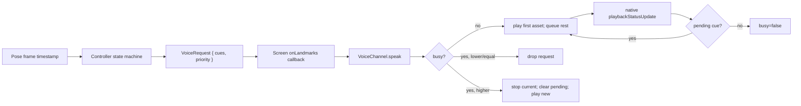

# Pearl Voice Runtime Timeline Audit

## 1. Executive Summary

- Physical MP3 assets measured: 300 (150 Clara, 150 Marcus).
- Runtime scenarios modelled: 374.
- Exact training levels covered: 37.
- Deterministic drops: 0; deterministic interruptions: 0; possible timing collisions: 1.
- Semantic instruction mismatches: 22; potentially unsafe mismatches: 0; voice-first coverage gaps: 24.
- Finding counts: P0 0, P1 2, P2 3, P3 0.
- Production code changed: no. This audit added report artifacts and the audit-only generator under `scripts/audits/`.

The five most important findings:

1. VF-001 (P2) The active set or measurement begins on the same frame that "Go!" is emitted, so the first roughly 604 ms of movement can happen while the word is still playing.
1. VF-002 (P2) Skip is silent even though a generated skip confirmation asset exists, so an eyes-off user gets no spoken confirmation.
1. VF-003 (P1) Several registered training levels emit no movement instruction cue, so the user must look at visible copy to know the exercise.
1. VF-004 (P1) Family-level cues can describe the wrong variant, equipment, load, tempo, side, or hold-vs-rep behavior.
1. VF-005 (P2) Safety narration is extensive and includes implementation language such as "tracking paused" and "wait for Pearl to reset".

## 2. Scope, Method, and Limitations

This audit independently inspected the current source files named in the prompt, measured every physical MP3 under `assets/audio/voice/{clara,marcus}` with local `ffprobe`, parsed `src/audio/manifest.ts`, and built a deterministic static timing model from production constants, exercise definitions, movement definitions, cue priorities, safety profiles, default check-up batteries, and screen-level stop/skip behavior.

The model intentionally does not instantiate `expo-audio`, call ElevenLabs, regenerate assets, or change production behavior. It models controller event times using frame-timestamp semantics from the controllers and measured asset durations. Native startup latency and playback callback latency remain device-only; sensitivity columns are represented in JSON as modelling assumptions rather than measured facts. Synthetic landmark replay was not used for every exercise branch, so device QA is still required for camera-readiness recovery, real callback latency, and app-background interruption behavior.

## 3. Audio Asset Duration Inventory

The full one-row-per-physical-asset inventory is in `docs/audits/PEARL_VOICE_ASSET_DURATIONS.csv`.

| Metric | Value |
|---|---:|
| Total MP3 assets | 300 |
| Clara assets | 150 |
| Marcus assets | 150 |
| Median duration | 2601 ms |
| 95th percentile duration | 8545 ms |
| Assets >3s / >5s / >8s / >10s | 125 / 56 / 21 / 2 |
| Shortest asset | clara/countdown-one (511 ms) |
| Longest asset | clara/ex-hamstring-reach (10403 ms) |
| Largest Clara-Marcus delta | training-intro (1765 ms Clara-minus-Marcus) |

All physical MP3 files are represented in the CSV exactly once. Manifest coverage and paired-voice presence are captured per row.

## 4. Runtime Playback and Timing Model

The runtime path is controller update to screen relay to `VoiceChannel.speak(cues, priority)`. `VoiceChannel` plays one sequence at a time. A new lower-or-equal-priority call is dropped while busy. A higher-priority call invokes `stop()`, clears pending cues, releases the current player, and starts the new sequence. SFX uses `SfxChannel` and can overlap speech.

Controllers use frame timestamps for state progression. Initial instructions, rest, transition, and completion phases generally wait for `voice.busy === false`. Countdown phases do not wait for `voiceBusy`; they emit `three/two/one/go` at one-second frame-time offsets. The active set or measurement starts in the same update branch that emits `go`.

Timing fields in the JSON use `scheduledAtMs`, `speakCalledAtMs`, `playbackStartMs`, `assetDurationMs`, `sequenceDurationMs`, `playbackEndMs`, `nextControllerEventMs`, `timingMarginMs`, and `outcome`.

## 5. Deterministic Cue Drop and Interruption Findings

The zero-latency static model found 0 deterministic dropped events and 0 deterministic interrupted events in the generated representative scenarios. The important timing issue is not countdown cue loss: all four countdown assets are shorter than one second for both voices. The issue is that `go` overlaps the start of active measurement by its measured asset duration.

## 6. Shared Setup and Countdown Timelines

Preflight prompt suppression is shared: the first prompt is immediate, changed prompts are suppressed for 5 seconds, and unchanged prompts repeat after the controller's 10 second repeat interval. `step-into-frame`, `center-yourself`, `step-back`, `step-closer`, `hold-still`, and `turn-on-light` are priority 5. Orientation prompts used as transitions are priority 9, but the same cue keys used by movement camera readiness inherit priority 9 from `voicePriority`.

Countdown assets fit the one-second intervals for both voices under zero added latency and under the requested 100 ms and 250 ms per-asset latency sensitivities. Active movement starts when `go` is emitted, not when `go` finishes.

## 7. Training Session Runtime Timelines

Training starts with `training-intro` plus a support reminder, then waits for voice idle before speaking the global safety sequence. For each exercise setup, the runtime submits a single cue array: `framing-ready`, the exercise's `voice.instructions`, setup safety cues, and active safety cues. Countdown waits for that setup sequence to finish plus `2000 ms` dwell. Rests speak `rest-now` or `last-set` plus repeated-set safety cues, and the next countdown waits for both the rest timer and voice idle.

Longest modelled initial setup sequence: standing-band-row, Clara 50666 ms, Marcus 48810 ms.

## 8. Exact Exercise-Level Instruction Accuracy Matrix

| Exercise | Cue(s) | Verdict | Voice-first | Consequence |
|---|---|---|---|---|
| balance-feet-together-hold | ex-balance | missing | cannot_complete_reliably_by_voice | No stance-specific training cue is emitted; "the position I describe" never gets described. |
| balance-single-leg-hold | ex-balance | missing | cannot_complete_reliably_by_voice | No standing-leg or lifted-leg choice is spoken during training. |
| balance-tandem-hold | ex-balance | missing | cannot_complete_reliably_by_voice | No tandem stance cue is emitted during training. |
| band-pull-apart | (none) | missing | cannot_complete_reliably_by_voice | No movement instruction cue is emitted. |
| chair-supported-split-squat | ex-squat | misleading | cannot_complete_reliably_by_voice | User performs an ordinary squat instead of a split squat. |
| glute-bridge-hold | ex-glute-bridge | misleading | screen_glance_required | User expects repetitions during a hold level. |
| glute-bridge-reps | ex-glute-bridge | accurate | mostly_eyes_off | None |
| heel-raise-free | ex-heel-raise | incomplete_but_safe | mostly_eyes_off | Cue tells the user to use support even though this level is unsupported. |
| heel-raise-supported | ex-heel-raise | accurate | fully_eyes_off | None |
| hip-hinge-free | ex-hip-hinge | misleading | screen_glance_required | Cue tells user to tap a wall where no wall is required. |
| hip-hinge-wall | ex-hip-hinge | accurate | mostly_eyes_off | None |
| loaded-march | ex-march | incomplete_but_safe | mostly_eyes_off | Cue omits support; the registered level is not actually loaded despite the legacy id. |
| loaded-sit-to-stand | ex-sit-to-stand | misleading | screen_glance_required | User is not told to use the backpack or weight. |
| mini-band-lateral-walk | (none) | missing | cannot_complete_reliably_by_voice | No movement instruction cue is emitted. |
| neck-rotation | ex-neck-rotation | accurate | mostly_eyes_off | None |
| overhead-press-band | ex-overhead | misleading | screen_glance_required | User is not told to use or control the band press. |
| overhead-reach | ex-overhead | accurate | mostly_eyes_off | None |
| push-up-incline | ex-push-up | misleading | screen_glance_required | Cue says wall or floor but not chair or counter, so user may use the wrong surface. |
| push-up-standard | ex-push-up | accurate | mostly_eyes_off | None |
| push-up-wall | ex-push-up | accurate | mostly_eyes_off | None |
| seated-band-row | (none) | missing | cannot_complete_reliably_by_voice | No movement instruction cue is emitted. |
| seated-hamstring-reach | ex-hamstring-reach | accurate | fully_eyes_off | None |
| squat-free | ex-squat | incomplete_but_safe | mostly_eyes_off | Cue mentions a chair even though this level is equipment-free. |
| squat-loaded | ex-squat | misleading | screen_glance_required | User is not told to use load. |
| squat-slow-eccentric | ex-squat | misleading | screen_glance_required | User is not told the slow-lower tempo. |
| squat-supported | ex-squat | accurate | mostly_eyes_off | None |
| standing-band-row | (none) | missing | cannot_complete_reliably_by_voice | No movement instruction cue is emitted. |
| step-up | ex-step-up | incomplete_but_safe | mostly_eyes_off | Cue omits nearby support; safety narration supplies it. |
| sts-cushion | ex-sit-to-stand | incomplete_but_safe | mostly_eyes_off | Cue omits cushion setup. |
| sts-power | ex-sit-to-stand | misleading | screen_glance_required | User is not told this is a brisk power variant. |
| sts-slow-eccentric | ex-sit-to-stand | misleading | screen_glance_required | User is not told to lower slowly. |
| sts-standard | ex-sit-to-stand | accurate | mostly_eyes_off | None |
| supported-hip-flexor-stretch | (none) | missing | cannot_complete_reliably_by_voice | No movement instruction cue is emitted. |
| supported-side-step | (none) | missing | cannot_complete_reliably_by_voice | No movement instruction cue is emitted. |
| thoracic-rotation | (none) | missing | cannot_complete_reliably_by_voice | No movement instruction cue is emitted. |
| toe-raise-supported | ex-heel-raise | misleading | cannot_complete_reliably_by_voice | User performs heel raises instead of toe raises. |
| wall-calf-stretch | (none) | missing | cannot_complete_reliably_by_voice | No movement instruction cue is emitted. |

## 9. Safety Narration Load

Training speaks global safety once per session, then per-exercise setup and active safety during setup. Repeated-set safety is appended to rest narration. Recovery safety is reactive. Initial safety durations by exercise are present in JSON.

| Exercise | Setup+Active Safety Cues | Clara ms | Marcus ms |
|---|---:|---:|---:|
| standing-band-row | 15 | 49087 | 46999 |
| mini-band-lateral-walk | 13 | 40169 | 39800 |
| seated-band-row | 12 | 37477 | 37199 |
| overhead-press-band | 12 | 35758 | 35435 |
| band-pull-apart | 11 | 32647 | 32091 |
| step-up | 9 | 28094 | 27399 |
| glute-bridge-hold | 8 | 25587 | 24103 |
| glute-bridge-reps | 8 | 25587 | 24103 |
| push-up-standard | 8 | 25587 | 24103 |
| supported-hip-flexor-stretch | 8 | 23684 | 23267 |
| wall-calf-stretch | 8 | 23684 | 23267 |
| squat-supported | 8 | 23313 | 22989 |

Safety language requiring product review includes `global_pause_if_tracking_lost` and `tracking_pause_and_reset`, because the user hears implementation-oriented wording such as "tracking pauses" and "wait for Pearl to reset."

## 10. Movement Check-Up Timelines

Default battery: chair-stand-30s → balance-ladder → shoulder-flexion-peak → hinge-reach. TUG is not part of the default battery; it appears in `BETA_BATTERY_WITH_TUG`. The raw-first V2 battery is chair-rise-30s-v2 → one-leg-balance-45s-v2 → active-shoulder-reach-v2 → hinge-reach and remains separate through protocol policy.

Chair stand starts its 30-second controller window on the same frame as `go`. `times-up` is emitted when the active window ends, followed by a stitched result sequence after voice idle. Counts are spoken through `numberCue`, clamped to bundled numbers 0-40; the chair grader itself supports more reps than can be spoken exactly. Balance default stages skip semi-tandem. Shoulder and hinge use near-side dynamic selection; the voice does not explicitly persist a side for retests. Hinge says "Last one"; that is true for the current default and V2 batteries but would be wrong if the movement were used alone or reordered.

## 11. Micro Check-Up Timelines

All three micro-checks use `framing-ready` plus a type-specific instruction; `microcheck-intro` is not emitted. Chair power ends on the fifth accepted rep or the active cap, not on a fixed five-rep timer. Rep progress is SFX-only. Single-leg balance does not speak which leg to stand on. Mobility reach speaks "one leg straight out" but does not identify a side; the grader evaluates a side-chain angle generically.

## 12. Pause, Retry, Skip, Cancellation, and Tracking Recovery

Pause stops voice and freezes controller progression by skipping updates; resume shifts controller timing by the paused duration. Retry stops voice and resets setup. Skip stops voice and advances silently. Cancel/discard/unmount call `voice.stop()`, clearing pending cues and releasing the current player. There is no spoken pause, resume, skip, discard, or tracking-recovered confirmation.

## 13. Voice-First Coverage Matrix

The full coverage matrix is in JSON. Summary: 24 rows are not fully or mostly eyes-off. Missing movement instructions, missing side selection for unilateral holds/reaches, silent skip/pause/resume confirmations, and visible-only set targets are the main gaps.

## 14. Inactive Cue Product Decisions

| Cue | Current status | Provisional decision |
|---|---|---|
| set-done | bundled_but_inactive | requires_product_review |
| cooldown-now | bundled_but_inactive | requires_product_review |
| time-to-retest | bundled_but_inactive | requires_product_review |
| exercise-skipped | bundled_but_inactive_on_skip | add_or_remove_after_product_decision |
| balance-semi-tandem | bundled_conditional_not_default | keep_conditional_or_protocol_review |
| microcheck-intro | bundled_but_inactive | requires_product_review |

## 15. Prioritised Findings

### VF-001 (P2)

The active set or measurement begins on the same frame that "Go!" is emitted, so the first roughly 604 ms of movement can happen while the word is still playing.

Evidence: TrainingSessionPlayer, SessionController, and MicroCheckRunner switch to active inside the same branch that emits go. Measured go duration: Clara 604 ms, Marcus 604 ms.

Next step: `change_controller_wait_policy`.

### VF-002 (P2)

Skip is silent even though a generated skip confirmation asset exists, so an eyes-off user gets no spoken confirmation.

Evidence: TrainingSessionScreen and CheckUpScreen skip handlers stop current audio and advance state; neither submits exercise-skipped.

Next step: `add`.

### VF-003 (P1)

Several registered training levels emit no movement instruction cue, so the user must look at visible copy to know the exercise.

Evidence: 11 exact levels have empty or functionally missing instructions in the runtime setup sequence.

Next step: `add`.

### VF-004 (P1)

Family-level cues can describe the wrong variant, equipment, load, tempo, side, or hold-vs-rep behavior.

Evidence: 11 exact levels are marked misleading or potentially unsafe in the instruction accuracy matrix.

Next step: `rewrite`.

### VF-005 (P2)

Safety narration is extensive and includes implementation language such as "tracking paused" and "wait for Pearl to reset".

Evidence: Longest initial setup safety load is standing-band-row: Clara 49087 ms, Marcus 46999 ms. Recovery cue text exposes reset semantics.

Next step: `merge`.

## 16. Recommended Next Implementation Phase

1. Architecture/timing fixes: decide whether active start should wait for `go` completion or add a short post-go guard.
2. Exercise-specific cue splitting: replace broad family cues for confirmed P1 mismatches and add cues for currently silent levels.
3. Missing guidance: add spoken side/stance/target coverage where eyes-off completion depends on it.
4. Safety-cue consolidation: merge duplicate support/tracking language and remove implementation wording.
5. Protocol decisions: decide whether `exercise-skipped`, `microcheck-intro`, `balance-semi-tandem`, `cooldown-now`, `set-done`, and `time-to-retest` should remain bundled.
6. Copy rewrite/audio regeneration: regenerate only after the product decisions are made.
7. Device QA: measure native callback latency and real cancellation behavior on Android and iOS.

## 17. Physical-Device Test Plan

- Android and iOS: measure elapsed time from `voice.speak(['go'])` to audible completion and compare with active timer start.
- Android and iOS: pause/cancel during a multi-asset setup sequence and confirm no stale playbackStatusUpdate advances pending cues.
- Android and iOS: force tracking loss during active training, active check-up, and micro-check; confirm what is audible and whether state resets as modelled.
- Android and iOS: verify repeated preflight prompt suppression with real camera jitter and lighting failure.
- Android and iOS: change trainer voice while a session screen is mounted; confirm existing `VoiceChannel` keeps its constructor voice until remount.

## 18. Validation and Commands Run

See JSON `validation` for the full command list and booleans. Commands recorded so far:

- `npx tsx scripts/audits/generate-voice-runtime-audit.ts` — passed (Generated Markdown, JSON, and CSV audit artifacts; measured MP3 duration with ffprobe.)
- `node -e "const a=require('./docs/audits/PEARL_VOICE_RUNTIME_TIMELINE_AUDIT.json'); console.log(JSON.stringify({summary:a.summary, validation:a.validation}, null, 2));"` — passed (Parsed generated JSON and printed summary/validation.)
- `node - <<'NODE' ... JSON/CSV row-count validation ... NODE` — passed (Parsed generated JSON, parsed CSV, and verified 300 CSV asset rows.)
- `npx jest src/audio/__tests__/voicePlayer.test.ts src/audio/__tests__/safetyAudio.test.ts src/preflight/__tests__/promptTiming.test.ts src/assessment/__tests__/sessionController.test.ts src/checkup/__tests__/checkup.test.ts src/training/__tests__/sessionPlayer.test.ts src/training/__tests__/microCheck.test.ts src/training/__tests__/safetyCues.test.ts --runInBand` — passed (8 suites passed, 44 tests passed.)
- `npx tsc --noEmit` — passed (TypeScript check completed with no errors.)

The generator parsed JSON, parsed CSV, verified every physical MP3 row, verified number and safety assets for both voices, verified every registered exercise has an accuracy row, verified every registered training level has scenarios, verified default assessment and micro-check normal/interruption scenarios, classified every inventory cue, and checked all source paths exist.

## 19. Complete Source Index

- src/audio/voicePlayer.ts VoiceChannel playback, priority, stop, and SFX policy.
- src/audio/cues.ts cue ids, priorities, and number cue clamp.
- src/audio/manifest.ts bundled MP3 manifest.
- src/audio/safetyAudio.ts and src/audio/safetyAudioManifest.ts safety asset metadata.
- src/profile/voices.ts Clara and Marcus voice definitions.
- src/training/sessionPlayer.ts training runtime sequence.
- src/training/microCheck.ts micro-check runtime sequence.
- src/assessment/sessionController.ts per-assessment runtime sequence.
- src/checkup/checkup.ts default, beta, and V2 check-up batteries.
- src/preflight/preflight.ts generic framing prompts and lighting check.
- src/preflight/movementCameraReadiness.ts movement-specific orientation readiness.
- src/preflight/promptTiming.ts prompt suppression rule.
- src/screens/TrainingSessionScreen.tsx voice relay, pause, skip, cancel, repeat.
- src/screens/CheckUpScreen.tsx voice relay, pause, skip, cancel, repeat.
- src/screens/MicroCheckScreen.tsx voice relay, pause and discard.
- src/exercises/*.ts registered exact training levels.
- src/exercises/ladders.ts release status and visible exercise-level copy.
- src/training/safetyCueDefinitions.ts safety text.
- src/training/safetyCues.ts safety profile selection.
- src/movements/*.ts movement check-up definitions and grader-owned voice cues.

## Appendix A: Full Scenario Timeline Tables

The full scenario table is in `docs/audits/PEARL_VOICE_RUNTIME_TIMELINE_AUDIT.json`. Sample:

### TRAIN-sts-cushion-first-set-clara

| Time | State | Source event | Cues | Priority | Duration | Outcome | Margin |
|---:|---|---|---|---:|---:|---|---:|
| 0 | intro | training intro | training-intro + support_keep_support_within_reach | 9 | 11378 | played | 0 |
| 11378 | intro | global safety | global_stop_sharp_or_increasing_pain + global_stop_dizzy_or_lightheaded + global_breathe_normally + global_clear_space + global_stop_if_support_moves + global_pause_if_tracking_lost | 8 | 19784 | played | 1500 |
| 32662 | instructions | framing ready + exercise instructions + safety | framing-ready + ex-sit-to-stand + chair_use_sturdy_chair + tracking_keep_full_body_in_view + tracking_move_when_cued + chair_controlled_sit + comfortable_range_only + tracking_no_rush_or_exaggerate | 8 | 26471 | played | 2000 |
| 61133 | countdown | countdown three | countdown-three | 10 | 697 | played | 303 |
| 62133 | countdown | countdown two | countdown-two | 10 | 604 | played | 396 |
| 63133 | countdown | countdown one | countdown-one | 10 | 511 | played | 489 |
| 64133 | countdown->active | go and active start | go | 10 | 604 | played |  |

### TRAIN-sts-cushion-later-set-clara

| Time | State | Source event | Cues | Priority | Duration | Outcome | Margin |
|---:|---|---|---|---:|---:|---|---:|
| 0 | rest | rest narration | last-set + chair_controlled_sit + tracking_no_rush_or_exaggerate | 9 | 7988 | played | 37012 |
| 45000 | countdown | countdown three | countdown-three | 10 | 697 | played | 303 |
| 46000 | countdown | countdown two | countdown-two | 10 | 604 | played | 396 |
| 47000 | countdown | countdown one | countdown-one | 10 | 511 | played | 489 |
| 48000 | countdown->active | go and active start | go | 10 | 604 | played |  |

### TRAIN-sts-cushion-final-transition-clara

| Time | State | Source event | Cues | Priority | Duration | Outcome | Margin |
|---:|---|---|---|---:|---:|---|---:|
| 0 | transition | advance to next exercise | next-up | 9 | 1765 | played |  |

### TRAIN-sts-cushion-tracking-loss-clara

| Time | State | Source event | Cues | Priority | Duration | Outcome | Margin |
|---:|---|---|---|---:|---:|---|---:|
| 0 | set | tracking pause recovery | tracking_pause_and_reset | 10 | 4505 | played |  |

### TRAIN-sts-standard-first-set-clara

| Time | State | Source event | Cues | Priority | Duration | Outcome | Margin |
|---:|---|---|---|---:|---:|---|---:|
| 0 | intro | training intro | training-intro + support_keep_support_within_reach | 9 | 11378 | played | 0 |
| 11378 | intro | global safety | global_stop_sharp_or_increasing_pain + global_stop_dizzy_or_lightheaded + global_breathe_normally + global_clear_space + global_stop_if_support_moves + global_pause_if_tracking_lost | 8 | 19784 | played | 1500 |
| 32662 | instructions | framing ready + exercise instructions + safety | framing-ready + ex-sit-to-stand + chair_use_sturdy_chair + tracking_keep_full_body_in_view + tracking_move_when_cued + chair_controlled_sit + comfortable_range_only + tracking_no_rush_or_exaggerate | 8 | 26471 | played | 2000 |
| 61133 | countdown | countdown three | countdown-three | 10 | 697 | played | 303 |
| 62133 | countdown | countdown two | countdown-two | 10 | 604 | played | 396 |
| 63133 | countdown | countdown one | countdown-one | 10 | 511 | played | 489 |
| 64133 | countdown->active | go and active start | go | 10 | 604 | played |  |

### TRAIN-sts-standard-later-set-clara

| Time | State | Source event | Cues | Priority | Duration | Outcome | Margin |
|---:|---|---|---|---:|---:|---|---:|
| 0 | rest | rest narration | rest-now + chair_controlled_sit + tracking_no_rush_or_exaggerate | 9 | 7663 | played | 37337 |
| 45000 | countdown | countdown three | countdown-three | 10 | 697 | played | 303 |
| 46000 | countdown | countdown two | countdown-two | 10 | 604 | played | 396 |
| 47000 | countdown | countdown one | countdown-one | 10 | 511 | played | 489 |
| 48000 | countdown->active | go and active start | go | 10 | 604 | played |  |

### TRAIN-sts-standard-final-transition-clara

| Time | State | Source event | Cues | Priority | Duration | Outcome | Margin |
|---:|---|---|---|---:|---:|---|---:|
| 0 | transition | advance to next exercise | next-up | 9 | 1765 | played |  |

### TRAIN-sts-standard-autoregulation-clara

| Time | State | Source event | Cues | Priority | Duration | Outcome | Margin |
|---:|---|---|---|---:|---:|---|---:|
| 0 | set | autoregulation stop | thats-your-set | 9 | 1486 | played | 0 |
| 1486 | transition | post-autoregulation transition | next-up | 9 | 1765 | played |  |

## Appendix B: Full Asset Duration Statistics

See the CSV and JSON `assetDurations` array for every asset, including codec, sample rate, channel count, manifest status, paired-voice status, and Clara/Marcus duration deltas.
